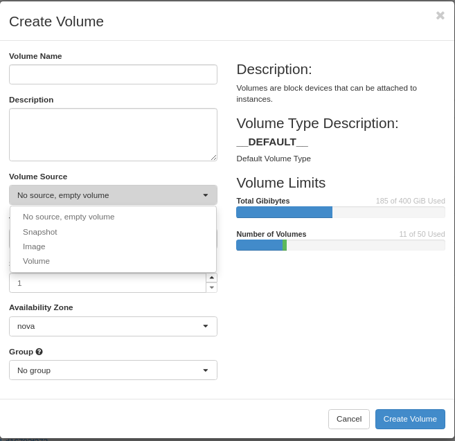
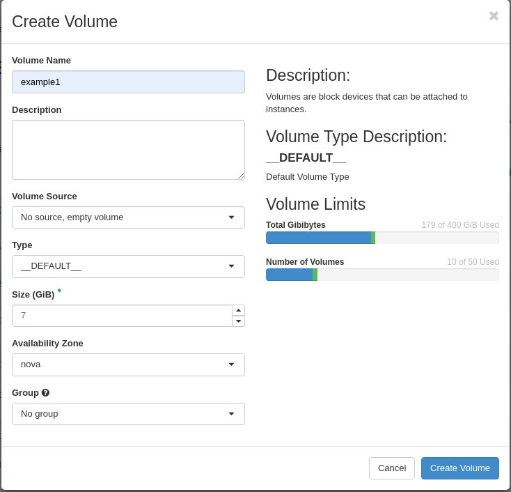
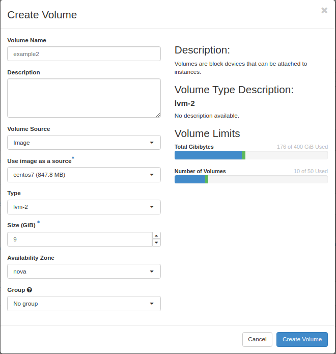
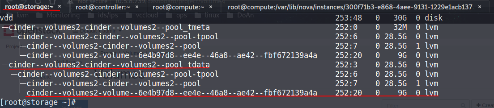
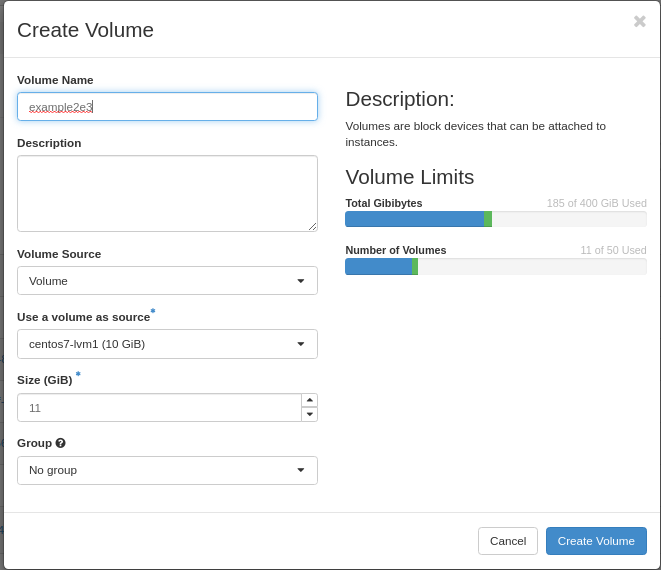
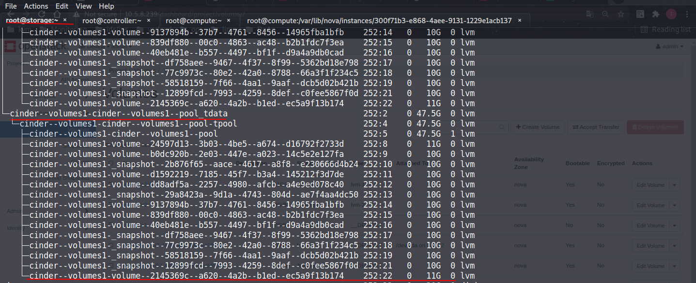
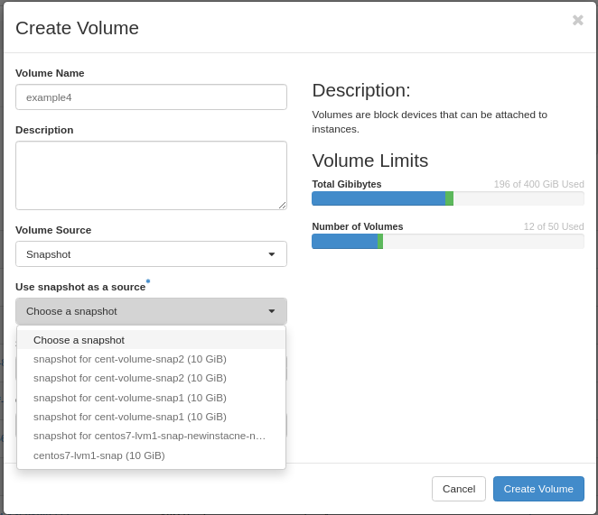
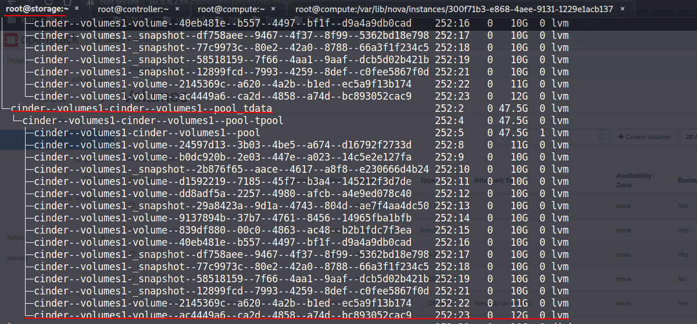
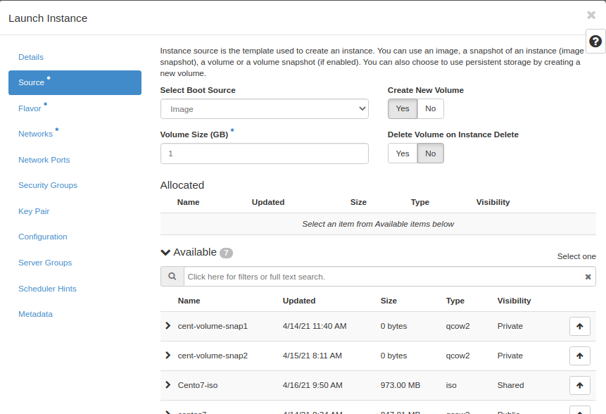

# Một số trường hợp sử dụng volume trong ops.

## 1. Các tường hợp tạo volume mới.

Khi create 1 volume mới thì ta có 4 lưa chọn là No source, Snapshot, Image, Volume.

Chúng ta sẽ đi đến từng trường hợp.

## Trường hợp 1

Tạo volume với trường hợp vo source volume. Kiểu volume là default

Sau khi tạo thì 1 volume mới sẽ được tạo lên trên máy compute host. Kiểm tra.

## Trường hợp 2

Tạo volume với trường hợp có source là image và type là nơi backend dùng để lưu. Ở đây tạo volume mới có size là 9GB.
 
Image được lấy từ glance và snapshot của instacnce.

Sau khi tạo volume thì 1 phân vùng mời với kích thước 7G sẽ đc tạo trong backend lvm2 vì có file image nên volume này có thể sừ dụng để boot instance. Kiểm tra

## Trường hợp 3

Tạo volume mới từ souce là volume. `Use a volume as source` chọn các volume có trạng thái là available. Size là 11 GB 

Sau khi tạo 1 volume sẽ đươc lưu vào backend lvm1 trên máy storage host.

## Trường hợp 4 
Tạo volume mới từ source volume là snapshot. `Use snapshot as a source` chọn các  volume snapshot của các instance. Ỏ đây mình t volume có size là 12GB.

Sau khi ta thì 1 volume mới được tạo và chỉ đỉnh lưu bỏi quá trình schedule của cinder. Trong tướng hợp này nó lưu tại lvm1.

## 2. Các trường hợp instance sử dụng volume.

Trường `Select Boot Source` lựa chọn nguồn sử dùng để boot new instance. Có 4 tùy chọn là : image, instance snapshot, volume và volume snapshot.

Trường `Create New Volume`: Nếu chọn yes thì 1 volume mới sẽ dc tạo và lưu trong storage host. Nếu chọn no thì volume disk mới sẽ dc tạo trên máy compute host.

Trường `Delete Volume on Instacne Detele` Nếu chọn yes thì mỗi khi xóa instance thì volume cũng bị xóa cùng. Còn no thì khi xóa instance thì volume sẽ không bị xóa.

