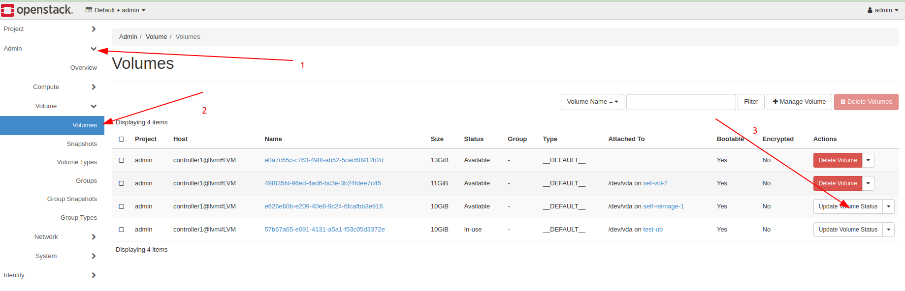
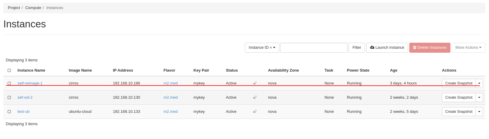
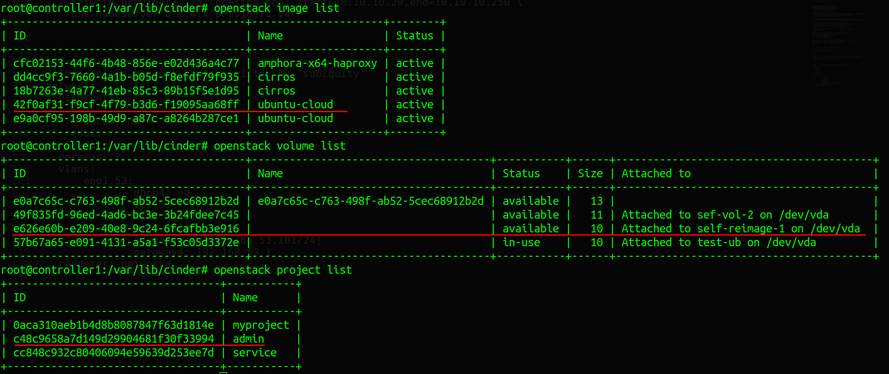
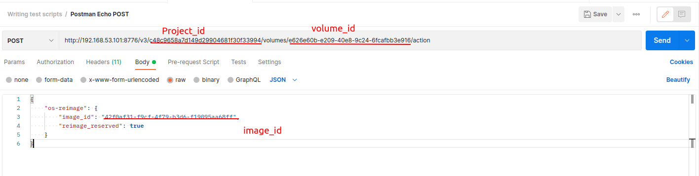
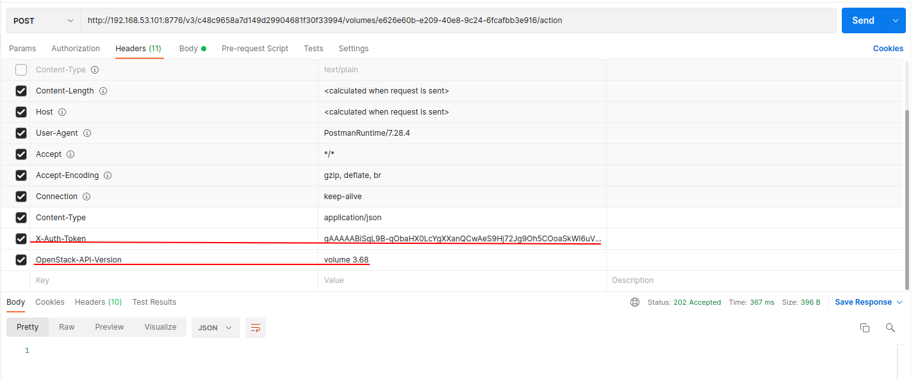
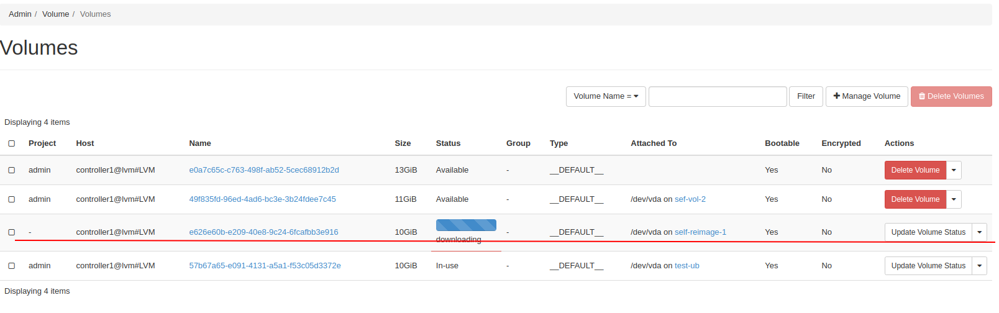
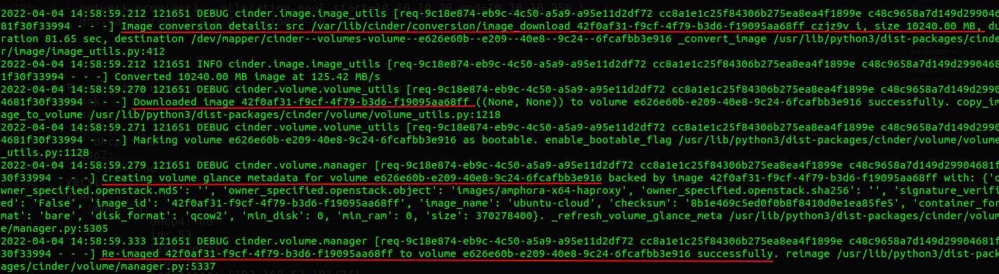
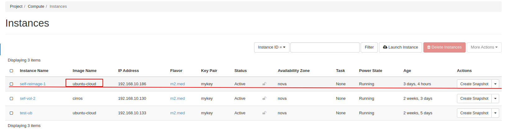

Các bước cài đặt và sử  dụng tính năng os-reimage trên cinder.

1. update cinder api-version lên bản mới nhất là yoga như sau.

Cập nhật repo yoga:
```
sudo add-apt-repository cloud-archive:yoga
```

Sau đó update cinder lên phiên bản mới nhất.

```
apt install cinder-api cinder-volume cinder-scheduler -y 
```

sau đó kiểm tra version của API.

```
cinder api-version
```

nếu thấy version là 3.68 là đã update thành công cinder.


2. Sử dụng postman để gửi request có body chứa os-reimage.
   
Để reimage 1 volume thì ta phải cần chuyểnt trạng  thái của volume đò về 1 trong 3 trạng thái" `error`, `available`, `reserved`. Để chuyển các trạng thái của volume ta làm các bước như sau.



Đây là trường hợp reimage root disk sử dụng os cirros về os sử dụng ubuntu.



Sau đó ta cần xác định các thông số sau: `volume_ID`, `image_ID`, `project_ID`.



sau đó ta sẽ sử dụng postman để gửi POST request.




Phần body ta sẽ viết như sau:
```
{
    "os-reimage": {
        "image_id": "42f0af31-f9cf-4f79-b3d6-f19095aa68ff",
        "reimage_reserved": true
    }
}
```

Phần header ta thêm 2 thông số sau:



- X-Auth-Token: là token id có thể sử dụng lệnh `openstack token issue` để lấy token id.
- OpenStack-API-Version: chỉ định cinder-api sử dụng version mới nhất là 3.68 nếu ko có dòng này nó sẽ sử dụng versioi mặc định là 3.0 và sẽ ko dùng dc tính năng os-reimage.


Sau đó ta ấn nút send rồi kiểm tra kết quả:






Sau đó ta hard reboot lại VM đang được gắn với volume đó.




Như vậy ta đã cấu hình và sử dụng được tính năng os-reimage của cinder trên bản yoga.