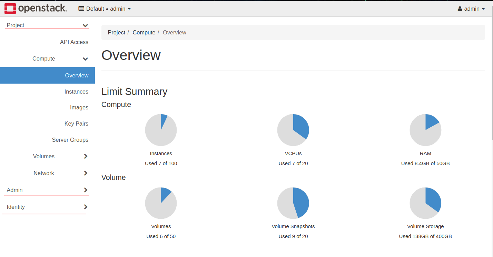

# Tìm hiểu sử dụng horizone 

Sau khi truy cập vào dashbroad của openstack ta thấy giao diện như sau.

Trên đây được chia làm 3 mục chính như :
- Project
- Admin
- Identity

## 1 Các mục trong tab Project.
Trong tab project chứa các project đã được cài trên openstack :
- API access.
- Compute project
- Volume project
- Network project

### 1.1 Compute project
Trong tab compute có các tab chính như sau
- Overview
- Instance
- Image 
- Key Pairs
- Server Group

`Overview` là cái nhìn tổng quan nhất về tài nguyên đãn dc hệ thông sử dụng đưcọ biểu diễn bằng các biểu đô rất đễ nhìn.

`Instance` Chứa danh sách cac máy ảo đã được tạo.

Trong tab instance cho ta thấy thông tin của các máy ảo. Thong tin của mỗi cột từ trái sang phải như sau:
- Instance Name : Tên của máy ảo
- Image Name: Máy ảo sử dụng image nào để boot.
- IP Address: Chưa các địa chỉ ip trên máy ảo đó.
- Flavor: Tên flavor đang sử dụng và nó xác định xem máy ảo dùng bao nhiêu tài nguyên Ram, vcpu, disk.
- Key pairs: Sau khi tạo máy ảo thì nguời sử dụng có thể  ssh vào máy ảo thông qua key này.
- Status: Trạng thái của máy ảo như error, shutoff, build, active, delete, reboot, ..
- Availability Zone: 
- Task : Nhiệm vụ của từng quá trình boot vm như Block mappping device, Swapning, Running, Powering Off, ..
- Power State: Cho biết máy ảo có đang chạy hay không có 2 option là Running và Shutdown.
- Age : Là thời gian tư lúc tạo máy ảo đến hiện tại.
- Actions: Chứa các hành động của người dùng với vm đó vd: Floating IP, Attach interface, Dettach interface, Attach Volume, Rescuse, reboot, ..

Ngoài ra còn co thể Launch Instace và xóa instances bắng cách tích vào các ô ở đâu mỗi instance.

`image` Chứa các image để sử dụng boot các instance.

Trong tab này ta có thể tạo mới các image mới bằng cách upload file và xóa các image.

Các thông tin cơ bản của tab này như sau:
- Owner : Người sở hữu hay ngời tạo ra image này.
- Name : Tên của images.
- Type : Kiểu của image đó như image, snapshot, ..
- Status : trạng thái của image Active hoặc Error.
- Visibility : Phân quyền truy cập của image có 4 loại là 
    - private:  Chỉ sử dụng cho user đó
    - Shared:  
    - Community:
    - Public: Tất cả user để có thể sử dụng.
- Protected : Có 2 trường hợp nếu là yes thì ko thể xóa image còn nó thì có thể xóa image.
- Disk Format: định dạng của disk như QCOW2, ISO, VMDK, ...
- Size: Kich thước của disk.
- Các action như create  Volume, edit image, update metadata, delete image,

`Key pairs` chứa ssh key cho nguwoif dụng truy cập vào VM thông qua ssh.
`Server Group` :

### 1.2 Volume project.
Sau khi ta cài cinder thì trên dashboad có thêm tab volume. Dấy là nới kiểm soát việc lưu trữ dữ liệu vào storage host.

Trong tab này có các tab sau.

`Volume` tông hợp các volume đã được tạọ trên storage host.

Các thông tin trên dashbroad như sau:
- Name: Tên của các volume.
- Description : Mo tả tóm tắt volume.
- Size: kích thước của volume đó.
- Status : trạng thái của volume.
- Type: loại backend volume sử dụng.
- Attach To: Device của các VM nào đang sử dụng volume.
- Availability zone
- Bootable: nếu là yes thì cos thể thêm image vào vào boot dc còn no thì nó chỉ là ổ cứng ngoài được thêm vào vm thôi.
- Encrypted: dữ liệu trong volume có được mã hóa hay không.
- Action: các hành động nguời dùng tương tác với volume như edit volume, attachments, create snapshot

`Snapshots` Hiển thị các phiên bản snapshot của instance.

Các thông tin trên dashbroad như sau:
- Name: Tên của các bản snapshots.
- Description : Mo tả tóm tắt volume.
- Size: kích thước của volume đó.
- Status : trạng thái của volume như Creating, Available, Deleting, Error.
- Volume Name: Tên của các volume.
- Actions : Các hành đông giup người dùng tương tác với volume snapshot như Launch as Instansce, Edit snapshot, delete volume snapshot,.

`Groups` nhóm các volume type thành các grop khác nhau.

### 1.3 Network project.
Sau khi cài đặt neutron trên controller host và compute host thì trên dashboard sẽ có project của network.

Trong tab network có các tab nhơ như Network topology, Networks, Router, Security group, Floating IP.

`Network topology` Trong tab này network và các VM được kết nói với nhau và hiển thị lên mô hình đồ họa giúp ta có thể quan sát một cách dễ dàng. Bên cạnh đó ta tạo được network mới và các router ảo trong network.

`Networks` Trong tab này sẽ hiển thị chi tiết các network đang có

các cột trong bảng có ý nghĩ như sau.
- Name: Tên của các networks.
- Subnets Associated: Hiển thị tên của subnet và subnet của network đó.
- Shares: có cho user khác sử dụng network này ko.
- External: mạng này có ra được dải mạng máy vật lý cung cấp hay không. 
- Admin State : trạng thái của admin .
- Avalabiliy Zones:
- Actions: Các hành động với network như tạo subnet, xóa network.

`Router` Hiển thị các routers 

