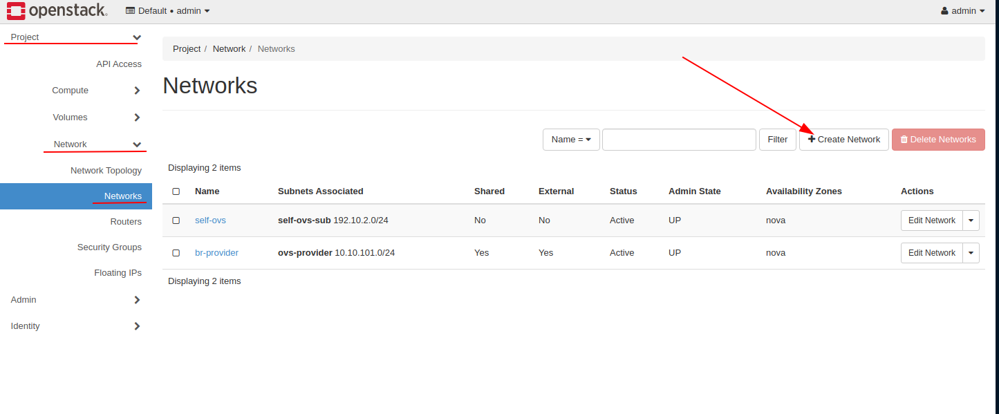
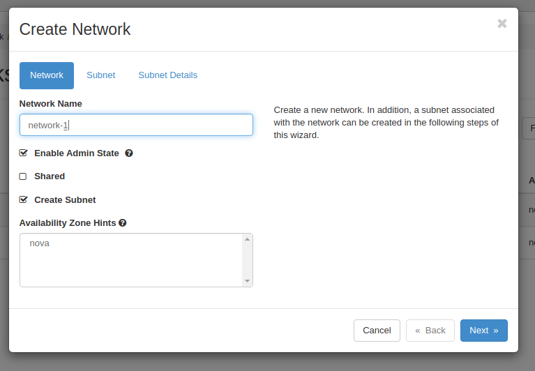
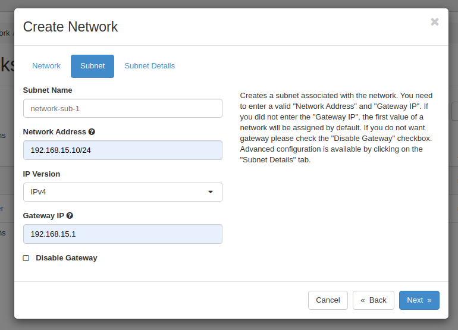
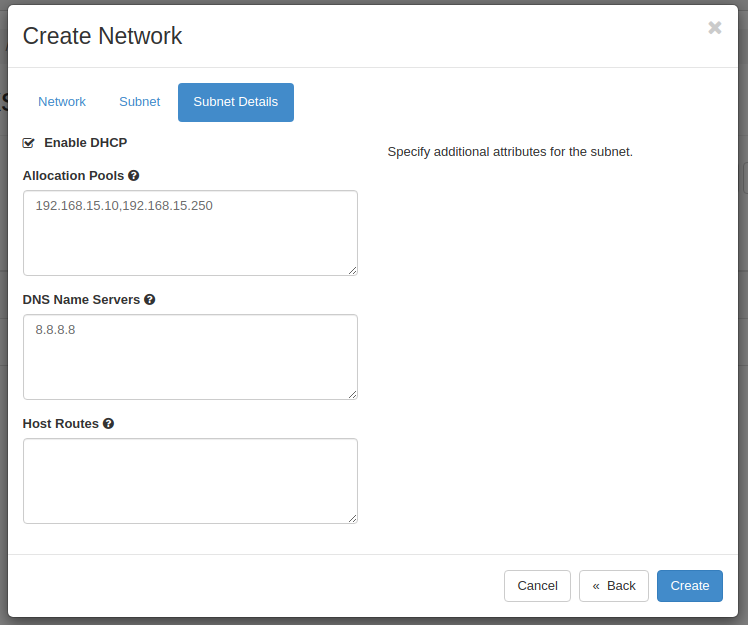
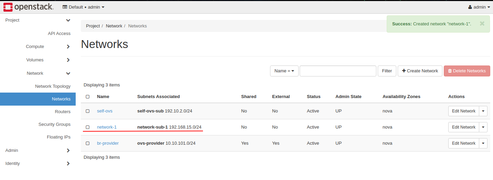
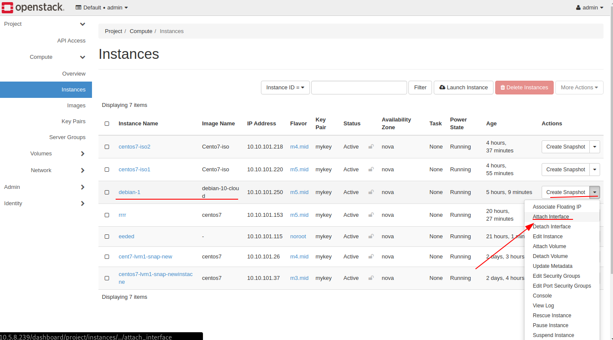
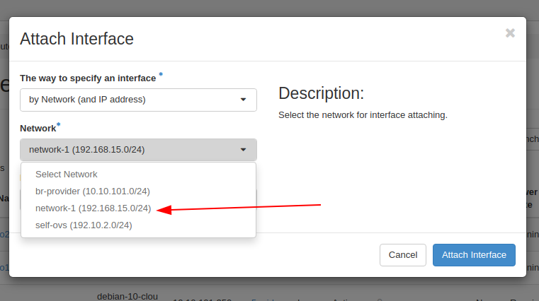
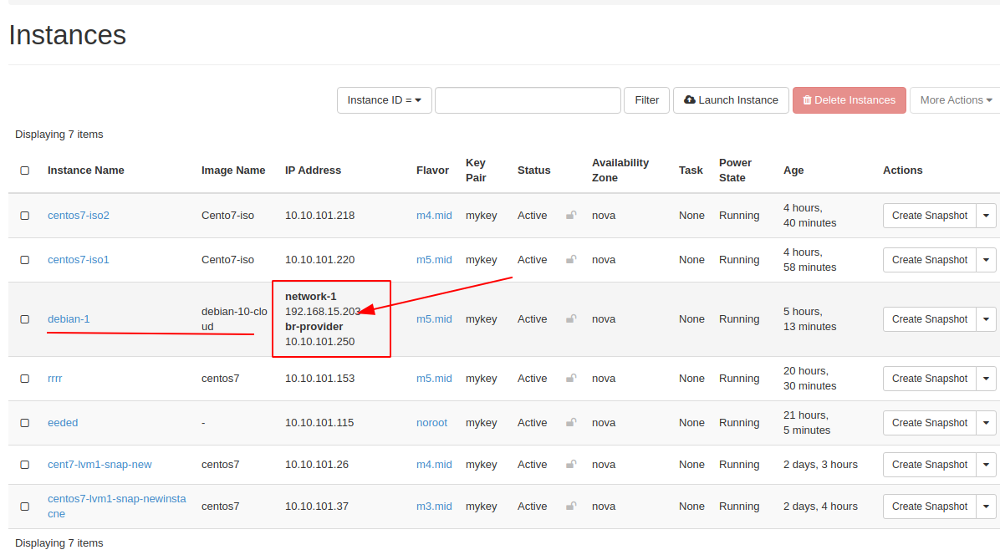

# Hướng dẫn tạo sửa xóa network trên dashboard.

Để tạo nework mới ta vào tab Project -> Network -> Networks.

Chọn Create Network 

Sau đó sẽ hiện thị lê 1 pop-up. Ta điền cac thông tin vào. Rồi chọn next.

Chọn tên subnet, network address và gateway. Rồi chọn next.

Sau đó chọn pool cho dhcp và dns cuôi cùng chọn create.

Vậy là ta dã tạo xong network kiểu self-service.

Tiếp đến ta sẽ attack network này vào VM.

Chọn VM dể attach thêm 1 card mạng vào.
Project -> Compute -> Instances 

Sau đó chọn network cân attach.

Sau đó chọn Attach create

Như ta đã thầy VM của chúng ta đã có 2 địa chỉ ip ứng với 2 dải mạng đã dc gắn vào.

#