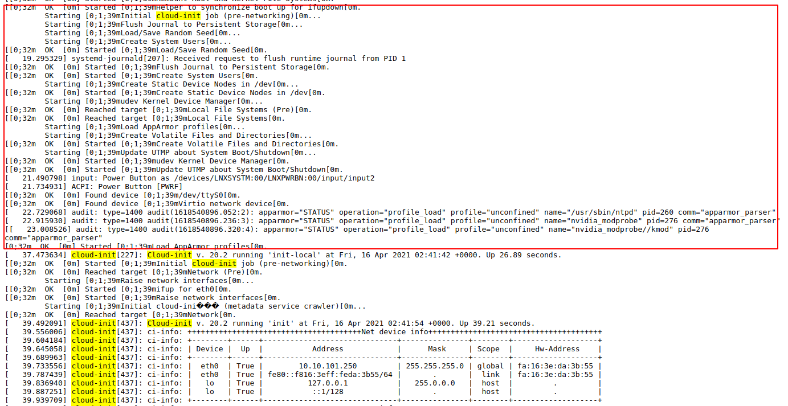
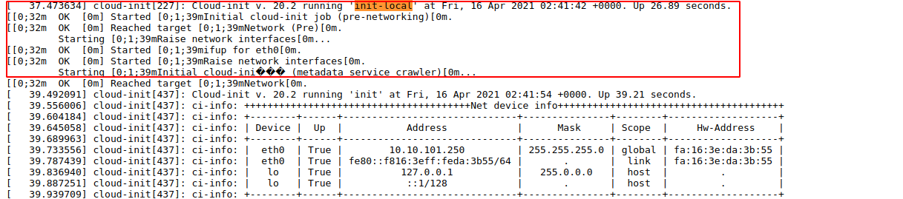
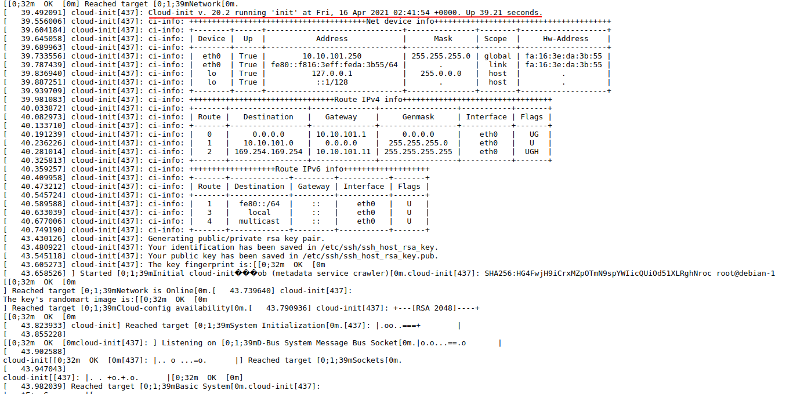
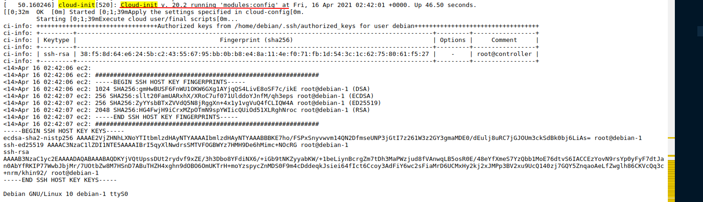
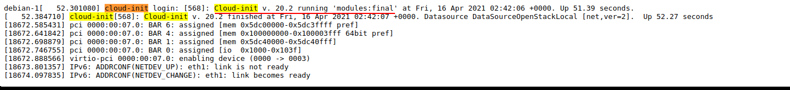

# Tìm hiểu về cloud init trong openstack.

## 1. Tổng Quan
Cloud init được sử dụng nhằm custom lại Linux VM trong lần boot đầu tiên

Cloud init hỗ trợ:

- Thiết lập gói cơ bản
- Cấu hình hostname
- Sinh SSH private key
- Tự động bổ sung SSH Key vào tài khoản người dùng (.ssh/authorized_keys)
- Cấu hình mount tự động
- Cấu hình network

Các Giao Đoạn Thực Thi Gồm 5 Giai Đoạn
- Generator
- Local
- Network
- Config
- Final

### 1.1 - Generator
Qúa trình khởi tạo tiến trình cloud init.
Xảy ra khi hệ thống đang boot. Quyết định có chạy dịch vụ cloud-init.target. Mặc định sẽ kích hoạt dịch vụ cloud init.
LOG

### 1.2 - Local

Tiến trình: cloud-init-local.service
Chạy khi mount đường dẫn ‘/’
blocks: Sớm nhất khi boot, cần block network được bật
Mục đích:

Chứa các ‘local’ data source
Thực hiện cấu hình network hệ thống
Bổ sung:

Trong nhiều trường hợp, qúa trình có thể bao gồm nhiều bước hơn bao gồm tìm kiếm data sources, quyết định network cần cấu hình.
Khi instance được boot lần đầu, cấu hình network config sẽ được sinh. Bao gồm làm sạch các quá trình trước đó.
Giai đoạn này sẽ block quá trình bật các card mạng, apply các cấu hình

LOG

## 1.3 - Network
systemd service: cloud-init.service 
runs: Thực thi sau giai đoạn local và các cấu hình networking được bật blocks: Sớm nhất khi boots 
modules: cloud_init_modules in /etc/cloud/cloud.cfg
Yêu cầu các cấu hình network sẵn sàng, nó sẽ xử lý bất kỳ user-data này tìm thấy.
Mục đích

Nó sẽ giải nén các module, get các dữ liệu về.
Giai đoạn này sẽ chạy các module như bootcmd.
Module cho giai đoạn 3

cloud_init_modules:
 - migrator
 - bootcmd
 - write-files
 - growpart
 - resizefs
 - set_hostname
 - update_hostname
 - update_etc_hosts
 - rsyslog
 - users-groups
 - ssh

LOG

## 1.4 - Config

systemd service: cloud-config.service
runs: After network stage.
blocks: None.
modules: cloud_config_modules in /etc/cloud/cloud.cfg
Mục đích:

Giai đoạn chỉ chạy các module config. Các module không thể chạy trong giai đoạn khởi động.

cloud_config_modules:

 - mounts
 - locale
 - set-passwords
 - rh_subscription
 - yum-add-repo
 - package-update-upgrade-install
 - timezone
 - puppet
 - chef
 - salt-minion
 - mcollective
 - disable-ec2-metadata
 - runcmd

LOG

## 1.5 - Final
systemd service: cloud-final.service
runs: As final part of boot (traditional “rc.local”)
blocks: None.
modules: cloud_final_modules in /etc/cloud/cloud.cfg
Mục đích:

Chạy sau cùng trong quá trình boot. Thực hiện các tệp lệnh cơ bản người dùng. Như package installations, configuration management plugins (puppet, chef, alt-minion), user-scripts (including runcmd).

Module
cloud_final_modules:
 - rightscale_userdata
 - scripts-per-once
 - scripts-per-boot
 - scripts-per-instance
 - scripts-user
 - ssh-authkey-fingerprints
 - keys-to-console
 - phone-home
 - final-message
 - power-state-change

LOG

