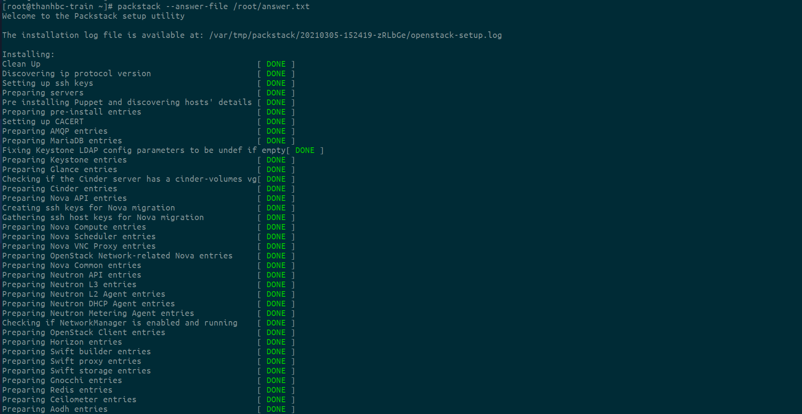
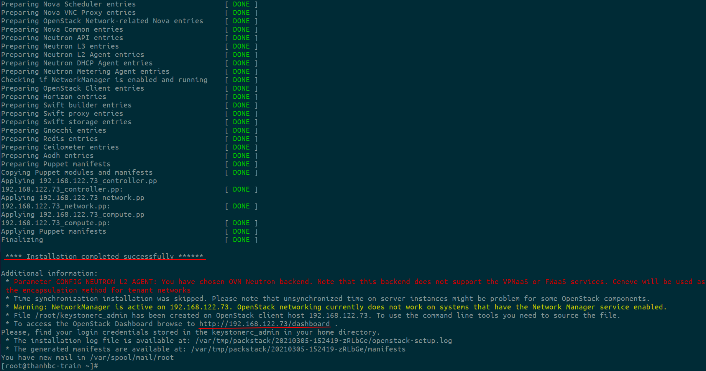

# Cài đặt openstack train sử dụng packstack


Trong bài viết này, tôi sẽ hướng dẫn các bạn cài đặt phiên bản mới nhất của OpenStack Train trên CentOS 7 bằng cách sử dụng rdo repositories. Các thiết lập ban đầu trên máy CentOS 7 của tôi như sau:
```
Hostname = thanhbc-train
IP address = 192.168.122.73
Netmask = 255.255.255.0
Gateway = 192.168.122.1
DNS = 192.168.122.1
```

## Bước 1: Thiết lập hostname sử dụng lệnh hostnamectl
```
[root@localhost ~]# hostnamectl set-hostname thanhbc-controller
```

## Bước 2: Đặt Selinux ở Chế độ cho phép Permissive Mode

```
[root@thanhbc-train ~] setenforce 0
```
Sửa file cấu hình selinux  /etc/sysconfig/selinux  và thiết lập “SELINUX=disabled”
```
grep SELINUX /etc/sysconfig/selinux
```


## Bước 3: Vô hiệu hóa tường lửa

```
systemctl stop firewalld
systemctl disable firewalld
```


## Bước 4: Enable rdo repository cho train packages
Sử dụng các lệnh dưới đây để cập nhật hệ thống và kích hoạt kho lưu trữ rdo
```
yum update -y
yum install -y https://www.rdoproject.org/repos/rdo-release.rpm
```

## Bước 5: Cài đặt gói OpenStack PackStack

```
yum install -y openstack-packstack
```
Tạo answer file bằng lệnh dưới đây:

```
packstack --gen-answer-file=/root/answer.txt
```


Chỉnh sửa answer file /root/answer.txt, đặt các tham số sau và giữ nguyên các tham số cũ:

```
# Disable Demo Version
CONFIG_PROVISION_DEMO=n

# Set KeyStone Admin Password or Admin user Password
CONFIG_KEYSTONE_ADMIN_PW=admin


# Password for the MariaDB administrative user.
CONFIG_MARIADB_PW=admin


# Config Horizon over SSL
CONFIG_HORIZON_SSL=y

```

## Bước 6: Bắt đầu cài đặt OpenStack sử dụng answer file.

```
packstack --answer-file /root/answer.txt
```

Tiếp đến chúng ta đơi cho nó cài đặt khoảng 15-30 phút.

Sau khi cài đặt hoàn tất, chúng ta sẽ nhận được thông báo bên dưới:




## Bước 7: Bây giờ Truy cập Bảng điều khiển OpenStack

Khi quá trình cài đặt hoàn tất chúng ta có thể truy cập vào giao diện điều khiển theo đường dẫn  
http://192.168.122.73/dashboard.


Đăng nhập bằng tài khoản admin và mật khẩu chúng ta đã thiết lập cho keystone admin user trong answer file.


Như vậy ta đã cài đặt thành công openstack train trên centos7 sử dụng phương pháp packstack.

