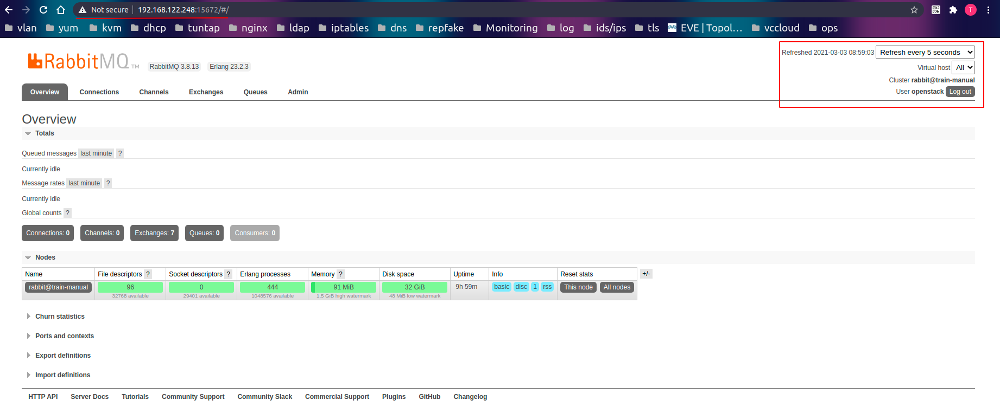

# Hướng dẫn cài đặt openstack all in one bằng phương pháp cài manual.

## 1. Mô hình.
Tất cả các project sẽ nằm trên 1 máy host.

Hệ điều hành sử dụng là CentOS-7.


## 2. Cài đặt các dịch vụ cần thiết trước khi cài đặt ops.
### 2.1 Đặt tên cho các host.

Cài đặt các tool cần thiết.

```
yum update -y
yum install vim wget -y
```
Sửa tên host.
```
echo "10.5.10.198   controller" >> /etc/hosts
```
### 2.2 Cấu hình chrony đồng bộ thời gian.
Cài đặt theo các câu lệnh sau 
```
yum install chrony -y
```
Sửa file cấu hình `/etc/chrony.conf`. Thêm các server network của việt nam
```
server 0.vn.pool.ntp.org
server 0.asia.pool.ntp.org
server 2.asia.pool.ntp.org
```
Sau đó enable và khởi động lại dịch vụ.
```
systemctl enable chronyd.service
systemctl start chronyd.service
```

Kiểm tra cấu hình đã đưọc áp dụng chưa bằng lệnh
```
chronyc sources
```


## 2.3 Cài đặt Openstack packages.

Sử dụng câu lệnh sau để cài packages ops train
```
yum install centos-release-openstack-train -y
```
Update system
```
yum upgrade -y 
```

Cài đặt openstack client cho train
```
yum install python-openstackclient -y
```


## 2.4 Cài đặt SQL database.

Cài đặt mariadb để sử dụng cho openstack bằng câu lệnh sau.
```
yum install mariadb mariadb-server python2-PyMySQL -y
```
Tạo và cấu hình mysqld trong file `etc/my.cnf.d/openstack.cnf`
```
[mysqld]
bind-address = 10.5.10.198

default-storage-engine = innodb
innodb_file_per_table = on
max_connections = 4096
collation-server = utf8_general_ci
character-set-server = utf8
```

Sau đó enable và khởi động lại dịch vụ.
```
systemctl enable mariadb.service
systemctl start mariadb.service
```
Tiếp đến cài đặt mất khẩu root cho mariadb bằng lệnh 
```
mysql_secure_installation
```
Sau đó đọc và làm theo các bước.


### 2.5 Cài đặt message queue 

Messague sử dụng ở đây là RabbitMQ.
Trước khi cài đặt RabbitMQ ta phải cài đặt ngôn ngũ Erlang vì đây là ngôn ngữ lấp trình lên Rabbit.
```
yum update -y

yum install epel-release -y

yum install gcc gcc-c++ glibc-devel make ncurses-devel openssl-devel autoconf java-1.8.0-openjdk-devel git wget wxBase.x86_64 -y
```

Cài đặt Erlang
```
wget http://packages.erlang-solutions.com/erlang-solutions-1.0-1.noarch.rpm

rpm -Uvh erlang-solutions-1.0-1.noarch.rpm

yum install erlang -y

```
Kiểm tra đã cài đặt thành công chưa ta sử dụng lệnh `erl`.


Như vấy ta đã cài đặt xong ngôn ngữ erlang tiếp đên ta sẽ cài đặt rabbitMQ.


```
wget https://github.com/rabbitmq/rabbitmq-server/releases/download/v3.8.14/rabbitmq-server-3.8.14-1.el7.noarch.rpm

rpm --import https://www.rabbitmq.com/rabbitmq-release-signing-key.asc

yum install rabbitmq-server-3.8.14-1.el7.noarch.rpm
```
Tắt firewalld và selinux
```
sed -i 's/SELINUX=enforcing/SELINUX=disabled/g' /etc/selinux/config

systemctl stop firewalld
systemctl disable firewalld
```

Tiếp đến enable và start dịch vụ.
```
systemctl start rabbitmq-server.service
systemctl enable rabbitmq-server.service
```

Kiểm tra trạng thái của RabbitMQ bằng lệnh `rabbitmqctl status`


Cho phép người dùng truy cập thông qua web. Để enable RabbitMQ management console, chạy dòng lệnh 
```
rabbitmq-plugins enable rabbitmq_management

chown -R rabbitmq:rabbitmq /var/lib/rabbitmq/
```
Khởi động lại rabbitmq
```
systemctl restart rabbitmq-server.service
```

Sau đó mở trình duyệt và truy cập vào địa chỉ `http://ip-address:15672/`

Username và Password mặc định của RabbitMQ Management console là “ guest “ và “ guest “. Người dùng cũng có thể tạo riêng cho mình một user openstack nếu muốn. Để thực hiện, chạy các dòng lệnh :
```
rabbitmqctl add_user openstack thanhbc_rabbitmq
rabbitmqctl set_user_tags openstack administrator
rabbitmqctl set_permissions  openstack ".*" ".*" ".*"
```


Sau khi đăng nhập thì ta sẽ được dashbroad như sau.



### 2.5 Cài đặt Memcached

Cài đặt Memcached bằng lệnh sau.
```
yum install memcached python-memcached -y
```
Mở file `/etc/sysconfig/memcached` tìm và sửa cấu hình như sau.
```
OPTIONS="-l 127.0.0.1,::1,controller"
```
Tiến hành enable và khởi động lại dịch vụ.
```
systemctl enable memcached.service
systemctl start memcached.service
```
Kiểm tra xem đã hoạt động chưa bằng lệnh `systemctl status memcached.service`

.

### 2.6 Cài đặt Etcd.

etcd là một hệ thống phân tán, mã nguồn mở, dùng để lưu trữ các giá trị key-value.

Cài đặt etcd.

```
yum install etcd -y
```

Mở file `/etc/etcd/etcd.conf` và cấu hình các thông số sau.
```
#[Member]
ETCD_DATA_DIR="/var/lib/etcd/default.etcd"
ETCD_LISTEN_PEER_URLS="http://10.5.10.198:2380"
ETCD_LISTEN_CLIENT_URLS="http://10.5.10.198:2379"
ETCD_NAME="controller"
#[Clustering]
ETCD_INITIAL_ADVERTISE_PEER_URLS="http://10.5.10.198:2380"
ETCD_ADVERTISE_CLIENT_URLS="http://10.5.10.198:2379"
ETCD_INITIAL_CLUSTER="controller=http://10.5.10.198:2380"
ETCD_INITIAL_CLUSTER_TOKEN="etcd-cluster-01"
ETCD_INITIAL_CLUSTER_STATE="new"
```

Sau đó enable và khởi động lại dịch vụ
```
systemctl enable etcd
systemctl start etcd
```
Kiểm tra trạng thái bằng lệnh `systemctl status etcd`


Như vậy là ta đã cấu hình hết các dịch vụ cho môi trường đề cài đặt openstack.

Tiếp theo là bài cài đặt và cấu hình kestone project.
