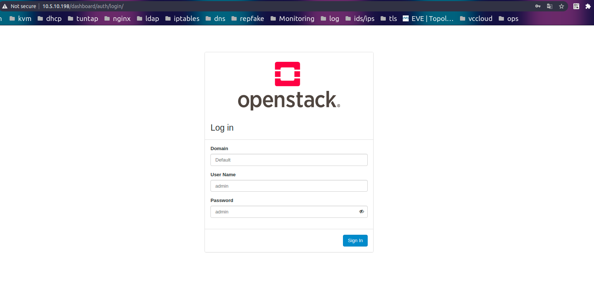
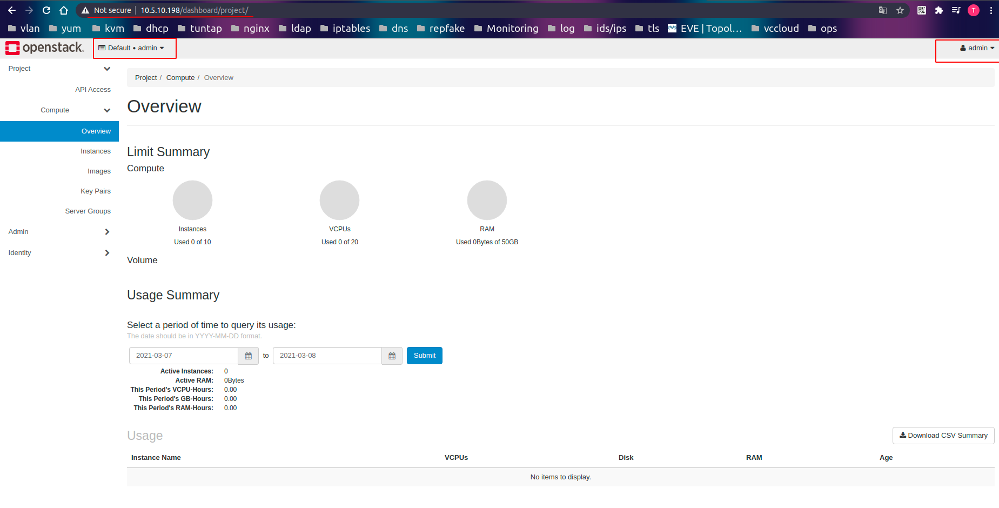

# Cài đặt horizone project.

1. Cài đặt gói horizone project.

```
yum install openstack-dashboard -y
```

2. Chỉnh sửa file cấu hình của horizone `vim /etc/openstack-dashboard/local_settings`

```
OPENSTACK_HOST = "controller"

ALLOWED_HOSTS = ['controller', '10.5.10.198', 'localhost']

SESSION_ENGINE = 'django.contrib.sessions.backends.cache'

CACHES = {
    'default': {
         'BACKEND': 'django.core.cache.backends.memcached.MemcachedCache',
         'LOCATION': 'controller:11211',
    }
}

OPENSTACK_KEYSTONE_URL = "http://%s:5000/v3" % OPENSTACK_HOST

OPENSTACK_KEYSTONE_MULTIDOMAIN_SUPPORT = True


OPENSTACK_API_VERSIONS = {
    "identity": 3,
    "image": 2,
    "volume": 3,
}


OPENSTACK_KEYSTONE_DEFAULT_DOMAIN = "Default"

OPENSTACK_KEYSTONE_DEFAULT_ROLE = "user"

OPENSTACK_NEUTRON_NETWORK = {
    ...
    'enable_router': False,
    'enable_quotas': False,
    'enable_distributed_router': False,
    'enable_ha_router': False,
    'enable_lb': False,
    'enable_firewall': False,
    'enable_vpn': False,
    'enable_fip_topology_check': False,
}

TIME_ZONE = "UTC"

WEBROOT = '/dashboard/'

```

3. Chỉnh sửa  file `/etc/httpd/conf.d/openstack-dashboard.conf`
Thêm dòng sau vào file 
```
WSGIApplicationGroup %{GLOBAL}
```
4. Khởi động lại http và memcache.
```
systemctl restart httpd.service memcached.service
```

5. Mở trình duyệt lên và đăng nhập vào openstack
```
http://10.5.10.198/dashboard
```

Đăng nhập vào domain `Defaul` với user `admin` và mật khẩu `admin` mà ta đã cấu hình.



Sau khi đăng nhập thành công sẽ hiện giao diện sau.



Vậy là ta đã cấu hình thành công horizone project.