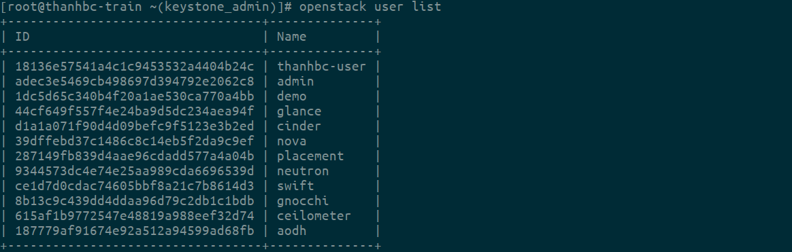

# Sử dụng lệnh curl để làm việc với Keystone api

## 1. Openstack API.
- Sử dụng OpenStack API cho phép người dùng tạo server, image, gán metadata cho instance, tạo storage container, object, v.v. Nói chung sẽ cho phép người dùng thao tác với OpenStack cloud.

Để Thao Tác Với API OpenStack, Các Phương Thực Cơ Bản
- CURL:

    - Công cụ dòng lệnh cho phép tương tác với các giao thức FTP, FTPS, HTTP, HTTPS, IMAP, SMTP, v.v.

    - Không có giao diện, chạy trên dòng lệnh, nhanh gọn.

- Openstack command-line client:

    - Mỗi Project trong OpenStack cho phép người dùng tương tác với chính nó thông qua cli. Bản chất các CLI sử dụng API OPS.

## 2. Sử dụng curl để tao tác với API.

Để bắt đầu, ta cần phải thiết lập 1 số biến môi trường (environment variables) để không phải lặp lại nhiều lần trong quá trình xác thực.

Ta có thể lưu các biến vào trong file source sử dụng lệnh `vim /root/keystone_admin`
```
unset OS_SERVICE_TOKEN
    export OS_USERNAME=admin
    export OS_PASSWORD='admin'
    export OS_REGION_NAME=RegionOne
    export OS_AUTH_URL=http://192.168.122.73:5000/v3
    export PS1='[\u@\h \W(keystone_admin)]\$ '

export OS_PROJECT_NAME=admin
export OS_USER_DOMAIN_NAME=Default
export OS_PROJECT_DOMAIN_NAME=Default
export OS_IDENTITY_API_VERSION=3
```

### 2.1 Sử dụng lệnh lấy token.

Ta sử dụng câu lệnh curl sau để lấy token id.
```
curl -i -H "Content-Type: application/json" -d '
{ "auth": {
    "identity": {
        "methods": ["password"],
        "password": {
            "user": {
              "name": "admin",
              "domain": { "name": "Default" },
              "password": "admin"
            }
          }
        },
        "scope": {
          "project": {
            "name": "admin",
            "domain": { "name": "Default" }
          }
        }
      }
}' http://192.168.122.73:5000/v3/auth/tokens
```
Sau đó ta đưcọ kết quả như sau.


Phần response phía trên đã được rút ngắn lại cho dễ đọc bởi nó chứa catalog với tất cả các endpoints nên khá dài. Lá chúng ta sử dụng Postman show respone dưới dạng JSON cho dễ nhìn.


Token id được lưu trong hàng: `X-Subject-Token`
Lưu token id vào 1 biến đến tiện cho sử dụng lần sau.
```
export OS_TOKEN=gAAAAABgQjLwGhtyW1ZoZN0Ofqd-4-6rw3Vso6X_ywLjOPOwm1XiNCUX9O5mZQgX4kz5s9rCqxmY4w0pF-eYOvcBvRyDzanScYSlbYsVCCxZyjPMdcTR85k_WGNSvwVCp9BF5CoNV_Z7c3u1-9kVCJhBa_KIGqTH6yflnChEVPNy2e4TkbTw070
```
### 2.2 Liệt kệ danh sách user list.
Ta sử dụng lệnh sau.
```
curl -s -H "X-Auth-Token: $OS_TOKEN" \
 http://192.168.122.73:5000/v3/users | python -mjson.tool
```


### 2.3 Liệt kê danh sách project list.
Ta sử dụng lệnh sau:
```
curl -s -H "X-Auth-Token: $OS_TOKEN" \
 http://192.168.122.73:5000/v3/projects | python -mjson.tool
```


### 2.4 Liệt kê danh sách group list.
Ta sử dụng câu lệnh sau.
```
curl -s -H "X-Auth-Token: $OS_TOKEN" \
 http://192.168.122.73:5000/v3/groups | python -mjson.tool
```


### 2.5 Liệt kê danh sách role list.
Ta sử dụng câu lênh.
```
curl -s -H "X-Auth-Token: $OS_TOKEN" \
 http://192.168.122.73:5000/v3/roles | python -mjson.tool
```


### 2.6 Sự dụng curl để tạo domain.
Ta sử dụng câu lệnh .
```
curl -s -H "X-Auth-Token: $OS_TOKEN" -H "Content-Type: application/json" -d '{ "domain": { "name": "thanhbc-curl"}}' http://192.168.122.73:5000/v3/domains | python -mjson.tool
```
Kiểm tra kết quả.


### 2.7 Sử dụng curl tạo user.
```
curl -s -H "X-Auth-Token: $OS_TOKEN" -H "Content-Type: application/json" -d '{ "user": { "name": "thanhbc-user-curl", "password": "thanhbc-ops", "email": "bobama532@gmail.com", "domain_id": "dd470609447a4e5c9f8c8ffd9540ba35", "description": "user duoc tao bang lenh curl"}}' http://192.168.122.73:5000/v3/users | python -mjson.tool
```
Kiểm tra kết quả.


## 3. Sử dụng openstack command đê tương tac với các API.

### 3.1 Lấy thông số token.


```
openstack token issue
``` 


Ta sẽ lấy dc token id là: `gAAAAABgQjIIv2ooM1OE-Cdj2y6sRB1xjx-9bi_N5bbHQB8XqOw1cHKls1H65K489ulKQO0xh3fVssVmT81xlT47jceHKXWIbW5hwhxiFL3vKLtP1AEh2RC0MJjVPMD0Otlw_0u5G55ygG4Gix3Wf85Z5UQQn0gOEAOfEPgHPcLGBByy1kLKS-w`

### 3.2 Liệt kê danh sách user 

```
openstack user list
```



### 3.3 Liêt kê danh sách domain.
```
openstack domain list
```

### 3.4 Liệt kê danh sách project.
```
openstack project list
```

### 3.4 Liệt kê danh sách role 
```
openstack role list
```


Xem thêm về các câu lệnh [tại đây](https://docs.openstack.org/python-openstackclient/latest/cli/command-list.html)


## 4. Sử dụng postman tương tác với openstack.

Ta sử dụng  Phương thực POST tới url và có phần body của request như sau.


Sau khi `send` ta sẽ nhận được token có các thuộc tính như sau.


Trong đó:
- `is_domain`: nó không có scope là domain.
- `menthos`: phương thức xác thực ở đâu sử dụng là password.
- `roles`: Chứa thông tin các role.
- `expires_at` :thời gian hết hạn
- `project`: tên project
- `catalog`: Chứa các endpoints, type, id, name của các user.
- `user`: thông tin user.
- `audit_ids`:
- `issue_at` : thời gian cấp phát.

Đối với các thao tac như show list user, domain, project, role thì t sử dụng phần payload vủa curl để truyền vào  phần body trong postman sẽ show ra các kết quả tương tự.


Trên postman có thể sử dụng các phương thức như POST, GET, DELETE. Nên trên postman có nhiều thao tac hơn so với sử dụng curl.


