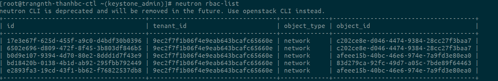

# RBAC là gì và cấu hình cơ bản.

## 1. RBAc là gì ?
RBAC viết tắt của Role-based access control.

Trong các phiên bản openstack cũ, Neutron cung cấp cho người dùng tính năng chia sẻ tài nguyên mạng giữa các tenant(project). Khi 1 tài nguyên mạng được chỉ định là **shared**, thì nó sẽ được chia sẻ cho tất cả các tenant trong môi trường openstack. Điều này có nghĩa, 1 tài nguyên chỉ có thể shared cho tất cả hoặc không shared cho bất kì tenant nào (all-or-nothing). Điều này gây ra nhiều bất tiện và đôi khi, dẫn tới cả các rủi ro về bảo mật và quyền riêng tư.

Để giải quyết vấn đề này, từ phiên bản liberty, openstack cung cấp tính năng role-based access control cho network (RBAC), cho phép người dùng có thể chỉ định việc chia sẻ tài nguyên mạng với 1 nhóm tenant xác định. 

### 1.1 RBAC command
Để quản lí RBAC, neutron cung cấp 1 số api mới trong neutron client:
```
openstack +
            rbac-create
            rbac-delete
            rbac-list
            rbac-show
            rbac-update
```
Từ những api này ta có thể tạo nên role-based access controll table với các entries quy định việc chia sẻ tài nguyên mạng giữa các tenant thông qua  object type, target tenant, action và RBAC_OBJECT

    usage: rbac-create [-h] [-f {html,json,shell,table,value,yaml}] [-c COLUMN]
                   [--max-width <integer>] [--prefix PREFIX]
                   [--request-format {json,xml}] [--tenant-id TENANT_ID]
                   --type {network} [--target-tenant TARGET_TENANT] --action
                   {access_as_external,access_as_shared}
                   RBAC_OBJECT

- object type: kiểu tài nguyên cần chia sẻ (network, port, subnet...) Hiện tại mới chỉ support việc chia sẻ tài nguyên network.
- target tenant: là UUID của tenant được share phần tài nguyên này
- action: access_as_external hoặc access_as_shared
- RBAC_OBJECT: là UUID của phần tài nguyên muốn chia sẻ

Để tạo 1 RBAC policy, trước tiên ta tạo 3 tenant A B C với các user tương ứng là thanhbc, userB và userC:

```
openstack project create tennatA
openstack project create tenantB --description "tenantB"
openstack project create tenantC --description "tenantC"
```

Tạo các user và add các role vào các user đó.
```
openstack user create thanhbc --password thanhbc
openstack role add --project tennatA --user thanhbc roles-thanhbc

openstack user create userB --password b
openstack role add --project tenantB --user userB roles-thanhbc

openstack user create userC --password c
openstack role add --project tenantC --user userC roles-thanhbc
```
Sau khi tạo ta sẽ kiểm tra lại:


Tiếp theo, tạo 1 network có tên rbac-network với user admin: 
```
neutron net-create rbac-network
```
 
Ở đây ta để ý trường shared network được set là false, tức là chỉ được sử dụng bởi user admin. Nếu trường này được set là true, vùng mạng này sẽ được chia sẻ cho tất cả các tenant, đây là điều mà ta không mong muốn.

Tạo 1 subnet trong vùng mạng này:

```
neutron subnet-create rbac-network 192.168.100.0/24
```

### 1.2 Tạo RBAC policy

Ta sẽ gán quyền truy cập vào network rbac-net cho các user trong tenantA thông qua rbac policy. Nhưng trước tiên, ta kiểm tra sự tồn tại của rbac-net: 

Đăng nhập với user admin, ta thấy sự xuất hiện của rbac-net: 


Đăng nhập bằng thanhbc thuộc tenantA, không thấy sự xuất hiện của dải mạng này:


Kiểm tra xem network và lấy ip của network vừa tạo bằng lệnh `openstack network list`

Để gán quyền truy cập rbac-net cho tenantA, ta tạo 1 rbac policy có dạng:

    $ neutron rbac-create --type network --target-tenant c599dae694d7427b8464638ea647e239 --action access_as_shared afeee15b-40bc-46e6-974e-7a9fd3e80ea0

trong đó target-tenant là id của tenantB, rbac-object là id của dải mạng rbac-network.


`neutron rbac-list` sẽ show tất cả các RBAC policy đã tạo:



Kiểm tra lại trên tenanB, thấy xuất hiện dải mạng rbac-network:


Từ đây trên tenantA có thể tạo các VM có port thuộc dải mạng này. Kiểm tra trên user admin, ta thấy trên dải mạng rbac-net xuất hiện port của VM vừa mới được tạo: 


### 2.3 Tạo vm sử dụng dải mạng vừa tạo.

Ta tạo VM bằng userB sử dụng dải mạng rbac-network:


UserC do không có quyền truy cập dải mạng này nên việc boot VM sử dụng dải rbac-net không thực hiện được:


Để xóa 1 RBAC policy, ta sử dụng lệnh 
```
neutron rbac-delete {rbac-policy-id}
```
Nhưng trước tiên cần xóa các port gắn trên dải mạng đang được share.

Tài liệu tham khảo:

[1] : https://developer.rackspace.com/blog/A-First-Look-at-RBAC-in-the-Liberty-Release-of-Neutron/

[2] : http://docs.openstack.org/liberty/networking-guide/adv-config-network-rbac.html

[3] : http://specs.openstack.org/openstack/neutron-specs/specs/liberty/rbac-networks.html
[4] : https://github.com/hocchudong/ghichep-OpenStack/blob/master/04-Neutron/RBAC-policy.md