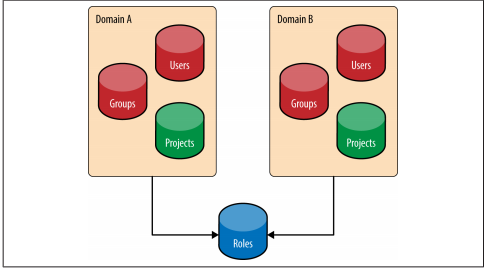

# Nhiệm vụ, chức năng và thành phần chính của keystone 

## 1. Nhiệm vụ của keystone.

Cung cấp dịch vụ xác thực cho toàn bộ hạ tầng OpenStack

- Theo dõi người dùng và quyền hạn của họ
- Cung cấp một catalog của các dịch vụ đang sẵn sàng với các API endpoints để truy cập các dịch vụ đó

## 2. Chức năng của keystone.
Keystone có 3 chức năng chính.
### 2.1 Identity

- Nhận diện những người đang cố truy cập vào các tài nguyên cloud

- Trong keystone, identity thường được hiểu là User

- Tại những mô hình OpenStack nhỏ, identity của user thường được lưu trữ trong database của keystone. Đối với những mô hình lớn cho doanh nghiệp thì 1 external Identity Provider thường được sử dụng.

### 2.2 Authentication

- Là quá trình xác thực những thông tin dùng để nhận định user (user's identity) 

- Keystone có tính pluggable tức là nó có thể liên kết với những dịch vụ xác thực người dùng khác như LDAP hoặc Active Directory.

- Thường thì keystone sử dụng Password cho việc xác thực người dùng. Đối với những phần còn lại, keystone sử dụng tokens.

- Openstack dựa rất nhiều vào tokens để xác thực và keystone chính là dịch vụ duy nhất có thể tạo ra tokens.

- Token có giới hạn về thời gian được phép sử dụng. Khi token hết hạn thì user sẽ được cấp một token mới. Cơ chế này làm giảm nguy cơ user bị đánh cắp token.

Hiện tại, keystone đang sử dụng cơ chế  `bearer token`. Có nghĩa là bất cứ ai có token thì sẽ có khả năng truy cập vào tài nguyên của cloud. Vì vậy việc giữ bí mật token rất quan trọng.

### 2.3 Access Management (Authorization)

- Access Management hay còn được gọi là Authorization là quá trình xác định những tài nguyên mà user được phép truy cập tới.

- Trong OpenStack, keystone kết nối users với những Projects hoặc Domains bằng cách gán role cho user vào những project hoặc domain ấy.

- Các projects trong OpenStack như Nova, Cinder...sẽ kiểm tra mối quan hệ giữa role và các user's project và xác định giá trị của những thông tin này theo cơ chế các quy định (policy engine). Policy engine sẽ tự động kiểm tra các thông tin (thường là role) và xác định xem user được phép thực hiện những gì.

## 2. WorkFlow của keystone.

 
- Cung cấp giao diện xác thực và quản lí truy cập cho các services của OpenStack. Nó cũng đồng thời lo toàn bộ việc giao tiếp và làm việc với các hệ thống xác thực bên ngoài.

- Cung cấp danh sách đăng kí các containers (“Projects”) mà nhờ vậy các services khác của OpenStack có thể dùng nó để "tách" tài nguyên (servers, images,...)

- Cung cấp danh sách đăng kí các Domains được dùng để định nghĩa các khu vực riêng biệt cho users, groups, và projects khiến các khách hàng trở nên "tách biệt" với nhau.

- Danh sách đăng kí các Roles được keystone dùng để ủy quyền cho các services của OpenStack thông qua file policy.

- Assignment store cho phép users và groups được gán các roles trong projects và domains.

## 3. Các thành phần trong Keystone 

### 3.1 Domains
- Trong thời kì đầu, không có bất cứ cơ chế nào để hạn chế sự truy cập của các project tới những nhóm user khác nhau. Điều này có thể gây ra những sự nhầm lẫn hay xung đột không đáng có giữa các tên của project của các tổ chức khác nhau.

- Tên user cũng vậy và nó hoàn toàn cũng có thể dẫn tới sự nhầm lẫn nếu hai tổ chức có user có tên giống nhau.

- Vì vậy mà khái niệm Domain ra đời, nó được dùng để cô lập danh sách các Projects và Users.

- Domain được định nghĩa là một tập hợp các users, groups, và projects. Nó cho phép người dùng chia sẻ nguồn tài nguyên cho từng tổ chức sử dụng mà không phải lo xung đột hay nhầm lẫn.

### 3.2 Projects
- Trong Keystone, Project được dùng bởi các services của OpenStack để nhóm và cô lập các nguồn tài nguyên. Nó có thể được hiểu là 1 nhóm các tài nguyên mà chỉ có một số các user mới có thể truy cập và hoàn toàn tách biệt với các nhóm khác.

- Ban đầu nó được gọi là tenants sau đó được đổi tên thành projects.

- Mục đích cơ bản nhất của keystone chính là nơi để đăng kí cho các projects và xác định ai được phép truy cập projects.

- Bản thân projects không sở hữu users hay groups mà users và groups được cấp quyền truy cập tới project sử dụng cơ chế gán role.

### 3.3 Users and User Groups (Actors)
- Trong keystone, Users và User Groups là những đối tượng được cấp phép truy cập tới các nguồn tài nguyên được cô lập trong domains và projects.

- Groups là một tập hợp các users. Users và User Groups được gọi là Actors.

Mối quan hệ giữa domains, projects, users, và groups:

### 3.4 Roles
- Roles được dùng để hiện thực hóa việc cấp phép trong keystone. Một actor có thể có nhiều roles đối với từng project khác nhau.

### 3.5 Assignment
- Role assignment là sự kết hợp của actor, target và role.
- Role assignment được cấp phát, thu hồi, và có thể được kế thừa giữa các users, groups, project và domains.
### 3.6 Targets
- Projects và Domains đều giống nhau ở chỗ cả hai đều là nơi mà role được "gán" lên. Vì thế chúng được gọi là targets.

### 3.7 Catalog
- Chứa URLs và endpoints của các services khác nhau.
Nếu không có Catalog, users và các ứng dụng sẽ không thể biết được nơi cần chuyển yêu cầu để tạo máy ảo hoặc lưu dữ liệu.

- Service này được chia nhỏ thành danh sách các endpoints và mỗi một endpoint sẽ chứa admin URL, internal URL, and public URL.

