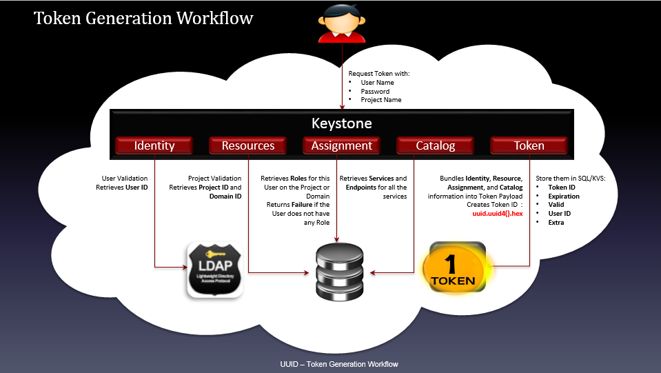

# Tìm hiểu về token trong keystone.

## 1. Token là gì.
- Để user truy cập bất cứ OpenStack API nào thì user cần chúng minh họ là ai và họ được phép gọi tới API. Để làm được điều này, họ cần có token và "dán" chúng vào "API call". Keystone chính là service chịu trách nhiệm tạo ra tokens.

- Sau khi được xác thực thành công bởi keystone thì user sẽ nhận được token. Token cũng chứa các thông tin ủy quyền của user trên cloud.

- Token bao gồm phần ID và payload. ID được dùng để đảm bảo rằng nó là duy nhất trên mỗi cloud và payload chứa thông tin của user.

## 2. Các loại token trong keystone.

### 2.1 `UUID Tokens`

- UUID là token format đầu tiên của keystone, nó đơn giản chỉ là một chuỗi UUID gồm 32 kí tự được generate random. Nó được xác thực bởi identity service. Phương thức hexdigest() được sử dụng để tạo ra chuỗi kí tự hexa. Điều này khiến token URL trở nên an toàn và dễ dàng trong việc vận chuyển đến các môi trường khác.

- UUID token bược phải được lưu lại trong một backend (thường là database). Nó cũng có thể được loại bỏ bằng các sử dụng DELETE request với token id. Tuy nhiên nó sẽ không thực sự bị loại bỏ khỏi backend mà chỉ được đánh dấu là đã được loại bỏ. Vì nó chỉ có 32 bytes nên kích thước của nó trong HTTP header cũng sẽ là 32 bytes.

- Loại token này rất nhỏ và dễ sử dụng quy nhiên nếu sử dụng nó, Keystone sẽ là "cổ chai" của hệ thống bởi mọi cuộc giao tiếp đều cần tới keystone để xác thực token.

- UUID thường dc lưu đinh danh cho các dịch vụ trong openstack.

### 2.1.1 Token Generation Workflow


- User request tới keystone tạo token với các thông tin: user name, password, project name

- Dịch vụ Identity: Chứng thực user thông qua `User ID` từ backend LDAP or SQL.

- Dịch vụ Resources: Chứng thực project, thu thập thông tin Project ID và Domain ID từ Backend SQL.

- Dịch vụ Assignment: Lấy ra Roles từ Backend trên Project hoặc Domain tương ứng trả về cho user, nếu user không có bất kỳ roles nào thì trả về Failure()

- Dịch vụ Catalog: Thu thập các Services và các Endpoints của các service đó.

Tổng hợp các thông tin về Identity, Resources, Assignment, Catalog ở trên đưa vào Token payload, tạo ra token sử dụng hàm `uuid.uuid4().hex`

Lưu thông tin của Token vào SQL/KVS backend với các thông tin: TokenID, Expiration, Valid, UserID, Extra


### 2.1.2. Token Validation Workflow (Quá trình thẩm định token)


- Ngưởi dùng gửi yêu cầu chứng thực token sử dụng API: GET v3/auth/tokens và token (X-Subject-Token, X-Auth-Token)

- Thu thập token payloads từ token backend KVS/SQL kiểm tra trường valid. Nếu không hợp lệ trả về thông báo Token Not Found. Nếu tìm thấy chuyển sang bước tiếp theo

- Phân tích token và thu thập metadata: User ID, Project ID, Audit ID, Token Expire.

- Kiểm tra token đã expired chưa. Nếu thời điểm hiện tại < "expired time" theo UTC thì token chưa expired, chuyển sang bước tiếp theo, ngược lại trả về thông báo token not found
Kiểm tra xem token đã bị thu hồi chưa (kiểm tra trong bảng revocation_event của database keystone)

- Nếu token đã bị thu hồi (tương ứng với 1 event trong bảng revocation_event) trả về thông báo Token Not Found. Nếu chưa bị thu hồi trả về token (truy vấn HTTP thành công HTTP/1.1 200 OK )

### 2.1.3 Token Revocation Workflow ( Quá trình thu hồi token)


- Người dùng yêu cầu thu hồi token với API request DELETE v3/auth/tokens. Trước khi thực hiện sự kiện thu hồi token thì phải chứng thực token nhờ vào tiến trình Token Validation Workflow đã trình bày ở trên.

- Kiểm tra trường Audit ID. Nếu có, tạo sự kiện thu hồi với audit id. Nếu không có audit id, tạo sự kiện thu hồi với token expired

- Nếu tạo sự kiện thu hồi token với audit ID, các thông tin cần cập nhật vào revocation_event table của keystone database gồm: audit_id, revoke_at, issued_before.

- Nếu tạo sự kiện thu hồi token với token expired, các thông tin cần thiết cập nhật vào revocation_event table của keystone database gồm: user_id, project_id, revoke_at, issued_before, token_expired.

- Loại bỏ các sự kiện của các token đã expired từ bảng revocation_event của database "keystone"

- Cập nhật vào token database, thiết lập lại trường "valid" thành false (0)


### 2.1.4. Multiple Data Centers


- UUID Token không hỗ trợ xác thực và ủy quyền trong trường hợp multiple data centers bởi token được lưu dưới dạng persistent (cố định và không thể thay đổi). 
- Như ví dụ mô tả ở hình trên, một hệ thống cloud triển khai trên hai datacenter ở hai nơi khác nhau. Khi xác thực với keystone trên datacenter US-West và sử dụng token trả về để request tạo một máy ảo với Nova, yêu cầu hoàn toàn hợp lệ và khởi tạo máy ảo thành công. Trong khi nếu mang token đó sang datacenter US-East yêu cầu tạo máy ảo thì sẽ không được xác nhận do token trong backend database US-West không có bản sao bên US-East.

### 2.2 `PKI Tokens`

- Token này chứa một lượng khá lớn thông tin ví dụ như: thời gian nó được tạo, thời gian nó hết hiệu lực, thông tin nhận diện người dùng, project, domain, thông tin về role cho user, danh mục dịch vụ,... Tất cả các thông tin này được lưu ở trog phần payload của file định dạng JSON. Phần payload được "signed" theo chuẩn X509 và đóng gói dưới dạng cryptographic message syntax (CMS). Với PKIz thì phần payload được nén sử dụng zlib.


- Muốn gửi token qua HTTP, JSON token payload phải được mã hóa base64 với 1 số chỉnh sửa nhỏ. Cụ thể, Format=CMS+[zlib] + base64. Ban đầu JSON payload phải được ký sử dụng một khóa bất đối xứng(private key), sau đó được đóng gói trong CMS (cryptographic message syntax - cú pháp thông điệp mật mã). Với PKIz format, sau khi đóng dấu, payload được nén lại sử dụng trình nén zlib. Tiếp đó PKI token được mã hóa base64 và tạo ra một URL an toàn để gửi token đi..
 
Dưới đây là ví dụ của token được dùng để vận chuyển:
```
MIIDsAYCCAokGCSqGSIb3DQEHAaCCAnoEggJ2ew0KICAgICJhY2QogICAgICAgI...EBMFwwVzELMAkGA
1UEBhMCVVMxDjAMBgNVBAgTBVVuc2V0MCoIIDoTCCA50CAQExCTAHBgUrDgMQ4wDAYDVQQHEwVVbnNldD
EOMAwGA1UEChM7r0iosFscpnfCuc8jGMobyfApz/dZqJnsk4lt1ahlNTpXQeVFxNK/ydKL+tzEjg
```
- Kích cỡ của token nếu có 1 endpoints trong danh mục dịch vụ đã rơi vào khoảng 1700 bytes. Với những hệ thống lớn, kích cỡ của nó sẽ vượt mức cho phép của HTTP header (8KB).

- Ngay cả khi được nén lại trong PKIz format thì vấn đề cũng không được giải quyết khi mà nó chỉ làm kích thước token nhỏ đi khoảng 10%.

- Mặc dù PKI và PKIz token có thể được cache, nó vẫn có một vài khuyết điểm. Sẽ là khá khó để cấu hình keystone sử dụng loại token này. Thêm vào đó, kích thước lớn của nó cũng ảnh hưởng đến các service khác và rất khó khi sử dụng với cURL. Ngoài ra, keystone cũng phải lưu những token này trong backend vì thế người dùng vẫn sẽ phải flushing the Keystone token database thường xuyên.


Để config PKI token, chúng ta cần sử dụng 3 loại certificates:

- Signing Key tạo ra private key dưới định dạng PEM
- Signing Certificates
Sử dụng Signing Key để tạo ra CSR (Certificate Signing Request)
Submit CSR tới CA (Certificate Authority)
Nhận lại chứng chỉ xác thực (cetificate) từ CA (certificate authority)
- Certificate Authority Certificate

### 2.2.1. Token Generation Workflow


- Người dùng gửi yêu cầu tạo token với các thông tin: User Name, Password, Project Name

- Keystone sẽ chứng thực các thông tin về Identity, Resource và Asssignment (định danh, tài nguyên, assignment)
Tạo token payload định dạng JSON

- Sign JSON payload với Signing Key và Signing Certificate , sau đó được đóng gói lại dưới định dang CMS (cryptographic message syntax - cú pháp thông điệp mật mã)

- Bước tiếp theo, nếu muốn đóng gói token định dạng PKI thì convert payload sang UTF-8, convert token sang một URL định dạng an toàn. Nếu muốn token đóng gói dưới định dang PKIz, thì phải nén token sử dụng zlib, tiến hành mã hóa base64 token tạo ra URL an toàn, convert sang UTF-8 và chèn thêm tiếp đầu ngữ "PKIZ"

- Lưu thông tin token vào Backend (SQL/KVS)


### 2.2.2. Token Validation Workflow


Vì id được generate bằng hàm hash của token nên quá trình validate token sẽ bắt đầu bằng việc sử dụng hàm hash để "băm" PKI token. Các bước sau đó (validate trong backend...) hoàn toàn giống với uuid.

### 2.2.3. Token Revocation Workflow

- Hoàn toàn tương tự như tiến trình thu hồi UUID token

### 2.2.4. Multiple Data Centers


- PKI và PKIz không thực sự support mutiple data centers. Các backend database ở hai datacenter phải có quá trình đồng bộ hoặc tạo bản sao các PKI/PKIz token thì mới thực hiện xác thực và ủy quyền được.

### 2.3 `Fernet Tokens`

- Đây là loại token mới nhất, nó được tạo ra để khắc phục những hạn chế của các loại token trước đó. 
    - Thứ nhất, nó khá nhỏ với khoảng 255 kí tự, lớn hơn UUID nhưng nhỏ hơn rất nhiều so với PKI. Token này cũng chứa vừa đủ thông tin để cho phép nó không cần phải được lưu trên database.

    - Thứ 2 nó chứa một lượng nhỏ dữ liệu ví dụ như thông tin để nhận diện người dùng, project, thời gian hết hiệu lực,...Nó được sign bởi symmetric key để ngăn ngừa việc giả mạo. Cơ chế hoạt động của loại token này giống với UUID vì thế nó cũng phải được validate bởi Keystone.

- Một trong những vấn đề của loại token này đó là nó dùng symmetric key để mã hóa token và các keys này buộc phải được phân phối lên tất cả các region của OpenStack.

Các trường của Fernet token

- Fernet Format Version (0x80) - 8 bits, biểu thị phiên bản của định dạng token.(0,1,2)

- Current Timestamp – số nguyên 64-bit không dấu, chỉ nhãn thời gian tính theo giây, tính từ 1/1/1970, chỉ ra thời điểm token được tạo ra.

- Initialization Vector (IV) – key 128 bits sử dụng mã hóa AES và giải mã Ciphertext

- Ciphertext: là keystone payload kích thước biến đổi tùy vào phạm vi của token. Cụ thể hơn, với token có phạm vi project, Keystone Payload bao gồm: version, user id, method, project id, expiration time, audit ids

- HMAC: 256-bit SHA256 HMAC (Keyd-Hash Messasge Authentication Code) - Mã xác thực thông báo sử dụng hàm một chiều có khóa với signing key kết nối 4 trường ở trên.

### 2.3.1 Các loại fernet keys.
Thêm vào đó, keys cũng cần được rotated.

File fernet key /etc/keystone/fernet-keys => 0 1 2 3 4

Số key mặc định là 3 và dc cấu hình trong file `/etc/keystone.conf`


Các loại fernet keys:

- `Loại 1: Primary key`

    - Dùng để mã hóa và giải mã
    - Mặc định là file name có số index cao nhất

- `Loại 2: Secondary key`

    - Chỉ được dùng để giải mã
    - Mặc định là file name có số index nằm giữa private key và staged key.

- `Loại 3: Staged key`

    - Giải mã và chuẩn bị để chuyển thành primary key
    - Mặc định là file name nhỏ nhất (0)


### 2.3.2 Token Generation Workflow


Với key và message nhận được, quá trình tạo fernet token như sau:

- Ghi thời gian hiện tại vào trường timestamp
- Lựa chọn một IV duy nhất
- Xây dựng ciphertext:
- Padd message với bội số là 16 bytes (thao tác bổ sung một số bit cho văn bản trong mã hóa khối AES)
- Mã hóa padding message sử dụng thuật toán AES 128 trong chế độ CBC với IV đã chọn và encryption-key được cung cấp
- Tính toán trường HMAC theo mô tả trên sử dụng signing-key mà người dùng được cung cấp
- Kết nối các trường theo đúng format token ở trên
- Mã hóa base64 toàn bộ token

### 2.3.3 Token validation workflow


- User gửi yêu cầu xác thực token với API GET v3/auth/tokens
Khôi phục lại padding, trả lại token với padding chính xác
Decrypt sử dụng Fernet Keys để thu lại token payload
Xác định phiên bản của token payload. (Unscoped token: 0, Domain scoped payload: 1, Project scoped payload: 2 )

- Tách các trường của payload để chứng thực. Ví dụ với token trong tầm của project gồm các trường sau: user id, project id, method, expiry, audit id

- Kiểm tra xem token đã hết hạn chưa. Nếu thời điểm hiện tại lớn hơn so với thời điểm hết hạn thì trả về thông báo "Token not found". Nếu token chưa hết hạn thì chuyển sang bước tiếp theo

- Kiểm tra xem token đã bị thu hồi chưa. Nếu token đã bị thu hồi (tương ứng với 1 sự kiện thu hồi trong bảng revocation_event của database keystone) thì trả về thông báo "Token not found". Nếu chưa bị thu hồi thì trả lại token (thông điệp phản hồi thành công HTTP/1.1 200 OK)

### 2.3.5. Multiple data centers

Vì Fernet key không cần phải được lưu vào database mà nó được tạo ra và lưu trên cache nên nó có thể hỗ trợ multiple data center. Tuy nhiên keys sẽ phải được phân phối tới tất cả các regions.

### 2.4 Fernet Key rotation

Quá trình rotate fernet key:


Giả sử triển khai hệ thống cloud với keystone ở hai bên us-west và us-east. Cả hai repo này đều được thiết lập với 3 fernet key như sau:


```
$ ls /etc/keystone/fernet-keys
0 1 2
```
Ở đây 2 sẽ trở thành Primary Key để mã hóa fernet token. Fernet tokens có thể được mã hóa sử dụng một trong 3 key theo thứ tự là 2, 1, 0. Giờ ta quay vòng fernet key bên us-west, repo bên này sẽ đươc thiết lập như sau:
```
$ ls /etc/keystone/fernet-keys
0 1 2 3
```
Với cấu hình như trên, bên us-west, 3 trở thành Primary Key để mã hóa fernet token. Khi keystone bên us-west nhận token từ us-east (mã hóa bằng key 2), us-west sẽ xác thực token này, giải mã bằng 4 key theo thứ tự 3, 2, 1, 0. Keystone bên us-east nhận fernet token từ us-west (mã hóa bằng key 3), us-east xác thực token này vì key 3 bên us-west lúc này trở thành staged key (0) bên us-east, keystone us-east giải mã token với 3 key theo thứ tự 2, 1, 0. Có thể cấu hình giá trị max_active_keys trong file /etc/keystone.conf để quy định tối đa số key tồn tại trong keystone. Nếu số key vượt giá trị này thì key cũ sẽ bị xóa.