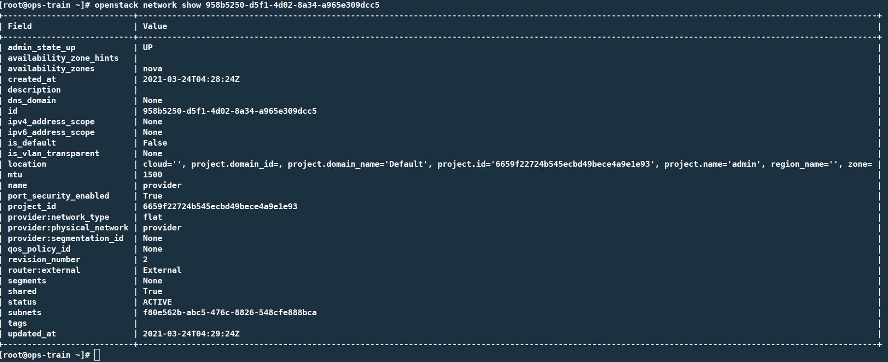

# Các lệnh cơ bản thường dùng trong Neutron

## 1. Tạo mới network
- Provider network

  ``` sh
  openstack network create --share --provider-physical-network <tên provider network> \
  --provider-network-type <kiểu network> <tên-network>
  ```
- Self-service network

  ```
  openstack network create <tên network
  ```

## 2. Liệt kê danh sách network

```
openstack network list
```


## 3. Hiển thị thông tin chi tiết của network

```
openstack network show <tên hoặc ID của network>
```

## 4. Xem danh sách các router

```
openstack router list
```

- Xóa router

```
openstack router delete <tên hoặc ID của router>
```

- Tạo mới router

```
openstack router create <tên router>
```

- Gán port cho router

``` sh
openstack router add subnet <tên router> <tên mạng gán vào router>
neutron router-gateway-set <tên router> <tên mạng gán vào gateway>
```

## 5. Tạo mới subnet

``` sh
openstack subnet create --subnet-range 172.16.1.0/24 --gateway 172.16.1.1 --network provider --allocation-pool start=172.16.1.242,end=172.16.1.250 --dns-nameserver 8.8.8.8 provider
```


- Xem danh sách các subnets

```
openstack subnet list
```


## 6. Tạo mới floating ip

```
openstack ip floating create <network>
```

- Hiển thị danh sách các floating ip

```
openstack floating ip  list
```

- Gán floating ip vào server

```
openstack ip floating add <ip-address> <server>
```

- Tạo mới security group

```
openstack security group create <tên security group>
```

- Xem danh sách security group

```
openstack security group list
```

- Tạo mới security group rule

```
openstack security group rule create --remote-ip <ip-address> --dst-port <port-range>  --protocol <protocol> --ingress|--egress  <tên group>
```

Xem thêm về các câu lệnh [tại đây](https://docs.openstack.org/python-openstackclient/latest/cli/command-list.html)