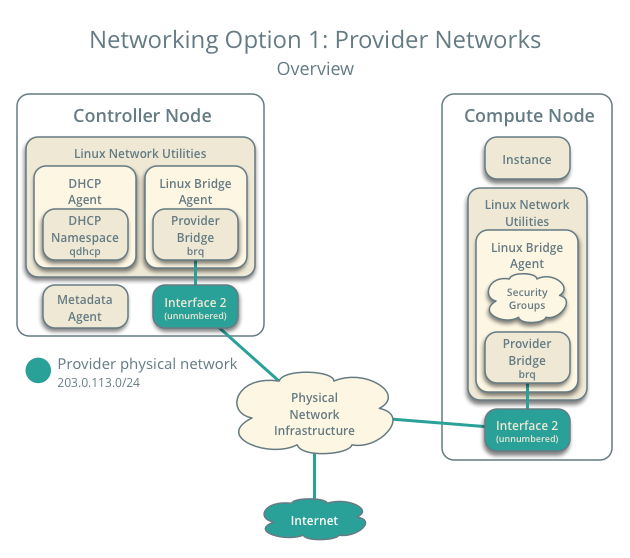

# Tìm hiểu 2 kiểu mạng provider và self-service.

## 1. Provider network 

Provider network là network sử dụng mạng kết nối giữa các instance với hạ tầng mạng vật lý thông qua các giao thực chuyển mạch lớp 2 và các kỹ thuật như linux bridge hoặc openvswitch.
Dưới đây là  hình ảnh sơ đồ kết nối tổng quan của provider network.

Sơ đồ kết nối các thành phần trong provider network

## 2. Self-server network.

Self-service là mạng  kết nối giữa mạng nội bộ trong openstack với mạng vật lý thông qua NAT. Mạng này bao gồm cả DHCP server và cung cấp metadata service cho các instance.
Mạng sefl-service  sử dụng các giao thức overlay như VXLAN hoặc GRE chúng hỗ trợ nhiều network hơn layer-2.

Sơ đồ tông quan của sefl-service network.

Sơ đồ kết nối các thành phần trong cả mạng provider và mạng self-service.

## 3. Quá trình gói tin di chuyển từ instance qua linux bridge ra internet.

### 3.1 Gói tin đi qua các thành phân mạng provider.

1. Máy ảo chuyển gói tin từ interface (1) tới interface của provider bridge (2) qua veth pair
2. Security group rules (3) trên provider bridge sẽ quản lí và giám sát traffic.
3. VLAN sub-interface port (4) trên provider bridge chuyển gói tin tới physical network interface (5).
4. Physical network interface (5) gán VLAN tag (101) vào cho packets và chuyển nó tới switch vật lí (6).
5. Switch vật lí bỏ VLAN tag 101 từ packets và chuyển nó tới router (7)
6. Router định tuyến packets từ provider network (8) sang external network (9) và chuyển nó tới switch (10)
7. Switch chuyển tiếp packet tới external network (11)
External network (12) nhận packets.

### 3.2 Gói tin đi qua self-service.

1. Interface của máy ảo(1) sẽ chuyển packets tới self-service bridge port (2) thông qua veth pair.
2. Security group rules (3) trên self-service bridge sẽ kiểm soát giám sát kết nối.
3. Self-service bridge chuyển tiếp tới VXLAN interface (4), đóng dói gói tin dùng VNI 101
4. Underlying interface (5) của VXLAN sẽ forward gói tin tới network node hoặc controller node thông qua overlay network(6).
5. Underlying interface (7) của VXLAN chuyển tiếp gói tin tới VXLAN interface để "mở gói"
6. Self-service bridge router port (9) chuyển gói tin tới self-service network interface (10) trên router. Tại đây router sử dụng SNAT để chuyển đổi IP rồi gửi chúng tới gateway interface của provider network.
7. Router chuyển tiếp gói tin tới provider bridge router port (12).
8. VLAN sub-interface port (13) trên provider bridge chuyển gói tin tới provider physical network interface (14)
9. Provider physical network interface (14) gán VLAN tag 101 vào packet và chuyển tiếp nó ra ngoài internet thông qua physical network infrastructure (15).

## 4. Quá trình gói tin di chuyển từ instance qua openvswitch ra internet.

### 4.1 Gói tin đi qua các thành phần Provider.

1. Máy ảo chuyển gói tin từ interface (1) tới interface của  bridge (2) qua veth pair
2. Security group rules (3) trên provider bridge sẽ quản lí và giám sát traffic.
3. VLAN sub-interface port (4) trên provider bridge chuyển gói tin tới physical network interface (5).
4. Physical network interface (5) gán VLAN tag (101) vào cho packets và chuyển nó tới OVS intergration birdge (6).
5. Sau đó gói tin  được chuyển qua OVS Provider bridge (7)
6. Từ tun (8) gói din gửi ênđ card mạng vật lý (9).
7. Từ card vật lý gói tin được gửi đến switch vật lý (10).8. Switch vật lí bỏ VLAN tag 101 từ packets và chuyển nó tới router (12)
9. Router định tuyến packets từ provider network (8) sang external network (9) và chuyển nó tới switch (10)
10. Switch chuyển tiếp packet tới external network (11)
External network (12) nhận packets.

### 4.2 Gói tin đi qua các thành phần sefl-service.

1. Máy ảo chuyển gói tin từ interface (1) tới interface của  bridge (2) qua veth pair
2. Security group rules (3) trên provider bridge sẽ quản lí và giám sát traffic.
3. VLAN sub-interface port (4) trên provider bridge chuyển gói tin tới physical network interface (5).
4. Physical network interface (5) gán VLAN tag (101) vào cho packets và chuyển nó tới OVS intergration birdge (6).
5. Sau đó gói tin  được chuyển qua OVS Provider bridge (7)
6. Từ tun (8) gói din gửi ênđ card mạng vật lý (9).
7. Từ card vật lý gói tin được gửi đến switch vật lý (10).8. Switch vật lí bỏ VLAN tag 101 từ packets và chuyển nó tới router (12)
9. Router định tuyến packets từ provider network (8) sang external network (9) và chuyển nó tới switch (10)
10. Switch chuyển tiếp packet tới external network (11)
External network (12) nhận packets.

# Tham khảo.

1. https://github.com/trangnth/Timhieu_Openstack/blob/master/Doc/04.%20Neutron/04.%20neutron_openvswitch.md

2. https://github.com/thaonv1/meditech-thuctap/blob/master/ThaoNV/Tim%20hieu%20OpenStack/docs/neutron/neutron-openvswitch.md

3. https://blog.oddbit.com/post/2013-11-14-quantum-in-too-much-detail/