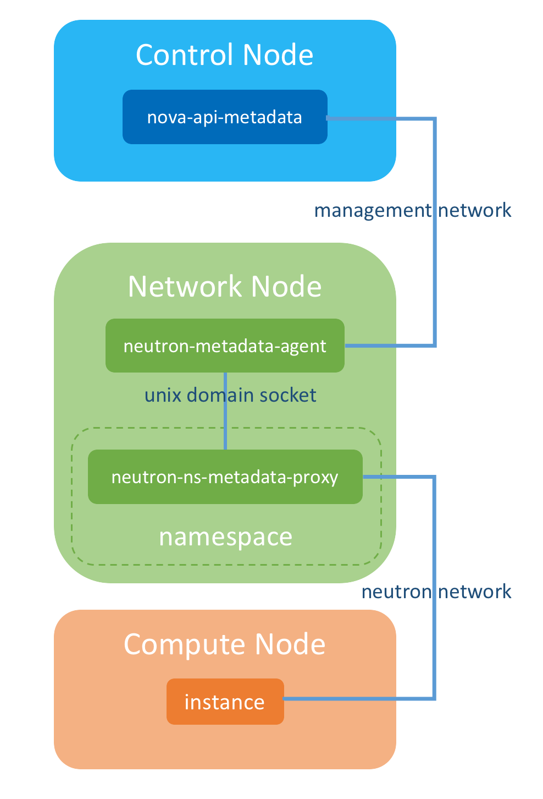
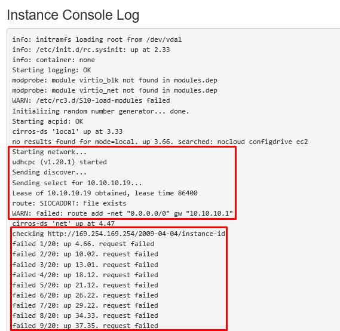
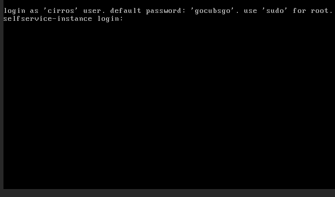
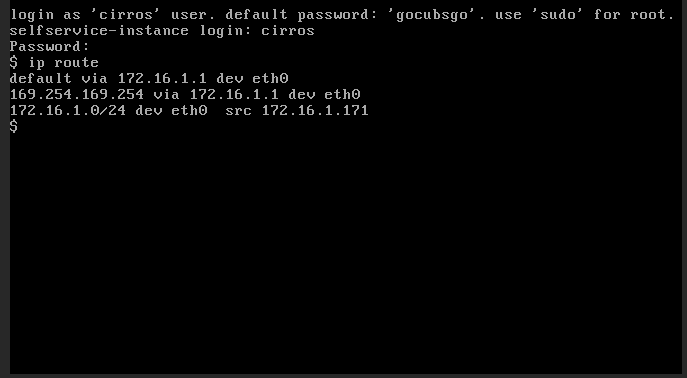
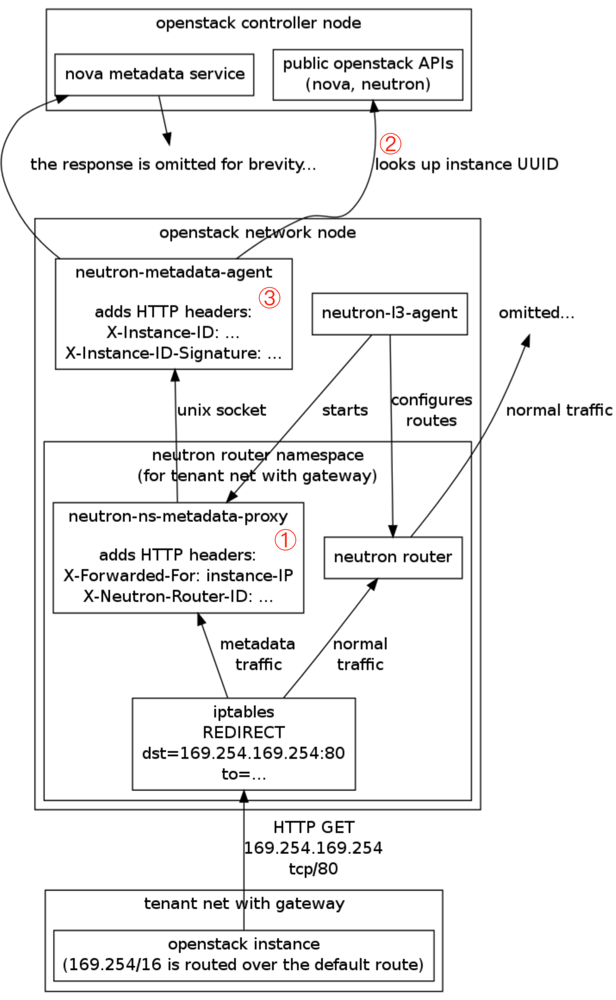
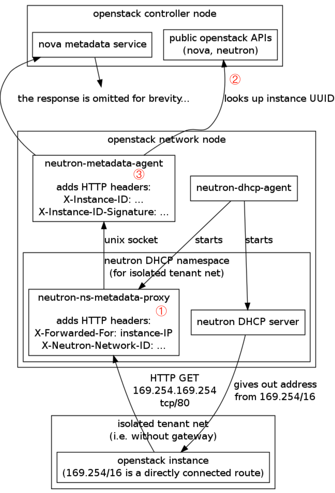

# Tìm hiểu về metadata service

## Mục lục

[1. Metadata service là gì và để làm gì?](#1)

[2. Cấu trúc của metadata service](#2)

[3. Cách thức hoạt động, luồng đi của metadata trong OPS](#3)

[4. Phân tích quá trình nova-api-metadata trả lại metadata cho instance](#4)

--------

## 1. Metadata service là gì và để làm gì?

Metadata serive là dịch vụ cung cấp cho các instance khả năng lấy thông tin của máy ảo (metadata) từ server thông qua link-local address. 

Vậy tại sao cần tới metadata service?

Đó là bởi máy ảo khi được boot lên phải nhận được một số thông tin cấu hình như:

- IP
- Hostname
- SSH keys
- cloud-init script
- thông tin routing
- ...

cloud-init là gì?

Đó là một service cho phép người dùng thực hiện những cấu hình tùy chọn trong thời gian máy ảo được boot lên.

cloud-init là một dịch vụ hoàn toàn riêng biệt với metadata service trong OPS. Tuy nhiên nó dùng metadata service để có thể truyền vào máy ảo dữ liệu cấu hình tùy chọn.

**Các cách để đưa cấu hình tùy chọn khi tạo máy ảo**

1. Tạo image với tất cả các cấu hình mong muốn

Cách này không thực tế lắm bởi image được sử dụng cho rất nhiều máy ảo và mỗi máy ảo lại có thể được phục vụ cho một mục đích khác nhau.

2. Cấu hình bằng tay sau khi deploy

Không thực tế, tốn công sức...

3. Sử dụng metadata service

Sự không hiệu quả của các cách trên là lí do khiến metadata ra đời. Mỗi khi máy ảo được tạo, nó sẽ yêu cầu metadata service trả lại metadata của nó và cloud-init sẽ hoàn thành những cấu hình tùy chọn theo metadata được lấy về.

**Các loại metadata**

Hiện tại người ta chia metadata ra thành 4 loại:

- Meta-Data: instance-id, account-id, random seed, hostname, etc.
- User-Data: Thường là cloud-config (một trong những định dạng script của cloud-init dùng để truyền cấu hình mà người dùng muốn vào trong máy ảo)
- Vendor-Data: Là cách mà các vendor dùng để cung cấp thông tin của họ vào trong máy ảo.
- Network-Data: bao gồm fixed ip addresses, MAC addresses, port-id's, network-id's, subnet-id's, DNS name-servers, etc.

## 2. Cấu trúc của metadata service

Đây là sơ đồ miêu tả tổng quan các thành phần trong metadata

**Nova-api-metadata**

Là một sub-service của nova-api, nó chịu trách nhiệm cung cấp metadata, instance có thể gửi request tới REST API của nova-api-metadata để lấy metadata.

Dịch vụ này chạy trên node controller với port là 8775

Các bạn có thể thấy ở một số trường hợp nhất định thì nova-api-metadata và nova-api sẽ được kết hợp lại với nhau.

Để có thể làm như vậy, ta cần khai báo trong file nova.conf

`enabled_apis=osapi_compute,metadata`

osapi_compute là dịch vụ của nova-api, metadata là nova-api-metadata service.

**Neutron-metadata-agent**

Máy ảo không thể kết nối trực tiếp tới http://controller_ip:8775 để lấy metadata. Vì thế ta cần tới neutron-metadata-agent. Thông thường dịch vụ này chạy trên node network. Trong một số trường hợp nó cũng có thể chạy trên node controller.

Instance sẽ gửi request tới neutron-metadata-agent và neutron-metadata-agent sẽ foward nó tới nova-api-metadata.

Thực tế thì máy ảo không thể giao tiếp trực tiếp với neutron-metadata-agent. Vì thế, ta cần tới sự trợ giúp của dhcp agent và l3 agent.

**Neutron-ns-metadata-proxy**

Neutron-ns-metadata-proxy được tạo bởi dhcp agent và l3 agent (nó chạy trên namespace nơi chứa dhcp-agent hoặc router). Neutron-ns-metadata-proxy được kết nối trực tiếp với neutron-metadata-agent thông qua unix domain socket.

## 3. Cách thức hoạt động, luồng đi của metadata trong OPS

Như vậy, ta có thể hình dung đường đi tổng quan của metadata như sau:

1. Máy ảo gửi request tới neutron-ns-metadata-proxy thông qua neutron network (Project network).

2. neutron-ns-metadata-proxy gửi request tới neutron-metadata-agent thông qua unix domain socket

3.  neutron-metadata-agent gửi request tới nova-api-metadata thông qua internal management network.

**Sau đây sẽ là ví dụ chi tiết về đường đi của metadata trong OpenStack.**

Giả sử mình có một private network với dhcp (không có router)

Ta thử deploy một máy ảo `vm01` với private network và theo dõi log.
Kết quả:

Ta có thể thấy rằng máy ảo đã nhận ip từ dhcp tuy nhiên nó không thể truy cập vào địa chỉ `http://169.254.169.254/2009-04-04/instance-id` (truy cập 20 lần thất bại)

**Địa chỉ 169.254.169.254 là gì**

Địa chỉ này bắt nguồn từ AWS, khi mà Amazon bắt đầu thiết kế lên public cloud, họ dùng 169.254.169.254 làm địa chỉ cho server để máy ảo có thể request metadata. OPS đơn giản là...dùng lại thôi...

Trở lại với ví dụ bên trên, khi mà máy ảo không thể truy cập tới 169.254.169.254 thì đương nhiên nó sẽ không thể lấy được metadata. Bởi thế hostname (mặc định là instance name) sẽ không được set

Như vậy tên của máy ảo đã không được set.

Ta kiểm tra neutron-ns-metadata-proxy process trên node controller, kết quả cho thấy hiện neutron-ns-metadata-proxy chỉ chạy trên external netwok (dhcp-agent).

Nguyên nhân đó là neutron-ns-metadata-proxy đối với private netwok được manage bởi L3_agent. Private netwok hiện không được kết nối với neutron router nên neutron-ns-metadata-proxy hiện không thể được bật.

Ta tiến hành thêm router và kết nối nó với private netwok. Sau đó kiểm tra lại neutron-ns-metadata-proxy process.

Restart lại instance và xem kết quả

Máy ảo đã có thể kết nối tới 169.254.169.254 và nhận metadata

**Phân tích quá trình routing tới 169.254.169.254 sử dụng L3 Agent**

Ta có thể thấy metadata service address là 169.254.169.254 port 80, thử "curl" tới địa chỉ này

Đã thấy metadata, thế nhưng 169.254.169.254 không phải là IP  của dịch vụ nova-api-metadata, làm sao nó có thể lấy được metadata?

Giải thích:

Request từ `sefl-service` thông qua bảng routing sẽ tới `169.254.169.254` qua `172.16.1.1`. Đó là địa chỉ gateway của router, địa chỉ này được add tự động. Vì thế request sẽ được forward tới neutron router metadata.

Tại đây, router sẽ forward nó qua port `9697` thông qua iptables rules

Đây chính là port listening của neutron-ns-metadata-proxy

Như vậy ta có:

1. Máy ảo gửi request tới 169.254.169.254

2. Request này được forward tới router

3. Router lại forward nó sang neutron-ns-metadata-proxy

4. neutron-ns-metadata-proxy thông qua Unix domain socket gửi tới neutron-metadata-agent và từ đó nó được gửi tới nova-api-metadata.

**Sử dụng DHCP agent**

Ngoài L3 agent thì OPS cũng sử dụng cả dhcp agent để tạo và quản lý neutron-ns-metadata-proxy. Để set-up, ta cần chỉnh sử tùy chọn `force_metadata = True` trong file `/etc/neutron/dhcp_agent.ini`.

Lúc này 169.254.169.254 sẽ được route thông qua IP cấp dhcp của network. Điều này có nghĩa rằng dhcp agent đã tự config khiến mọi metadata request tới http://169.254.169.254 sẽ được gửi thẳng tới dhcp-agent port 80 và port 80 cũng là port mà process neutron-ns-metadata-proxy được bật.

Luồng đi của metadata sau này vẫn tương tự với l3-agent.

Như vậy l3-agent sẽ sử dụng iptables rules để forward trong khi đó dhcp-agent lại tự config ip 169.254.169.254 cho chính interface của nó.

## 4. Phân tích quá trình nova-api-metadata trả lại metadata cho instance

Để lấy metadata từ nova-api-metadata, bạn cần phải chỉ ra id của máy ảo. Tuy vậy máy ảo khi mới được boot sẽ không thể biết được id của nó, vì thế http request sẽ không có thông tin về id, nó sẽ được thêm sau bởi neutron-metadata-agent. Ở đây ta thấy sự khác biệt khi sử dụng l3-agent và dhcp-agent.

### 4.1 l3-agent

Hình dưới đây mô tả cách L3-agent tham gia vào quá trình gửi và nhận metadata request.

instance -> neutron-ns-metadata-proxy -> neutron-metadata-agent -> nova-api-metadata:

1. neutron-ns-metadata-proxy nhận request, forward nó tới neutron-metadata-agent trước khi instance ip và router id được add vào request.

2.  neutron-metadata-agent nhận request, nó sẽ check instance id bằng quy trình sau:

    - Thông qua router id để tìm tất cả những subnet connection rồi filter ra instance ip
    - Thông qua subnet để tìm instance ip port phù hợp
    - Thông qua port để tìm instance phù hợp và cả id của nó nữa.

3. neutron-metadata-agent sẽ add instance id vào http request header rồi sau đó forward nó tới nova-api-metadata. nova-api-metadata lúc này có thể biết instance id để gửi lại metadata phù hợp.

### 4.2 DHCP-agent

1. neutron-ns-metadata-proxy trước khi gửi request sẽ add instance ip và network id vào header của http request
2. neutron-metadata-agent nhận request, nó sẽ check instance id bằng các bước sau:

    - Thông qua network id để tìm kiếm tất cả các subnet sau đó filter ra subnet chứa instance bằng instance ip.
    - Thông qua subnet tìm kiếm instance ip port phù hợp.
    - Thông qua port tìm kiếm ra instance và id của nó.

3. neutron-metadata-agent sẽ add instance id vào http request header rồi sau đó forward nó tới nova-api-metadata. nova-api-metadata lúc này có thể biết instance id để gửi lại metadata phù hợp.

**Lưu ý:**

Để có thể lấy được metadata thì có một bước rất quan trọng đó là instance cần phải lấy được dhcp ip đầu tiên. Nếu không thì nó sẽ không thể gửi request tới 169.254.169.254 vì lúc ấy không có bất cứ routing nào.

**Link tham khảo:**

1. http://www.cnblogs.com/CloudMan6/tag/OpenStack/

2. https://github.com/meditechopen/meditech-ghichep-openstack/blob/master/docs/100.Advanced/metadata.md

3. https://github.com/trangnth/Timhieu_Openstack/blob/master/Doc/05.%20Metadata/1.%20metadata.md