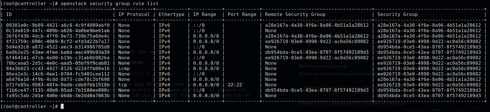
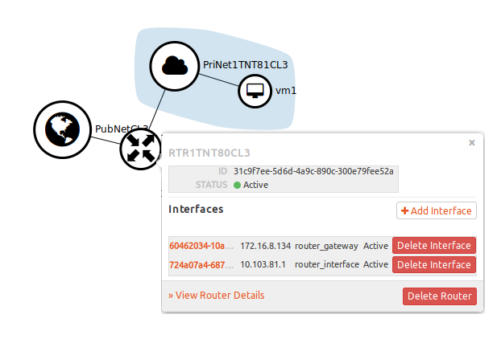
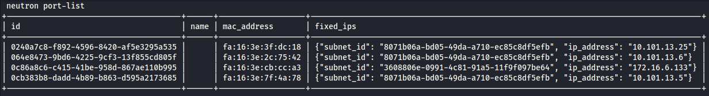
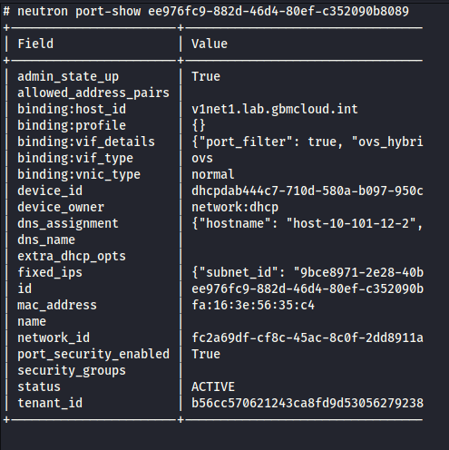
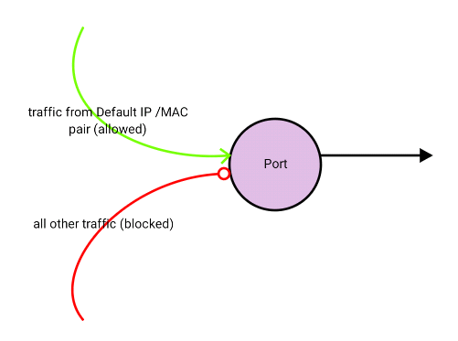
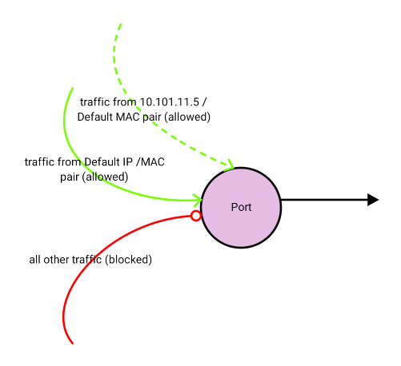
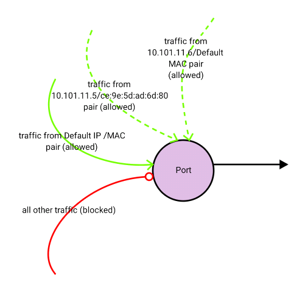
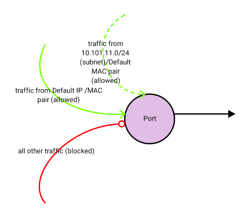

# Tìm hiểu Security group và security port.

## 1. Security Group trong Openstack
### 1.1 Overview
Security group là bộ các quy tắc để filter các IP, nó được áp dụng cho tất cả các instance để định nghĩa mạng truy cập và các máy ảo. Group rules được xác định cho các projects cụ thể, các user thuộc vào project nào thì có thể chỉnh sửa, thêm, xóa các rule của group tương ứng.

Tất cả các project đều có một security-groups mặc định là **default** được áp dụng cho bất kỳ một instance nào không được định nghĩa một security group nào khác. Nếu không thay đổi gì thì mặc định security group sẽ chặn tất  cả các incoming traffic với instance của bạn.

Bạn có thể sử dụng option **allow_same_net_traffic** trong file `/etc/nova/nova.conf` để kiểm soát toàn bộ nếu các rules áp dụng cho host được chia sẻ mạng. Có hai giá trị có thể:

* **True (default)**

	* Hosts cũng nằm trên một subnet không được lọc và được cho phép đi qua đối với tất cả các loại traffic giữa chúng. Trên Flat network, tất cả các instances của tất cả các project đề không được lọc khi giao tiếp với nhau. Với VLAN, cho phép truy cập giữa các instance cùng project. Bạn cũng có thể mô phỏng option này bằng cách cấu hình default security group cho phép tất cả các traffic từ subnet.

* **False** 
	* Security groups sẽ bắt buộc được áp dụng cho tất cả các kết nối, kể cả các kết nối cùng mạng.

Ngoài ra, số lượng tối đa các rules trong một security group được điểu khiển bởi **security_group_rules** và số lượng các security groups cho một project được điểu khiển bởi **security_groups** (xem [Manage quotas](https://docs.openstack.org/nova/rocky/admin/quotas2.html#manage-quotas))

### 1.2 List and view current security groups

Bạn có thể sử dụng command-line để lấy danh sách các security groups cho một project cụ thể bằng cách sử dụng **openstack** hoặc **nova** command:

1. Đảm bảo các giá trị xác thực về user và project có security groups muốn xem

```sh
export OS_USERNAME=myuser
export OS_TENANT_NAME=thanhbc
```

2. Sử dụng **openstack** command để xem danh sách các security group hiện có trong project:

		openstack security group list

3. Xem chi tiết một security group:

		openstack security group rule list GROUPNAME

### 1.3 Create a security group

Khi thêm một security group mới, nên pick thêm một mô tả ngắn gọn.

Add thêm một security group mới:

	openstack security group create GroupName --description Description

Add một rule mới vào group:

	openstack security group rule create SEC_GROUP_NAME --protocol PROTOCOL --dst-port FROM_PORT:TO_PORT --remote-ip CIDR

Ví dụ:

	openstack security group rule create global_http --protocol tcp --dst-port 80:80 --remote-ip 0.0.0.0/0


Xem các rule có trong một security group:

	openstack security group rule list <ID-sec-group>


Để xem tất cả các rule trong các group ở tất cả các project:

	neutron security-group-rule-list


### 1.4 Delete a security group

Để xóa một  new security group, thực hiện lệnh sau:

	openstack security group delete GROUPNAME

### 1.5 Create security group rules for a cluster of instances

Source Groups là một loại đặc biệt, linh động để xác định CIDR của các sources được cho phép. User cụ thể cho một Source Group (Security Group name) và tất cả các instance của user khác sử dụng một Source Group được lữa chọn linh động. Điều này làm giảm nhu cầu về các quy tắc riêng cho phép cho mỗi một user mới của cluster.

Tạo source group:
```sh
openstack security group rule create secGroupName \
   --remote-group source-group --protocol ip-protocol \
    --dst-port from-port:to-port
```

Ví dụ:

```sh
$ openstack security group rule create cluster \
    --remote-group global_http --protocol tcp --dst-port 22:22
```

Cluster sẽ cho phép ssh từ bất kỳ một instance nào sử dụng **global_http** group

## 2. Security port trong openstack.


Nền tảng OpenStack, cụ thể là Neutron (thành phần mạng), sử dụng khái niệm "cổng" để kết nối các phiên bản đám mây khác nhau với các mạng khác nhau và các thiết bị mạng ảo tương ứng như bộ định tuyến Neutron, tường lửa, v.v.

Default seciruty trên các cổng này khá hạn chế vì nền tảng được cho là một hệ thống tự trị, chủ yếu là độc lập, lưu trữ nhiều người thuê đám mây (khách hàng) hoặc các phiên bản đám mây khác nhau với các yêu cầu bảo mật khác nhau. Để có hình dung tốt hơn về các cổng, hãy xem sơ đồ bên dưới.



Đấy một cấu trúc liên kết mạng đơn giản trong OpenStack. Nó bao gồm một Bộ định tuyến (`RTR1TNT80CL3`)  được kết nối với hai mạng (`PubNetCL3, PriNetTNT81CL3`) và một máy ảo (vm1). Trong cửa sổ bật lên, bạn có thể thấy hai địa chỉ IP (172.16.8.134, 10.103.81.1) được gán cho hai giao diện trên bộ định tuyến. Đây là hai cổng kết nối bộ định tuyến với hai mạng.

OpenStack cho phép quản lý port security trong một môi trường theo các quy tắc sau:

- Tất cả lưu lượng đến và đi đều bị chặn đối với các cổng kết nối với các phiên bản máy ảo. (Trừ khi một 'security group' đã được áp dụng.)
- Chỉ lưu lượng truy cập bắt nguồn từ cặp địa chỉ IP / MAC mà OpenStack biết cho một cổng cụ thể mới được phép trên mạng.
- Chế độ pass through và promiscuous sẽ bị chặn.

### 2.2 Bổ sung địa chỉ thông qua port.
Trong một số trường hợp nhất định, chúng tôi cần cho phép lưu lượng truy cập từ nhiều cặp địa chỉ IP / MAC đi qua một cổng hoặc cho nhiều cổng chia sẻ địa chỉ MAC hoặc địa chỉ IP. Một yêu cầu như vậy sẽ dành cho các trường hợp phân cụm. Để làm được điều này, chúng ta cần thêm các cặp địa chỉ IP / MAC này trên cổng.

- Bước 1 - Để có được danh sách tất cả các cổng, hãy chạy lệnh sau:

Đầu ra ở trên liệt kê tất cả các cổng trong môi trường. Cột đầu tiên cung cấp ID cổng (ví dụ: “`0240a7c8-f892-4596-8420-af5e3295a535`”) và cột cuối cùng cung cấp địa chỉ IP (ví dụ: “`10.101.13.25`”). Địa chỉ IP thường là một cách tốt để xác định cổng.

- Bước 2 - Khi bạn đã xác định được cổng, hãy sử dụng lệnh sau để liệt kê chi tiết cổng:


	Kết quả trên cung cấp cho bạn thông tin chi tiết về cổng. Lưu ý rằng `ee976fc9-882d-46d4-80ef-c352090b8089` là ID của cổng mà bạn quan tâm. Thuộc tính đầu tiên mà chúng tôi quan tâm là “allow_address_pairs”. Điều này hiện đang trống, có nghĩa là nó sẽ chỉ cho phép lưu lượng truy cập cho cặp IP / MAC đã được Neutron gán cho cổng.
	

	Để cho phép nhiều cặp IP / MAC đi qua một cổng cụ thể, bạn cần thêm các IP bổ sung vào “allow_address_pairs”. Sử dụng các lệnh sau để quản lý thuộc tính này:

- Bước 3.a - Để thêm địa chỉ IP:
	```
	neutron port-update b7d1d8bd-6ca7-4c35-9855-ba0dc2573fdc --allowed_address_pairs list=true type=dict ip_address=10.101.11.5
	```
	


- Bước 3.b - Để thêm nhiều địa chỉ IP và một địa chỉ MAC bổ sung:
	```
	neutron port-update b7d1d8bd-6ca7-4c35-9855-ba0dc2573fdc --allowed_address_pairs list=true type=dict mac_address=ce:9e:5d:ad:6d:80,ip_address=10.101.11.5 ip_address=10.101.11.6
	```
	

Bước 3.c - Để thêm mạng con IP:

	```
	neutron port-update b7d1d8bd-6ca7-4c35-9855-ba0dc2573fdc --allowed_address_pairs list=true type=dict ip_address=10.101.11.0/24
	```
	

Lưu ý: Nếu bạn không cung cấp địa chỉ MAC, Neutron sẽ mặc định là địa chỉ MAC của cổng mà OpenStack biết đến. Điều này có nghĩa là bạn không thể cung cấp IP / dải (các) IP mà không có địa chỉ MAC. Điều này có hiệu quả khi bạn muốn thêm nhiều địa chỉ IP trên cùng một phiên bản máy ảo. Tuy nhiên, điều này sẽ không hiệu quả nếu bạn muốn tạo một máy ảo để cho phép lưu lượng truy cập đi qua, ví dụ như một máy ảo đại diện cho một bộ định tuyến hoặc một bức tường lửa.

### 2.3 Tắt security port
Trong một số tình huống nhất định, bạn có thể cần cho phép lưu lượng truy cập đi qua phiên bản máy ảo trong OpenStack. Ví dụ: nếu máy ảo này đại diện cho một thiết bị mạng, như bộ định tuyến hoặc tường lửa. Trong trường hợp này, không thể cung cấp tất cả các tổ hợp địa chỉ IP / MAC có thể có trong “allow_address_pairs” để bao gồm tất cả các máy có thể gửi lưu lượng truy cập qua phiên bản mạng này. Một tùy chọn tốt hơn trong trường hợp này là vô hiệu hóa bảo mật cấp cổng. Trước khi vô hiệu hóa bảo mật cấp cổng, vui lòng lưu ý những điều sau:

- Bảo mật cấp cổng không thể bị vô hiệu hóa nếu:
	- Một nhóm bảo mật được chỉ định cho phiên bản
	- Các cặp địa chỉ được phép được đặt cho trường hợp
- Khi bảo mật cấp cổng bị vô hiệu hóa, tất cả lưu lượng truy cập (Vào và ra) sẽ được phép trên giao diện này.
- Đảm bảo rằng bảo mật đang được quản lý bởi phiên bản máy ảo (ví dụ: quy tắc tường lửa) để bù đắp cho bảo mật bị vô hiệu hóa ở cấp độ OpenStack.

Như đã thấy ở trên, bạn sẽ cần phải xóa mọi nhóm bảo mật hiện có khỏi phiên bản. Điều này có thể dễ dàng thực hiện từ Horizon GUI. Ngoài ra, bạn sẽ cần phải vô hiệu hóa các cặp địa chỉ được phép. Chúng ta có thể sử dụng bằng API openstack như sau


Sử dụng lệnh sau để lấy mã thông báo xác thực từ keystone để truy cập API OpenStack:
```
curl -i -H "Content-Type: application/json" -d '
{ "auth": {
    "identity": {
        "methods": ["password"],
        "password": {
            "user": {
              "name": "admin",
              "domain": { "name": "tenant1" },
              "password": "pass"
            }
          }
        },
        "scope": {
          "project": {
            "name": "admin",
            "domain": { "name": "Default" }
          }
        }
      }
}' http://10.10.1.10:5000/v3/auth/tokens
```
Lưu ý rằng chúng tôi cần cung cấp tên người dùng và mật khẩu cho người dùng OpenStack hợp lệ có quyền truy cập vào và cũng lưu ý địa chỉ IP '10 .10.1.10 'đại diện cho máy chủ keystone . Đầu ra cho lệnh này sẽ như sau:
```
{"access": {"token": {"issued_at": "2016-06-05T01:49:36.477765", "expires": "2016-06-05T02:49:36Z", "id": "f3e704d837cf4074a0eb965d9de58c40", "tenant": {"description": "RDP Service UAT (TNT11_CL1)", "enabled": true, "id": "4dedb7b7ffe740c181d35a930809b22b", "name": "rdp_srv_uat"}, "audit_ids": ["H5JfGB-6QISRBlWObwAyRg"]}, "serviceCatalog": [{"endpoints": [{"adminURL": "http://10.10.1.10:8774/v2/4dedb7b7ffe740c181d35a930809b22b", "region": "RegionOne", "internalURL": "http://10.10.1.10:8774/v2/4dedb7b7ffe740c181d35a930809b22b", "id": "78655fc75ce2432986e1469c0703d32c", "publicURL": ….

```

Tôi đã cắt bớt đầu ra ở trên để dễ đọc. Mục duy nhất mà chúng tôi quan tâm là ID mã phiên (`4dedb7b7ffe740c181d35a930809b22b`). Chúng tôi sẽ sử dụng điều này trong lệnh tiếp theo:
```
# curl -i http://10.10.1.11:9696/v2.0/ports/ccbd0ed6-3dfd-4431-af29-4a2d921abb38.json -X PUT -H "X-Auth-Token: 4dedb7b7ffe740c181d35a930809b22b" -H "Content-Type: application/json" -H "Accept: application/json" -H "User-Agent: python-neutronclient" -d '{"port": {"allowed_address_pairs": []}}'
```

Mã thông báo (`4dedb7b7ffe740c181d35a930809b22b`) chính là mã thông báo mà chúng tôi thu được từ lệnh trước. ID của cổng mà chúng tôi cần đặt “`allow_address_pairs`” thành “`blank`” cũng được liệt kê ở trên (ccbd0ed6-3dfd-4431-af29-4a2d921abb38). 

Phần cuối cùng của lệnh (“'port': {'allow_address_pairs': []}”) đặt các cặp địa chỉ được phép thành “trống”.

Bây giờ chúng tôi đã xóa nhóm bảo mật và đặt các cặp địa chỉ được phép để trống, chúng tôi có thể vô hiệu hóa bảo mật cấp cổng. Chạy lệnh sau để đạt được điều này:
```
# neutron port-update ccbd0ed6-3dfd-4431-af29-4a2d921abb38 --port_security_enabled=False
```

Lệnh trên sẽ vô hiệu hóa bảo mật cổng trên cổng cụ thể và cho phép tất cả lưu lượng truy cập đi qua mà không làm rơi nơtron như mô tả bên dưới.


Tham khảo và dịch từ :

1. https://github.com/trangnth/Timhieu_Openstack/blob/master/Doc/04.%20Neutron/07.%20security-group.md

2. https://superuser.openstack.org/articles/managing-port-level-security-openstack/