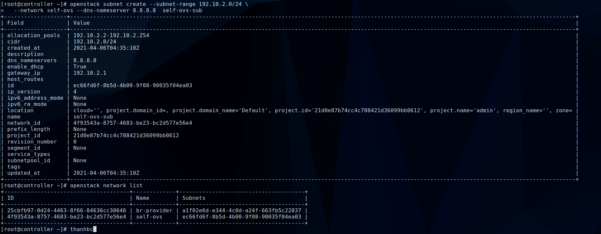

# Cặt đặt và cấu hình Neutron chuyển từ Linux Bridge sang 	OpenvSwitch


## 1. Cài đặt cấu hình Neutron  với openvswitch mô hình provider


Các phần cài đặt cấu hình cơ bản, compute, keystone, glance và đã cài đặt thành công linux bridge như cài đặt [ở đây](https://github.com/thanh474/internship-2020/blob/master/ThanhBC/Openstack/Install-ops-train-manual/07-install-neutron.md)

Sau khi đã hoàn thành ta tiến hành cài đặt.
### 1.1 Cài đặt trên controller

**Trên Controller**

Xóa Bridge Provider của Linux Bridge đang sử dụng:

```sh
brctl delif brq997cbfd5-c0 eth1
ip link set down brq997cbfd5-c0
brctl delbr brq997cbfd5-c0 
```

Tắt các Agent 
```
systemctl stop neutron-linuxbridge-agent neutron-server neutron-dhcp-agent neutron-l3-agent neutron-metadata-agent

systemctl disable neutron-linuxbridge-agent neutron-server neutron-dhcp-agent neutron-l3-agent neutron-metadata-agent
```

Khởi động lại network
```
systemctl restart network
```

Cài đặt các packages:

	yum install openstack-neutron openstack-neutron-ml2 openstack-neutron-openvswitch ebtables -y

Chỉnh sửa file cấu hình  `/etc/neutron/plugins/ml2/ml2_conf.ini
`

```sh
[ml2]
type_drivers = flat,vlan
tenant_network_types =
mechanism_drivers = openvswitch
extension_drivers = port_security

[ml2_type_flat]
flat_networks = provider

[ml2_type_vlan]
network_vlan_ranges = provider

[securitygroup]
firewall_driver = neutron.agent.linux.iptables_firewall.OVSHybridIptablesFirewallDriver
enable_ipset = True
```


Chỉnh sửa file cấu hình openvswitch-agent
 `/etc/neutron/plugins/ml2/openvswitch_agent.ini`
```sh
[ovs]
bridge_mappings = provider:br-provider

[securitygroup]
enable_security_group = True
firewall_driver = iptables_hybrid
```


Chỉnh sửa file cấu hình DHCP agent `/etc/neutron/dhcp_agent.ini`.

```sh
[DEFAULT]
interface_driver = openvswitch
dhcp_driver = neutron.agent.linux.dhcp.Dnsmasq
enable_isolated_metadata = True
force_metadata = True
```


Tạo OVS provider

	ovs-vsctl add-br br-provider

Gán interface provider vào OVS provider 

	ovs-vsctl add-port br-provider eth1

Tạo file cấu hình `/etc/sysconfig/network-scripts/ifcfg-eth1` mới

```sh
DEVICE=eth1
NAME=eth1
DEVICETYPE=ovs
TYPE=OVSPort
OVS_BRIDGE=br-provider
ONBOOT=yes
BOOTPROTO=none
NM_CONTROLLED=no
```

Tạo file cấu hình `/etc/sysconfig/network-scripts/ifcfg-br-provider` mới

```sh
ONBOOT=yes
IPADDR=10.10.101.145
NETMASK=255.255.255.0
#GATEWAY=10.10.101.1
#DNS1=8.8.8.8
DEVICE=br-provider
NAME=br-provider
DEVICETYPE=ovs
OVSBOOTPROTO=none
TYPE=OVSBridge
DEFROUTER=no
```
Lưu ý phải có thêm `DEFROUTER` vì ko có nó sẽ bị đưa đến router default dẫn đến không truy cập dc vào host.

Khởi động lại mạng:
	
	systemctl restart network


Đồng bộ database

	su -s /bin/sh -c "neutron-db-manage --config-file /etc/neutron/neutron.conf --config-file /etc/neutron/plugins/ml2/ml2_conf.ini upgrade head" neutron

Restart Compute API service

	systemctl restart openstack-nova-api.service

Start các service neutron và cho phép khởi động dịch vụ cùng hệ thống

```sh
systemctl enable neutron-server.service neutron-openvswitch-agent.service neutron-dhcp-agent.service neutron-metadata-agent.service

systemctl start neutron-server.service neutron-openvswitch-agent.service neutron-dhcp-agent.service neutron-metadata-agent.service
```

### 1.2. Cài đặt trên compute

Xóa các bridge cũ.
```
ip link set qbr6266ebc6-56 down
brctl delbr qbr6266ebc6-56
```

Tắt linuxbridge-agent 
```
systemctl stop neutron-linuxbridge-agent
systemctl disable neutron-linuxbridge-agent
```

Cài đặt packet ovs.

	yum -y install openstack-neutron-openvswitch ebtables ipset


Chỉnh sửa file cấu hình `/etc/neutron/plugins/ml2/openvswitch_agent.ini`:

```sh
[ovs]
bridge_mappings = provider:br-provider

[securitygroup]
enable_security_group = True
firewall_driver = iptables_hybrid
```

Restart compute service

	systemctl restart openstack-nova-compute.service

Start open vswitch agent và cho phép khởi động cùng hệ thống

	systemctl enable neutron-openvswitch-agent.service
	systemctl start neutron-openvswitch-agent.service

Tạo OVS provider

	ovs-vsctl add-br br-provider


Tạo file cấu hình `/etc/sysconfig/network-scripts/ifcfg-eth1` mới
```sh
DEVICE=eth1
NAME=eth1
DEVICETYPE=ovs
TYPE=OVSPort
OVS_BRIDGE=br-provider
ONBOOT=yes
BOOTPROTO=none
NM_CONTROLLED=no
```

Tạo file cấu hình `/etc/sysconfig/network-scripts/ifcfg-br-provider` mới
```sh
ONBOOT=yes
IPADDR=10.10.101.72
NETMASK=255.255.255.0
# GATEWAY=10.10.101.1
# DNS1=8.8.8.8
DEVICE=br-provider
NAME=br-provider
DEVICETYPE=ovs
OVSBOOTPROTO=none
TYPE=OVSBridge
DEFROUTER=no
```
Restart network và openvswitch-agent 

	systemctl restart networktha
	systemctl restart neutron-openvswitch-agent.service

Tiến hành cấu hình tương tự với node compute còn lại.

Kiểm tra lại các cấu hình
```sh
openstack network agent list
```


### 1.3 Tạo network, subnet và instance trên provider

Tạo dải mạng sử dụng lệnh.
```
openstack network create --share --provider-physical-network provider --provider-network-type flat br-provider
```


Tạo subnet cho dải `br-provider`
```
openstack subnet create --subnet-range 10.10.101.0/24 --gateway 10.10.101.1 --network br-provider --allocation-pool start=10.10.101.11,end=10.10.101.250 --dns-nameserver 8.8.8.8 ovs-provider
```


Tạo instance.
``` openstack server create --flavor m1.nano --image cirros \
      --nic net-id=25cbfb97-0d24-4463-8f66-84636cc30646 --security-group ee926719-03e0-4998-9d22-ac0a56c89082 \
      --key-name mykey provider-instance-ovs
```


## 2. Cài đặt cấu hình Neutron  với openvswitch mô hình self-service

Để cấu hình self-service cần cài đặt provider trước.

Hai phần trên là cấu hình cho mô hình provider, phần tiếp theo sẽ cấu hình thêm self-service tiếp tục phần trên

### 2.1 Cài đặt trên controller

**Cấu hình neutron.conf**

Chỉnh sửa file `/etc/neutron/neutron.conf`:

```sh
[DEFAULT]
service_plugins = router
allow_overlapping_ips = True
```
**Cấu hình ml2**

Chỉnh sửa file `/etc/neutron/plugins/ml2/ml2_conf.ini`
```sh
[ml2]
type_drivers = flat,vlan,vxlan
tenant_network_types = vxlan
mechanism_drivers = openvswitch,l2population

[ml2_type_vxlan]
vni_ranges = 1:1000
```

**Cấu hình openvswitch-agent**

Chỉnh sửa file `/etc/neutron/plugins/ml2/openvswitch_agent.ini`
```sh
[ovs]
bridge_mappings = provider:br-provider
local_ip = 10.10.101.145

[agent]
tunnel_types = vxlan
l2_population = True

[securitygroup]
firewall_driver = iptables_hybrid
```

**Cấu hình layer-3 agent**

Chỉnh sửa file cấu hình `/etc/neutron/l3_agent.ini`

```sh
[DEFAULT]
interface_driver = openvswitch
external_network_bridge =
```

Khởi động lại network

	systemctl restart network

Khởi động lại các dịch vụ :
```sh
systemctl restart openvswitch.service neutron-server.service neutron-openvswitch-agent.service neutron-dhcp-agent.service neutron-metadata-agent.service neutron-l3-agent
```

### 3.2 Trên compute

**Cấu hình openvswitch-agent**

Thêm các dòng sau vào file `/etc/neutron/plugins/ml2/openvswitch_agent.ini`
```sh
[ovs]
local_ip = 10.10.101.72

[agent]
tunnel_types = vxlan
l2_population = True
```
Restart network

	systemctl restart network

Khởi động lại các dịch vụ :

	systemctl restart openvswitch.service
	systemctl restart neutron-openvswitch-agent.service

Tiến hành cấu hình tương tự với node compute còn lại.

Để kiểm tra, trên controller chạy câu lệnh sau

	neutron agent-list


Xoá các agent cũ đi bằng lệnh
```
openstack network agent delete <id-agent>
```
### 3.3 Tạo network, subnet, instance và router

Tạo Network
```
openstack network create self-ovs
```


Tạo Subnet

```
openstack subnet create --subnet-range 192.10.2.0/24 \
  --network self-ovs --dns-nameserver 8.8.8.8  self-ovs-sub
```


Tạo instance
```
openstack server create --flavor m1.nano --image cirros -nic net-id=4f93543a-8757-4683-be23-bc2d577e56e4 --security-group ee926719-03e0-4998-9d22-ac0a56c89082 --key-name mykey self-instance-ovs
```


Tạo router
```
openstack router create router-ovs
```

Add interface vào router 
```
openstack router add subnet router-ovs self-ovs-sub

openstack router set --external-gateway br-provider router-ovs
```

Kiểm tra router 


Sau khi cấu hình ta sẽ được topology như sau.


Như vầy ta đã cấu hình xong neutron sử dụng openvswitch trên cả kiểu provider và seflservice.

## Tham khảo 
1. https://docs.openstack.org/neutron/train/admin/deploy-ovs-provider.html

2. https://docs.openstack.org/neutron/train/admin/deploy-ovs-selfservice.html

3. https://github.com/trangnth/Timhieu_Openstack/blob/master/Doc/04.%20Neutron/03.%20install_neutron_ovs_self_service.md