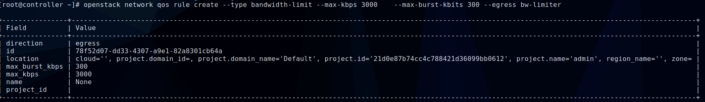

# Quality of Service (QoS) - Neutron

## 1. Giới thiệu

QoS được định nghĩa là khả năng đảm bảo các yêu cấu mạng nhất định như bandwidth, latency (độ trễ), jitter (độ giật) và reliability (độ tin cậy) để đáp ứng thỏa thuận về Service Level Agreement (SLA) giữa các nhà cũng cấp ứng dụng và end users.

Các thiết bị mạng như switches và routers có thể đánh dấu các traffic để nó được xử lý với priority cao hơn để đáp ứng các điều kiện đã thỏa thuận theo SLA. Trong trường hợp, các lưu lượng mạng nhất định như Voice over IP (VoIP) và video streaming cần được truyền với băng thông được hạn chế tối thiểu. Trên một hệ thống không có network QoS management, tất cả các trafic sẽ được truyền đi theo các nô lực nhất "best-efort" mà không thể đảm bảo được dịch vụ của khách hàng được chuyển đi.

QoS sẽ thể hiện rõ tác dụng ở những vị trí thường xảy ra hiện tượng bottleneck (nút thắt cổ chai), đồng thời quyết định trafic nào có độ ưu tiên cao hơn để quyết định thứ tự truyền đi. 

Trong môi trường Storage: Storage QoS cho phép admin có thể monitor và quản lý và thiết lập rule ưu tiên theo từng kiểu acces và resource sử dụng trong một Storage Cluster. Các policy giúp giới hạn các I/O storage và các VM đảm bảo không vượt qua ngưỡng cho phép.

QoS là một plug-in dịch vụ nâng cao. QoS được tách ra từ phần còn lại của Openstack Network code  ở nhiều levels và nó có thể thông qua trình driver mở rộng ml2.

## 2. QoS trong Neutron

Trong Neutron hiện đang hỗ trợ các rule QoS sau:

* banwitth_limit: hỗ trợ giới hạn băng thông tối đa trên từng network, port và IP floating
* dhcp_marking: hỗ trợ giới hạn băng thông dựa trên DSCP value. - Với QoS. Marking là 1 task nhỏ trong Classtifycation, (và tất nhiên marking lúc này là DSCP cho Difserv). Classtifycation có 2 task là identify gói tin và marking gói tin, sau đó đẩy vào các queuing, dùng scheduling để quyết định gói nào ra trước, gói nào phải chờ. 
* minimum_bandwidth: giới hạn băng thông tối đa dựa lên kiểu kết nối.

Bảng dưới đây là một số các backends, QoS rules được hỗ trợ và các hướng đi của trafic (nhìn từ VM)


## 3. Configuration

Để enable service, làm theo các bước dưới đây:

### 3.1 Trên Network nodes

Add QoS service vào `service_plugin` trong file `/etc/neutron/neutron.conf`, ví dụ:

```sh
[DEFAULT]
service_plugins = neutron.services.l3_router.l3_router_plugin.L3RouterPlugin, neutron.services.metering.metering_plugin.MeteringPlugin, neutron.services.qos.qos_plugin.QoSPlugin
```

Sửa file `/etc/neutron/plugins/ml2/ml2_conf.ini`

```sh
[ml2]
extension_drivers = port_security,qos
```

Nếu Open vSwitch agent được sử dụng, sửa file `/etc/neutron/plugins/ml2/openvswitch_agent.ini`

```sh
[agent]
extensions = qos
```

### 3.2 Trên compute node

Sửa file `/etc/neutron/plugins/ml2/openvswitch_agent.ini`

```sh
[agent]
extensions = qos
```


## 4. User workflow 

QoS policies chỉ được tạp ra bởi admin với file policy.json mặc định. Vì vậy, bạn nên yêu cầu người điều hành cloud thiết lập chúng thay mặt cho các cloud projects.

Nếu project được tin tưởng để tạp ra chính policies của chúng thì kiểm tra trusted projects policy.json configuration section.

Đầu tiên tạo một QoS policy và các rule giới hạn băng thông của chúng.

```sh
openstack network qos policy create bw-limiter
```


```
openstack network qos rule create --type bandwidth-limit --max-kbps 3000 --max-burst-kbits 300 --egress bw-limiter
```


```
openstack network qos rule list bw-limiter
```


**Note** : QOS yêu cầu chỉ số burst để chắc chắn sự đúng đắncác các rule set bandwith trên các OpenvSwitch và Linux Bridge. Nếu không set trong quá trình đặt rule thì mặc định chỉ số này sẽ về 80% bandwidth của các gói TCP thông thường. Nếu giá trị burst quá thấp sẽ gây ra việc giảm băng thông so với thông số cấu hình

Các QoS policy có thể được gắn vào port hoặc network cụ thể:

```sh
openstack port set --qos-policy bw-limiter 6266ebc6-5680-4b7f-8885-3b758fd837df
```


```
openstack port show 6266ebc6-5680-4b7f-8885-3b758fd837df
```


Ta thấy id của port và id của qos rule giống nhau.

Để detach a port from the QoS policy attached vào nó:

```sh
$ openstack port unset --no-qos-policy <id port>
```


