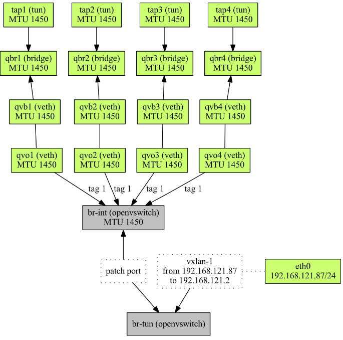
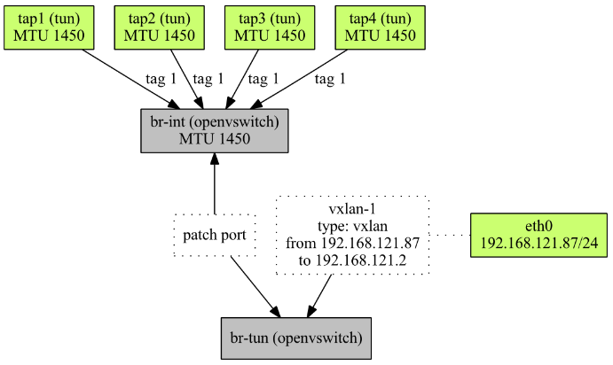
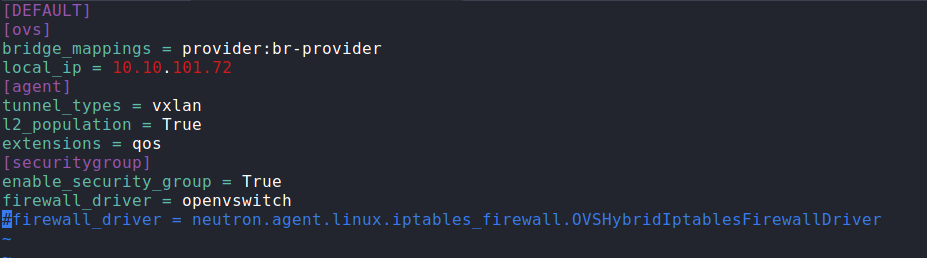
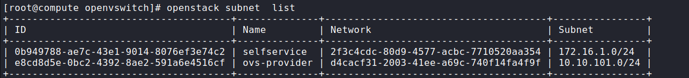
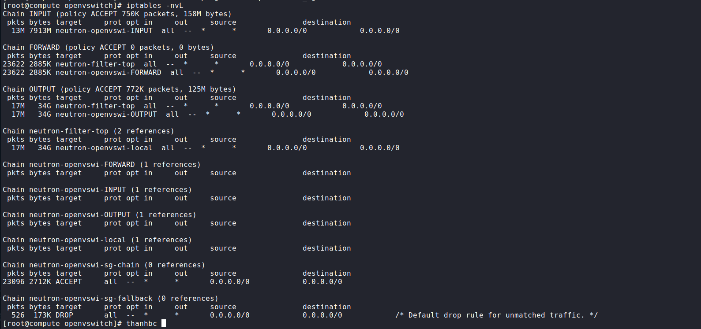
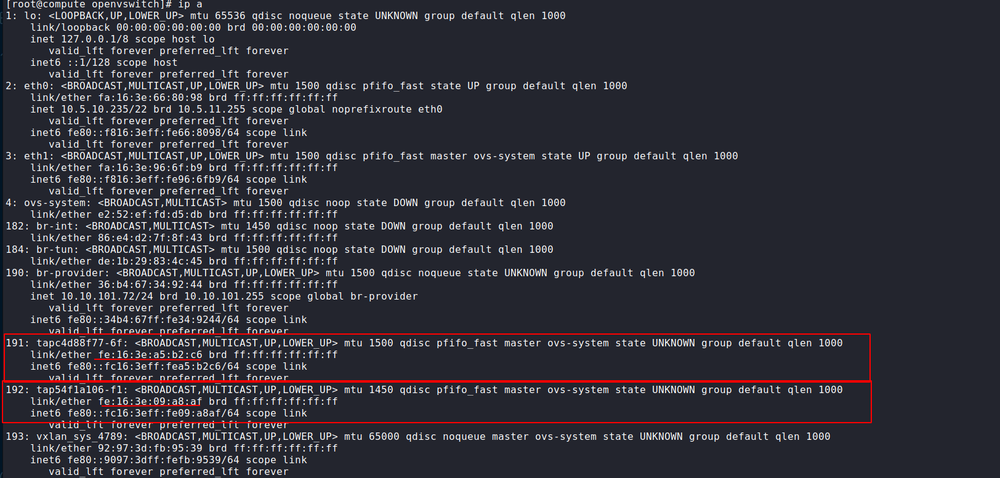
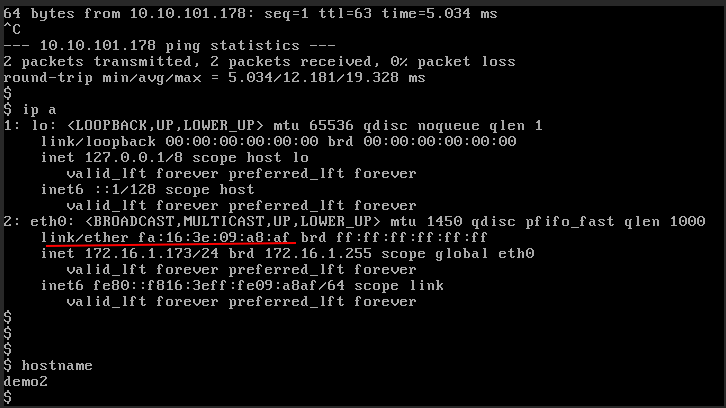
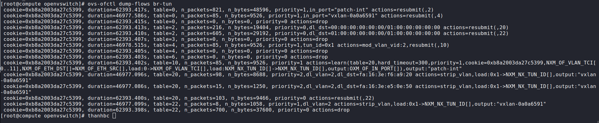

# Cấu hình sử dụng openvswitch firewall.


Để bảo về các vm khỏi những lưởng truy cập không mong muốn thì openstack sử dụng và triển khai tường lửa để kiểm soát truy cập các lưu lượng đó còn được gọi là Stateful firewall

Openstack theo dõi các kết nối riêng lẻ  và các gói trong các kết nối được gọi là connection contrack hoặc conntrack. Các kết nối này là các kết nối 2 chiều  và cần được thiết lập.

Openvswitch là môt switch ảo sử dụng nó có thể kết nối với các máy ảo khác nhau. Nhưng openvswitch đang hoạt động ở dạng luồng chỉ có 1 chiều và không có trạng thái nên thế ta cần kết hợp cả stateful firewall.


Trong nhân linux có chứa một module  có khả năng theo dõi và sử dụng để triển khai 1 tường lừa stateful firewall, tuy nhiên module này chỉ có sẵn ở lớp giao thực IP  tầng 3 trong OSI nó gọi là iptables. Tuy nhiên có 1 vấn đề là openvswitch không hoạt động ở giao thức IP( Layer 3) mà nó hoạt động ở laye 2 chình vì thế nó cần có 1 cầu nối để kết nối 2 layer này

Sử dụng linuxbridge có chứa cơ chế lọc riêng là ebtables mặc dù không thể sử dụng tính năng conntrack nhưng ta có thể cấu hình các chain cho nó như trong iptables. Bằng kỹ thuật này ta có thể sử dụng conntrack theo dõi chuyển gói giữa layer2 và layer3.

Trung tậm mỗi nút của openstack đưọc gọi là "integration bridge" hay br-int. Trong triển khai thì br-int là một openvswitch nó chịu  trách nhiệm định hướng các gói giữa các máy ảo, tạo tunnel giữa các nút và một số tac vụ khác. Do đó mọi máy ảo để phải kết nói đến br-int.

stateful firewall cần được đặt giữa máy ảo và br-int ở đây ta sử dụng iptable trên linux bridge. Trên linux brige gọi các rule iptables và áp dụng các rules đó vào các ingress và  egress. 

Mô hình tổng quan sau khi đặt linuxbridge như sau.



- Máy ảo đầu tiên được kết nối với máy chủ thông qua giao diện tap1. Một gói tin ra khỏi máy ảo sau đó sẽ được chuyển hướng tới Linux bridge qbr1.
- Trên cầu nối đó, ebtables gọi vào iptables nơi gói đến được khớp theo các quy tắc đã định cấu hình. 
- Nếu gói được chấp thuận, nó sẽ đi qua bridge và được gửi đến giao diện thứ hai được kết nối với bridge. Đó là qvb1 là một mặt của cặp veth.

- Veth pair là một cặp giao diện được kết nối nội bộ với nhau. Bất cứ thứ gì được gửi đến một trong các giao diện sẽ được nhận bởi một giao diện khác và ngược lại. Tại sao cần có cặp veth ở đây? Bởi vì chúng tôi cần một cái gì đó có thể kết nối giữa cây cầu Linux và cây cầu tích hợp Open vSwitch.

Bây giờ gói tin đã đạt đến br-int và được chuyển hướng đến máy ảo thứ hai. Nó đi ra khỏi br-int đến qvo2, sau đó qua qvb2 nó đến cầu qbr2. Gói tin đi qua ebtables và iptables và cuối cùng đến tap2 là máy ảo mục tiêu.

Điều này rõ ràng là rất phức tạp. Tất cả những cầu nối và giao diện đó làm tăng thêm chi phí xử lý CPU và thêm độ trễ. Hiệu suất bị ảnh hưởng.

Chính ví thể nên openvswitch đưa conntrack vào openswitch việc này loại bỏ sử dụng iptables trên linux bridge. 

Dưới đây là sơ đồ sau khi đã bỏ đi linux bridge.



Một gói tin đi ra từ máy ảo đầu tiên (tap1) được chuyển hướng đến br-int. Nó được kiểm tra bằng cách sử dụng các quy tắc đã định cấu hình và bỏ hoặc xuất trực tiếp đến máy ảo thứ hai (tap2).

Để sử dụng openvswich firewall ta cần cấu hình trong file cấu hình của openvswitch-agent như sau.

Thêm dòng sau vào file `/etc/neutron/plugins/ml2/openvswitch-agent.ini`
```
firewall_driver = openvswitch
```
Sau khi thêm file cấu hình sẽ như sau




Tiến hành tạo lại network , instance và kiểm tra lại .

Tạo provider network sử dụng ovs
```
openstack network create --share --provider-physical-network br-provider \
--provider-network-type flat br-provider


openstack subnet create --subnet-range 10.10.101.0/24 --gateway 10.10.101.1 --network br-provider --allocation-pool start=10.10.101.11,end=10.10.101.250 --dns-nameserver 8.8.8.8 ovs-provider
```

Tạo self-service network sử dụng ovs
```
openstack network create selfservice


openstack subnet create --network selfservice \
  --dns-nameserver 8.8.4.4 --gateway 172.16.1.1 \
  --subnet-range 172.16.1.0/24 selfservice
```

Tạo route connect 2 network 
```
openstack router create router


openstack router add subnet router selfservice

openstack router add subnet router ovs-provider
```
Kiểm tra kết quả .



Sau khi cấu hình xong thì ovs sẽ không có rule conntrack của các vm trong iptables ta kiểm tra iptables xem có trông hay không




Như ta thấy iptables không đưcọ sử dụng đến.

Kiểm tra ip và mac của các instane và xem đường đi của nó.



Ta thấy có 2 tap là `tapc4d88f77-6f`, `tap54f1a106-f1` có mac tương ứng là `fe:16:3e:a5:b2:c6`, `fe:16:3e:09:a8:af`

Không thấy các bridge qbrXXXX, qvbXXXX, qvoXXXX vì nó không sử dụng iptables trong linuxbridge nữa nên đã bị lược bỏ.


Kiểm tra instance trong ops và check mac của các instance.



Ta thấy địa chỉ mac đã trùng với nhau.

Kiểm tra các rule và  flow trong openvswitch.
```
ovs-ofctl dump-flows br-tun
```


Giải thích một sô rule cơ bản.
Các rule được xếp theo cá tables nên ta đi phân tích từng tables.

Tables 0:
```
cookie=0xb8a2003da27c5399, duration=62393.417s, table=0, n_packets=821, n_bytes=48596, priority=1,in_port="patch-int" actions=resubmit(,2)

 cookie=0xb8a2003da27c5399, duration=46977.586s, table=0, n_packets=85, n_bytes=9526, priority=1,in_port="vxlan-0a0a6591" actions=resubmit(,4)
 
 cookie=0xb8a2003da27c5399, duration=62393.415s, table=0, n_packets=0, n_bytes=0, priority=0 actions=drop
```
Giải thích.

- Rule 1	Có priority=1 và kiểm tra packet nếu đến từ port "patch-int" thì chuyển đến tables 2. 

- Rule 2 	Nếu packet đến từ port in_port="vxlan-0a0a6591" thì chuyển đên tables 4.

- Rule 3	Có priority=0 (lowest priority) thì xóa bỏ khỏi rule1 và rule 2.


Tables 2:
```
cookie=0xb8a2003da27c5399, duration=62393.413s, table=2, n_packets=216, n_bytes=19404, priority=0,dl_dst=00:00:00:00:00:00/01:00:00:00:00:00 actions=resubmit(,20)

 cookie=0xb8a2003da27c5399, duration=62393.410s, table=2, n_packets=605, n_bytes=29192, priority=0,dl_dst=01:00:00:00:00:00/01:00:00:00:00:00 actions=resubmit(,22)
```
Giải thích.

- Rule 4: Có  priority=0  và kiểm tra packets có  dl_dst=00:00:00:00:00:00/01:00:00:00:00:00 thì chuyển đên table 20 

- Rule 5 Có priority=0 và kiểm tra packets có dl_dst=01:00:00:00:00:00/01:00:00:00:00:00
(match all multicast(including broadcast Ethernet packets)thì chuyển đên table 22.

Link tham khảo:

https://aptira.com/openstack-rules-how-openvswitch-works-inside-openstack/

https://www.redhat.com/en/blog/how-connection-tracking-open-vswitch-helps-openstack-performance

https://www.techblog.moebius.space/posts/2018-02-17-openstack-neutron-understanding-l2-networking-and-port-binding/#4-2-what-is-os-vif

