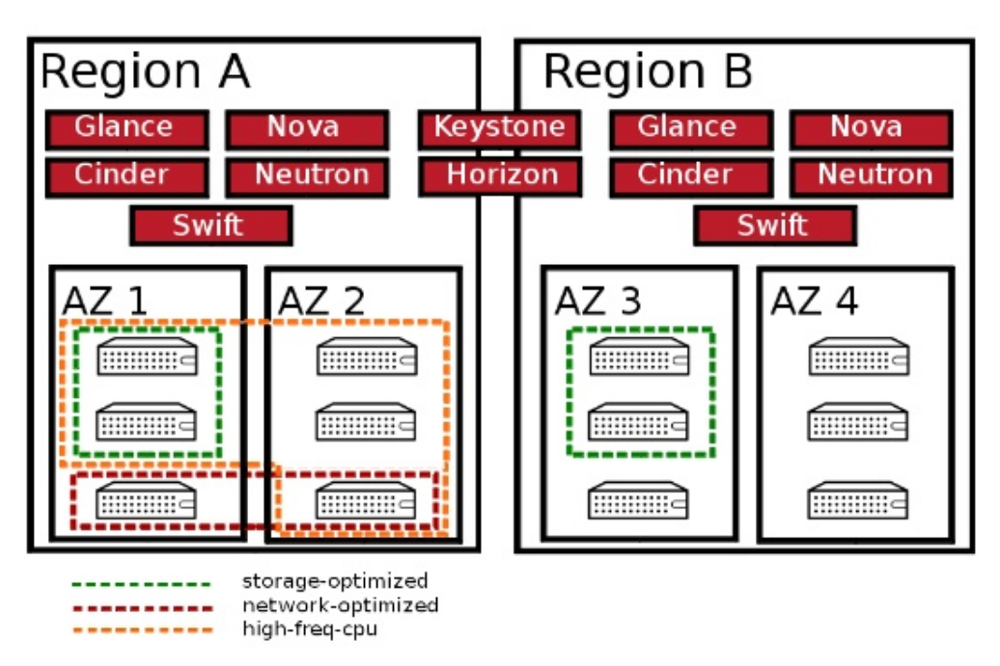
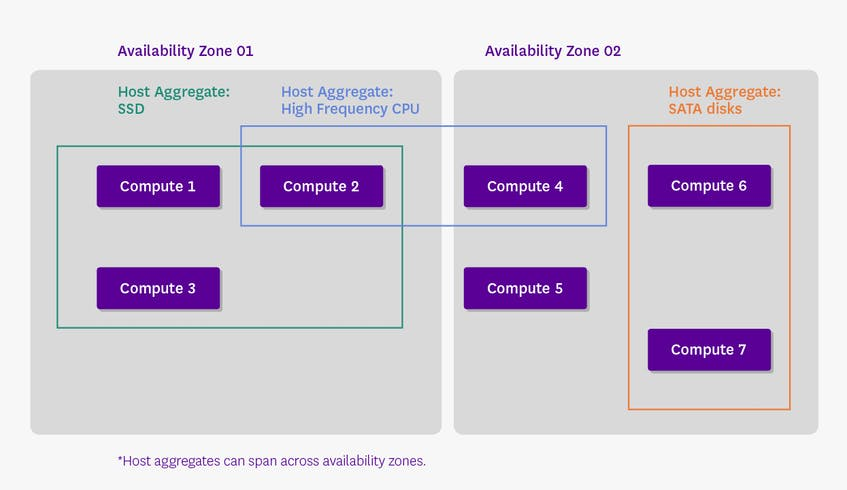
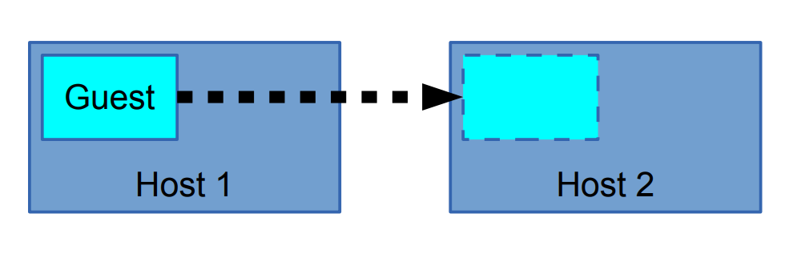
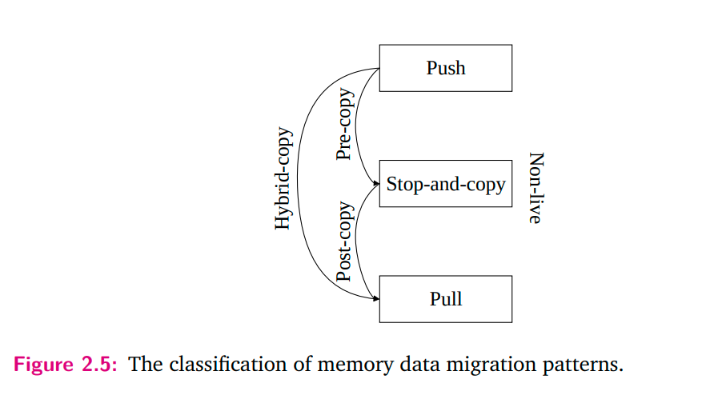
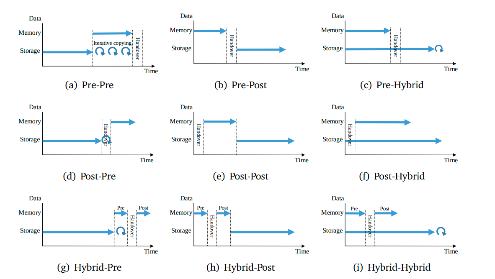
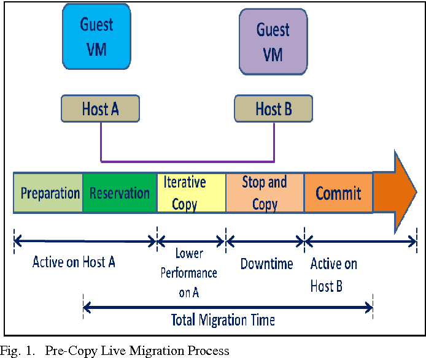
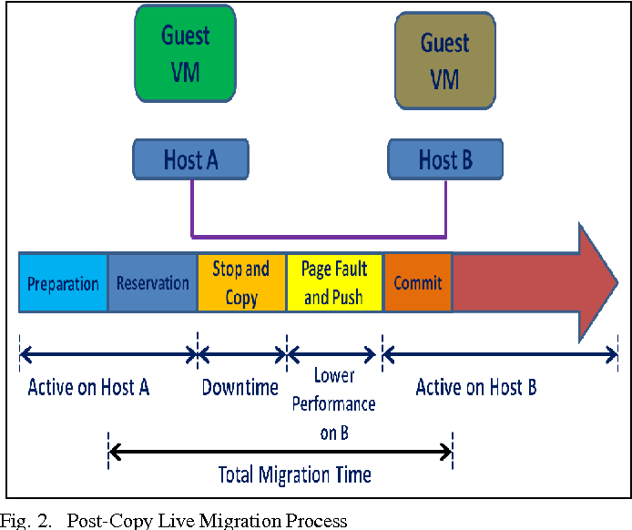
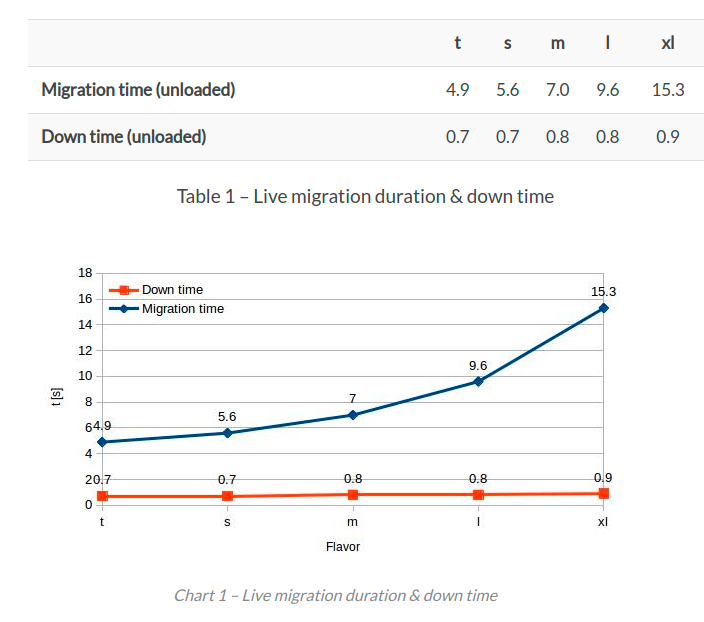
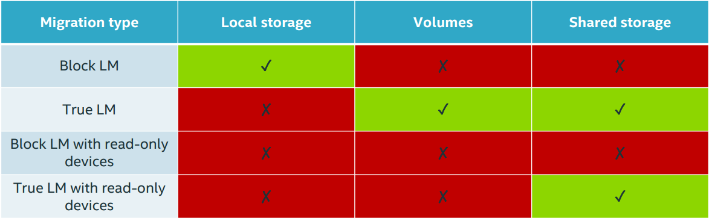
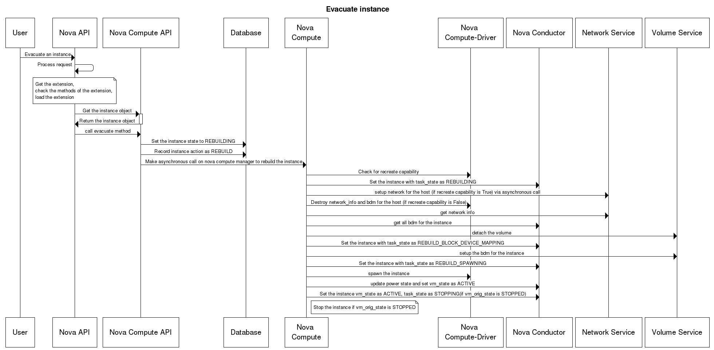

# Các khái niệm hay sử dụng trong nova.

## 1. Tìm hiểu và phân biệt 2 khái niệm host aggreate vs availability zone trong nova.


Mô hình tổng quan giữa Region, availability và host aggregate.


### 1.1 Khái niệm host aggregate.
Host aggregate được sử dụng bởi quản trị viên đê nhóm các máy có chung các thuốc tính phần cứng lại với nhau. Thông thường nhất host aggregate được sử dụng để tập hợp các máy chủ phân biệt giữa các cấu hình máy chủ vật lý.  Ví dụ: bạn có thể có một tổng hợp bao gồm các máy có RAM 2GB và một tổng hợp khác bao gồm các máy có RAM 64GB. Điều này làm nổi bật trường hợp sử dụng điển hình của tập hợp: xác định cấu hình phần cứng tĩnh.


Sau khi host aggregate  được tạo, quản trị viên có thể xác định công chúng cụ thể  từ đó khách hàng có thể chọn chạy các máy ảo của họ. Các yêu cầu được khách hàng sử dụng để chọn loại phần cứng sẽ lưu trữ phiên bản của họ.


### 1.2 Khái niệm availability zone.
Tương phản tổng hợp với vùng khả dụng(AZ) trong OpenStack, dành cho khách hàng và thường được phân vùng theo địa lý. Để củng cố khái niệm, hãy nghĩ về các khu vực sẵn có và flavor như các tập hợp con có thể tiếp cận của khách hàng của các tập hợp máy chủ lưu trữ.

Mô tả sự khác nhau giữa availability zone và host aggreate.




## 2.Giới thiệu về migrate trong OpenStack


Migration là quá trình di chuyển máy ảo từ host vật lí này sang một host vật lí khác. Migration được sinh ra để làm nhiệm vụ bảo trì nâng cấp hệ thống. Ngày nay tính năng này đã được phát triển để thực hiện nhiều tác vụ hơn:  
- Cân bằng tải: Di chuyển VMs tới các host khác kh phát hiện host đang chạy có dấu hiệu quá tải.
- Bảo trì, nâng cấp hệ thống: Di chuyển các VMs ra khỏi host trước khi tắt nó đi.
- Khôi phục lại máy ảo khi host gặp lỗi: Restart máy ảo trên một host khác.

Trong OpenStack, việc migrate được thực hiện giữa các node compute với nhau hoặc giữa các project trên cùng 1 node compute.  


# 2.1 Các kiểu migrate hiện có trong OPS và workflow của chúng
OpenStack hỗ trợ 2 kiểu migration đó là:  
- Cold migration : Non-live migration
- Live migration :
  - True live migration (shared storage or volume-based)
  - Block live migration


## 2.1.1.Cold Migrate 
\- Cold ligrate khác live migrate ở chỗ nó thực hiện migration khi tắt máy ảo ( Libvirt domain không chạy)  
\- Yêu cầu SSH key pairs được triển khai cho user đang chạy nova-compute với mọi hypervisors.  
\- Migrate workflow:  
- Tắt máy ảo ( tương tự “virsh destroy” ) và disconnect các volume.
- Di chuyển thư mục hiện hành của máy ảo ra ngoài ( (instance_dir -> instance_dir_resize). Tiến trình resize instance sẽ tạo ra thư mục tạm thời.
- Nếu sử dụng QCOW2, convert image sang dạng RAW.
- Với hệ thống shared storage, di chuyển thư mục instance_dir mới vào. Nếu không, copy thông qua SCP.


## 2.1.2.Live Migration
\- Thực hiện bởi câu lệnh "nova live-migration [--block-migrate]"  
\- Có 2 loại live migration: normal migration và “block” migrations.  
\- Normal live migration yêu cầu cả hai source và target hypervisor phải truy cập đến data của instance ( trên hệ thống lưu trữ có chia sẻ, ví dụ: NAS, SAN)  
\- Block migration không yêu cầu đặc biệt gì đối với hệ thống storage. Instance disk được migrated như một phần của tiến trình.  
\- Live migrations là một trong những thao tác vận hành mang tính nhạy cảm nhất liên quan đến phiên bản của QEMU đang chạy trên máy chủ nguồn và đích.  
\- Live Migration Workflow:  
- Kiểm tra storage backend là thích hợp với loại migration hay không:
  - Thực hiện kiểm ta hệ thống shared storage cho normal migrations
  - Thực hiện kiểm tra các yêu cầu cho block migrations
  - Kiểm tra trên cả source và destination, điều phối thông qua RPC calls từ scheduler.
- Trên destination
  - Tạo các kết nối volume cần thiết.
  - Nếu là block migration, tạo thư mục instance, lưu lại các file bị mất từ Glance và tạo instance disk trống.
- Trên source, khởi tạo tiến trình migration.
- Khi tiến trình hoàn tất, tái sinh file Libvirt XML và define nó trên destination.


## 2.1.3 Live migrate workflow.

Việc migrate của máy ảo đưọc chia làm 3 giai đoạn: Running state( bao gòm dữ liệu bộ nhớ, trạn thái cpu và các tráng thái thiết bị kết nối ngoài), storage data( dũ liệu trong disk.)và cuối cùng là network kết nối giữa VM và người sử dụng.

Live migrate sẽ xử lý từng thành phần của cấc phần để gửi các phần từ host nguồn đến host đích.

1. Memory data migration. Để tránh làm gián đoạn các dịch vụ đang chạy trong máy ảo được di chuyển, tất cả các trạng thái thời gian thực của máy ảo phải được chuyển sang máy chủ mới. Những dữ liệu này chứa trạng thái CPU, dữ liệu bộ nhớ, dữ liệu đệm của các thiết bị bên ngoài, v.v.
Nói chung, việc chuyển các trạng thái đang chạy được gọi là quá trình di chuyển dữ liệu bộ nhớ. 

    Có 3 kiểu thực thiện quá trình này.


2. Storage data migration. Nó là để di chuyển hình ảnh đĩa của một máy ảo đến vị trí mới. Tác vụ này là cần thiết khi máy chủ nguồn và máy chủ đích không chia sẻ vùng lưu trữ.

    Kết hợp với quá trình mirgate data memory ta có các kiểu migrate storage data như sau.



3. Network connection continuity. Sau khi máy ảo được chuyển đến vị trí mới, cần có chiến lược để chuyển hướng kết nối mạng của người dùng đến vị trí mới.


Dưới đây là tổng quan quá trình live migrate từ host A sang host B theo 2 kiểu  khác nhau.





Dưới đây là hình minh họa cho quá trình post-copy live migration process.



## 2.1.4. So sánh ưu nhược điểm giữa cold và live migrate
\- Cold migrate  
- Ưu điểm:
  - Đơn giản, dễ thực hiện
  - Thực hiện được với mọi loại máy ảo
- Hạn chế:
  - Thời gian downtime lớn
  - Không thể chọn được host muốn migrate tới.
  - Quá trình migrate có thể mất một khoảng thời gian dài

\- Live migrate  
- Ưu điểm:
  - Có thể chọn host muốn migrate
  - Tiết kiệm chi phí, tăng sự linh hoạt trong khâu quản lí và vận hành.
  - Giảm thời gian downtime và gia tăng thêm khả năng "cứu hộ" khi gặp sự cố
    
- Nhược điểm:
  - Dù chọn được host nhưng vẫn có những giới hạn nhất định
  - Quá trình migrate có thể fails nếu host bạn chọn không có đủ tài nguyên.
  - Bạn không được can thiệp vào bất cứ tiến trình nào trong quá trình live migrate.
  - Khó migrate với những máy ảo có dung lượng bộ nhớ lớn và trường hợp hai host khác CPU.

\- Trong live-migrate, có 2 loại đó là True live migration và Block live migration. Hình dưới đây mô tả những loại storage mà 2 loại migration trên hỗ trợ:  


\- Ngữ cảnh sử dụng:  
- Nếu bạn buộc phải chọn host và giảm tối da thời gian downtime của server thì bạn nên chọn live-migrate (tùy vào loại storage sử dụng mà chọn true hoặc block migration)
- Nếu bạn không muốn chọn host hoặc đã kích hoạt config drive (một dạng ổ lưu trữ metadata của máy ảo, thường được dùng để cung cấp cấu hình network khi không sử dụng DHCP) thì hãy lựa chọn cold migrate.

## 3. Tìm hiểu resize trong Openstack.
Resize là kỹ thuật thay đổi kích thước các instance bằng cách thay đổi flavor của instance đó.

Câu lệnh sử dụng để resize là
```
openstack server resize --flavor <flavor name> <Ten_instance>
```

Sau khi resize ta vần confirm lại họa động resize đó.
```
openstack server resize confirm <Ten_instance>
```

Nếu resize không hoạt động thì ta có thể  làm kỹ thuật revert  về flavor cũ của instance đó.

```
openstack server resize revert <Ten_instance>
```

## 4. Tìm hiểu kỹ thuật rescure.

OpenStack compute cung cấp một công cụ khắc phục sự cố tiện dụng rescure. Nếu người dùng mất khóa SSH hoặc không thể khởi động và truy cập một instance , chẳng hạn như cài đặt IPTABLES không hợp lệ hoặc cấu hình mạng không thành công, chế độ rescure sẽ bắt đầu một phiên bản tối thiểu và đính kèm đĩa từ phiên bản bị lỗi để hỗ trợ khôi phục. 

Các bước thực hiện rescure.

- Đầu tiên, nó tắt nguồn cá thể đã đặt tên.
- Sau đó, khởi động môi trường cứu hộ và gắn các đĩa của phiên bản. 
- Cuối cùng, nó cung cấp cho bạn thông tin đăng nhập cho phiên bản cứu hộ.

Việc truy cập phiên bản giải cứu được thực hiện thông qua SSH. Sau khi đăng nhập vào phiên bản cứu hộ, bạn có thể gắn đĩa bằng cách sử dụng `mount <path to disk> /mnt`.

Câu lệnh sử dụng để rescure.
```
openstack server rescue <Ten_instance>
```

Khi bạn đã hoàn tất việc khắc phục sự cố hoặc khôi phục, lệnh unrescue sẽ đảo ngược quá trình này. Đầu tiên dừng môi trường cứu hộ và tách đĩa. Sau đó khởi động phiên bản như ban đầu.


## 5. Tìm hiểu kỹ thuật evacuation.

- Evacuation là một kĩ thuật được dùng để chuyển máy ảo từ một node compute đã chết hoặc bị tắt sang một node compute khác ở trong cùng một môi trường. Vì thế nó chỉ có tác dụng khi máy ảo sử dụng shared storage hoặc block storage bởi nếu không thì ổ cứng của máy ảo sẽ không thể được truy cập từ bên ngoài trong trường hợp host bị chết. Trong trường hợp rebuild máy ảo được boot từ local sử dụng ephemeral disk thì một máy mới sẽ được tạo mang cùng thông số của máy ảo cũ (IP, ID, flavor...) nhưng ổ đĩa lúc này đã mất đồng nghõa với việc dữ liệu cũng không còn nữa.

- Evacuation cho phép người dùng lựa chọn host mới, nếu không thì host sẽ được lựa chọn bởi scheduler.

- Lưu ý rằng bạn chỉ có thể evacuate máy ảo khi host đã bị tắt.

Một số kĩ thuật khác được dùng để vận chuyển máy ảo

- Tạo ra một bản copy của máy ảo cho mục đích backup hoặc copy nó tới một môi trường/hệ thống mới, sử dụng snapshot (nova image-create)
Di chuyển máy ảo ở trạng thái static tới host trên cùng 1 môi trường/hệ thống, sử dụng cold migrate (nova migrate)
Di chuyển máy ảo ở trạng thái đang chạy tới host mới trên cùng 1 môi trường/hệ thống, sử dụng live migrate (nova live-migration


Workflow khi evacuate máy ảo:


1. User gửi yêu cầu evacuate máy ảo tới Nova API
2. Nova API tiếp nhận yêu cầu, kiểm tra các tùy chọn
3. Nova API gửi yêu cầu lấy instance object tới Nova Compute API, sau khi lấy được, nó sẽ gọi tới phương thức evacuate.
4. Nova Compute API đặt trạng thái cho máy ảo là REBUILDING và record lại action của máy ảo là REBUILD vào database.
5. Nova Compute API yêu cầu nova compute manager tạo lại máy ảo.
6. Nova compute check lại tài nguyên
7. Nova Compute đặt trạng thái instance là REBUILDING trong database thông qua nova conductor
8. Nếu capacity ok thì nó sẽ bắt đầu yêu cầu neutron set up network cho máy ảo. Trường hợp capacity không ok thì những thông tin về network và bdm (block device mapping) sẽ bị xóa bởi nova-compute driver.
9. Nova compute lấy network info từ network service
10. Nova compute lấy tất cả các thông tin của bdm thông qua nova conductor
11. Sau khi có được thông tin, nó sẽ yêu cầu volume service gỡ volume ra khỏi máy ảo cũ.
12. Nova compute sau đó thiết lập trạng thái REBUILD_BLOCK_DEVICE_MAPPING cho máy ảo thông qua nova conductor
13. Nova compute yêu cầu thiết lập bdm cho máy ảo mới.
14. Trạng thái của máy ảo bắt đầu được chuyển thành REBUILD_SPAWNING.
15. Cùng lúc đó, nova compute yêu cầu nova compute driver spawn máy ảo với những thông tin đã có sẵn
16. Trạng thái của máy ảo chuyển thành ACTIVE


Tài liệu tham khảo: 


1. https://core.ac.uk/download/pdf/159486365.pdf

2. https://docs.openstack.org/nova/latest/user/rescue.html

3. https://github.com/meditechopen/meditech-ghichep-openstack/blob/master/docs/100.Advanced/evacuate.md

4. https://www.datadoghq.com/blog/openstack-host-aggregates-flavors-availability-zones/

5. https://blog.zhaw.ch/icclab/an-analysis-of-the-performance-of-live-migration-in-openstack/ 