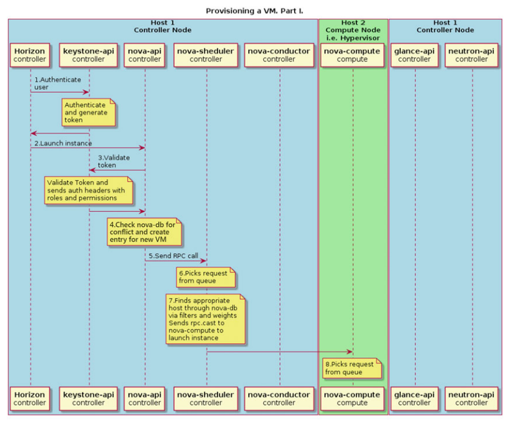
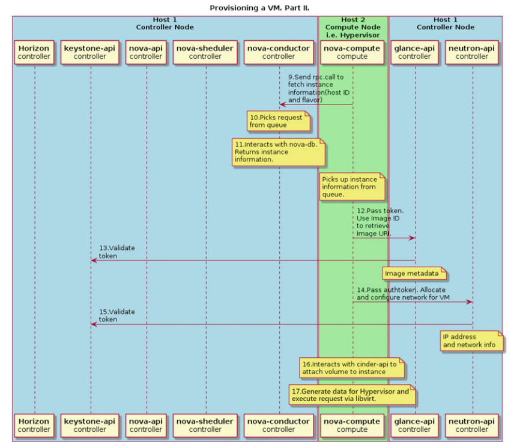
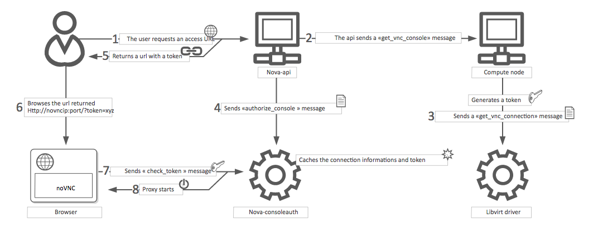

# Các luồng hoạt động trong nova.

## 1. Quá trình khởi taọ máy ảo của nova.

Ở ví dụ này có 2 hosts được sử dụng: compute host (hoạt động như Hypervisor khi nova-compute chạy) và controller host (chứa tất cả các dịch vụ quản lí).

Workflow khi khởi tạo máy ảo:

1. Client (có thể là Horizon hoặc CLI) hỏi tới keystone-api để xác thực và generate ra token.

2. Nếu quá trình xác thực thành công, client sẽ gửi request khởi chạy máy ảo tới nova-api. Giống câu lệnh `nova boot`.

3. Nova service sẽ kiểm tra token và nhận lại header với roles và permissions từ keystone-api.

4. Nova kiểm tra trong database để xem có conflicts nào với tên những objects đã có sẵn không và tạo mới một entry cho máy ảo mới trong database.

5. Nova-api gửi RPC tới nova-scheduler service để lên lịch cho máy ảo.

6. Nova-scheduler lấy request từ message queue

7. Nova-scheduler service sẽ tìm compute host thích hợp trong database thông qua filters và weights. Lúc này database sẽ cập nhật lại entry của máy ảo với host ID phù hợp nhận được từ nova-scheduler. Sau đó scheduler sẽ gửi RPC call tới nova-compute để khởi tạo máy ảo.

8. nova-compute lấy request từ message queue.

9. nova-compute hỏi nova-conductor để lấy thông tin về máy ảo như host ID, flavor. (nova-compute lấy các thông tin này từ database thông qua nova-conductor vì lý do bảo mật, tránh trường hợp nova-compute mang theo yêu cầu bất hợp lệ tới instance entry trong database)

10. nova-conductor lấy request từ message queue.

11. nova-conductor lấy thông tin máy ảo từ database.

12. nova-compute lấy thông tin máy ảo từ queue. Tại thời điểm này, compute host đã biết được image nào sẽ được sử dụng để chạy máy ảo. nova-compute sẽ hỏi tới glance-api để lấy url của image.

13. Glance-api sẽ xác thực token và gửi lại metadata của image trong đó bao gồm cả url của nó.

14. Nova-compute sẽ đưa token tới neutron-api và hỏi nó về network cho máy ảo.

15. Sau khi xác thực token, neutron sẽ tiến hành cấu hình network.

16. Nova-compute tương tác với cinder-api để gán volume vào máy ảo.

17. Nova-compute sẽ generate dữ liệu cho Hypervisor và gửi thông tin thông qua libvirt.

# 2. Luồng khởi tạo và quản lý vnc của nova

Proxy VNC là một thành phần OpenStack cho phép người dùng dịch vụ máy tính truy cập các máy ảo của họ thông qua các máy khách VNC.

Kết nối bảng điều khiển VNC hoạt động như sau:

- Một người dùng kết nối với API và nhận được một cái access_urlchẳng hạn như `http://ip:port/?token=xyz`

- Người dùng dán URL vào trình duyệt hoặc sử dụng nó làm thông số máy khách.

- Trình duyệt hoặc ứng dụng khách kết nối với proxy.

- Proxy nói chuyện để nova-consoleauthcấp phép mã thông báo cho người dùng và ánh xạ mã thông báo tới máy chủ riêng và cổng của máy chủ VNC chẳng hạn.

- Máy chủ tính toán chỉ định địa chỉ mà proxy sẽ sử dụng để kết nối thông qua nova.conftùy chọn tệp server_proxyclient_address,. Theo cách này, proxy VNC hoạt động như một cầu nối giữa mạng công cộng và mạng máy chủ riêng.

- Proxy bắt đầu kết nối với máy chủ VNC và tiếp tục proxy cho đến khi phiên kết thúc.

Proxy cũng tạo đường hầm cho giao thức VNC qua WebSockets để noVNC máy khách có thể nói chuyện với máy chủ VNC. Nói chung, proxy VNC:

- Cầu nối giữa mạng công cộng nơi khách hàng sống và mạng riêng nơi đặt máy chủ VNC.
- Dàn xếp xác thực mã thông báo.
- Rõ ràng giải quyết các chi tiết kết nối cụ thể dành cho hypervisor để cung cấp trải nghiệm khách hàng đồng nhất.

