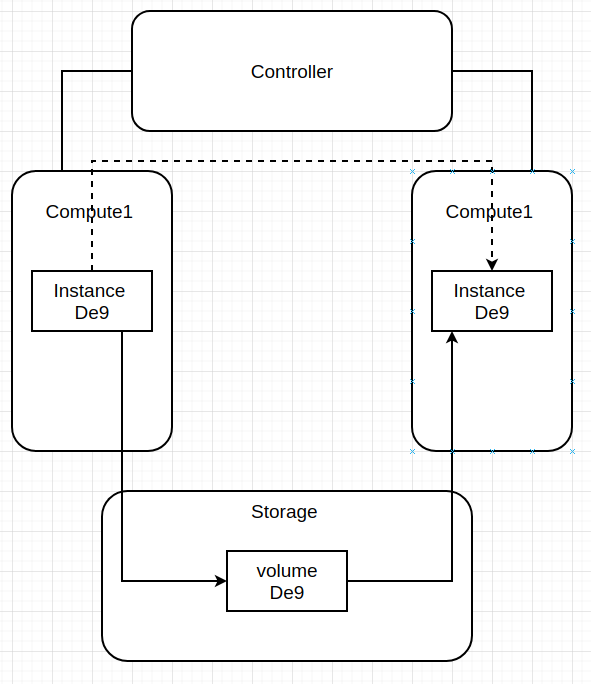
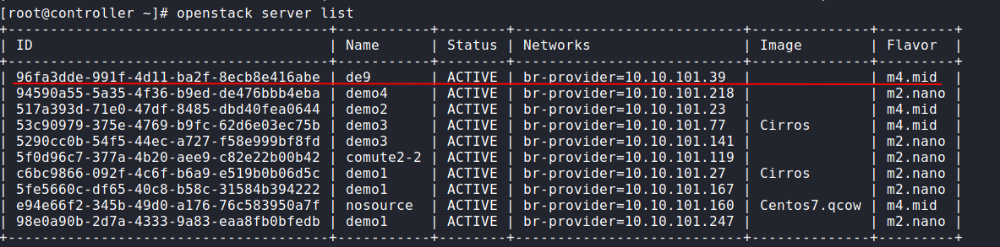
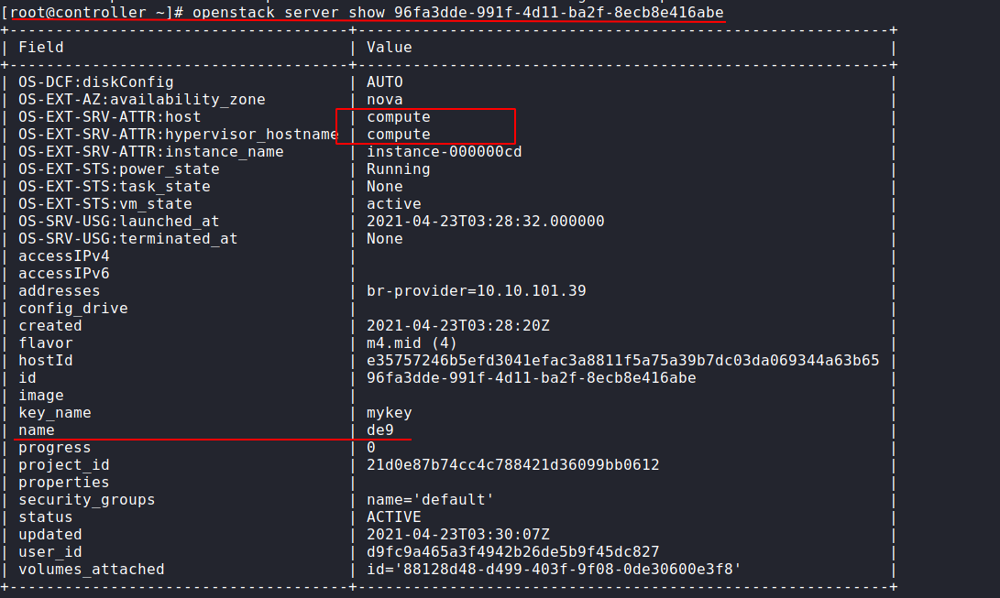
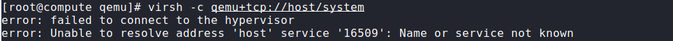
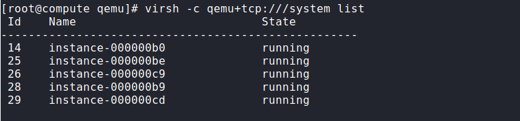
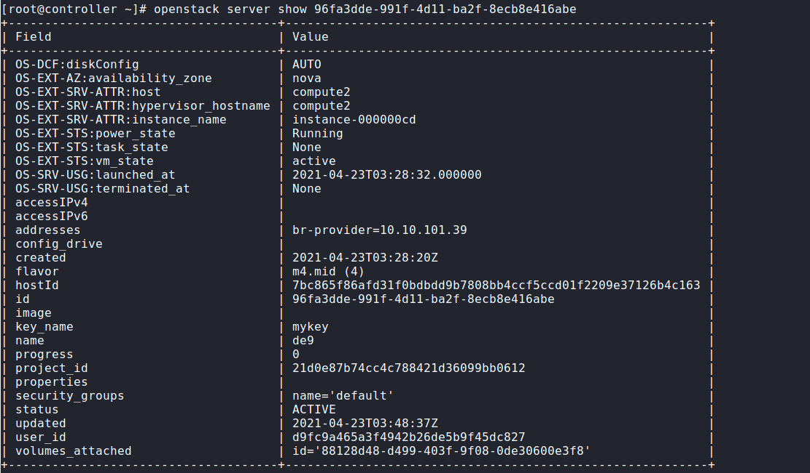

Hướng dẫn live migrate giữa 2 compute host trong openstack.

## Sơ đồ 


Xem danh sách các server đang có 
```
openstack server list
```


Kiểm tra instance cần migrate đang trên host nào.



Kiểm tra libvirt có kết nối được cổng 16509 đề mirgrate vm hay không. `KIểm tra trên các host compute1 và compute2`
```
virsh -c qemu+tcp://host/system
```


Nếu bị như trên thì ta cần mở port và cho phép libvirt kết nối.

Chỉnh sửa file cấu hình libvirt `vim /etc/libvirt/libvirtd.conf`

```
listen_tls = 0
listen_tcp = 1
tcp_port = "16509"
listen_addr = "0.0.0.0"
auth_tcp = "none"  
```
Chỉnh sửa file /etc/sysconfig/libvirtd  : bỏ dấu # ở dòng sau
```
LIBVIRTD_ARGS="--listen"
```
Tắt firewall và selinux.

Khởi động lại libvirt;
```
systemctl restart libvirtd
```

Sau khi cài xong t kiểm tra laij:
```
virsh -c qemu+tcp:///system list

```



Tiến hành live-migrate trên controller như sau.

Live-migrate instance de9 từ `compute`  sang `compute2` với cú pháp như sau:


```
openstack server migrate --live-migration --live  compute2 96fa3dde-991f-4d11-ba2f-8ecb8e416abe
```

Trong đó
- compute2 : là tên host mà instance di chuyển đến.
- 96fa3dde-991f-4d11-ba2f-8ecb8e416abe: id của instance cần migrate.

Sau khi thực hiện ta kiểm tra lại instance.



Như ta thấy instance đã di chuyển qua compute2 . Vậy là đã thành công live-migrate instance tư compute1 sang compute2.
