# Quá trình khởi tạo load balancer trong octavia.

Sau khi ta đã cài đặt thành công octavia service ta sẽ tạo load balancer đê sử dụng và các bước diễn ra như sau.

Để tạo mói một load balancer ta sử dụng lệnh từ command line hoặc có thể sử dung dashboard.

Tại cửa sổ Project --> Network --> Load Balancers.

Chọn `Create Load Balancer`

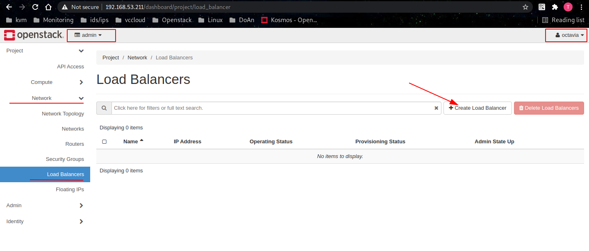

Trong Tab `Load Balancer Details` Đặt tên cho LB và chọn network để amphora cài đặt cùng dải mạng với các members.

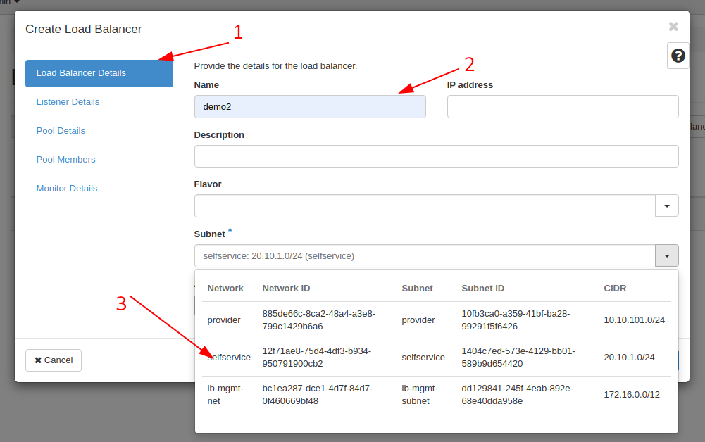

Trong tab `Listener Details` CHọn Phương thức và port.

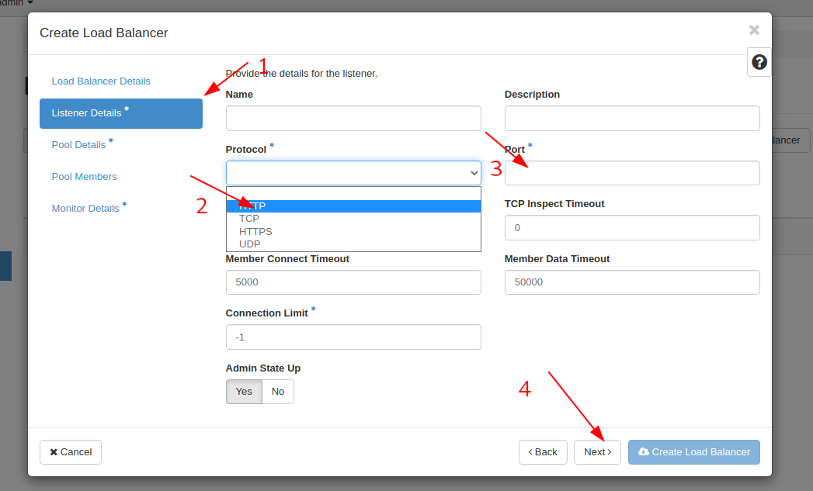

Trong tab `Pool Details` Chọn thuật toán cho các kết nối đên member.
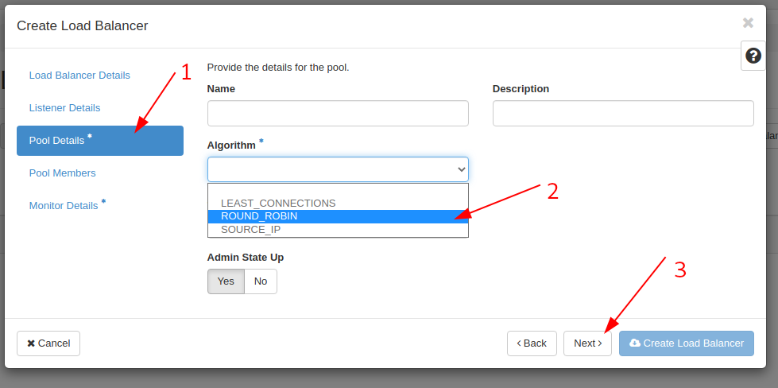

Trong tab `Pool Member` Chọn các member cần HA ở đây tôi sử dụng 2 máy web server.
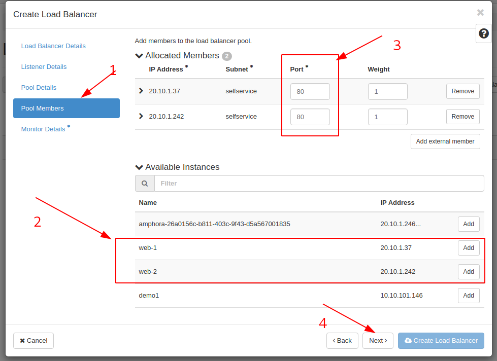

Trong ta `Moniter Details` Chọn giao thức sử dụng health check giữa các member và amphora.

Sau khi ta chọn `Create Load Balancer` thì các hành đông tiếp theo sẽ diễn ra.

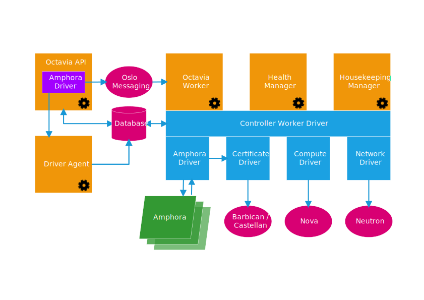

Bước 1: Request yêu cầu tạo Load Balancer mới sẽ được gửi đến Octavia API.

Bước 2: Octavia API tạo một bản ghi mới trong Database lưu các giá trị vừa nhận được như name LB, name pool, name listener, member, ... Và đặt trạng thái là `Pendding Create`

Bước 3: Octavia API gửi request đến RabbitMQ để lưu trong hàng đợi đợi được gọi đến.

Bước 4: Octavia Worker nhận messages từ RabbitMQ rồi thông báo đến Controller Worker Drive.

Bước 5: Controller Worker driver truy cập vào Database để lấy các thông số và thấy trạng thái là `Pendding Create` lúc này nó sẽ truy cập đến Computer Driver để chọn máy ảo amphora được boot, Và Controller Wordker driver truy cập đến Network Driver để lấy thông tin IP cho máy ảo amphora. Sau khi lấy đẩy đử thông tin nó sẽ lưu vào trong Database.

Bước 6: Amphora Driver Truy cập vào Database thông qua controller woker driver để lấy các thông sô và tiến hành boot máy amphora.

Bước 7: Sau khi tạo máy ảo amphora thành công thị trên máy ảo amphora tự động khỏi tạo service amphora-agent chạy trên port 9443.
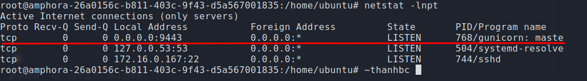

Bước 8: Amphora-agent tạo request xác thực ssl với Certificate Driver.

Bước 9: Sau khi xác thực thành công controller worker driver cập nhật thông tin bản ghi vào database và chuyển trạng thái thành Pendding update.

Sau đó nó tạo listener, pool, member và health moniter.
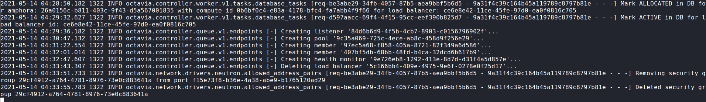

Bước 10: Sau khi tạo xong tất cả các thành phần controller worker driver lưu lại vào database và chuyển trạng thái thành `ACTIVE`.
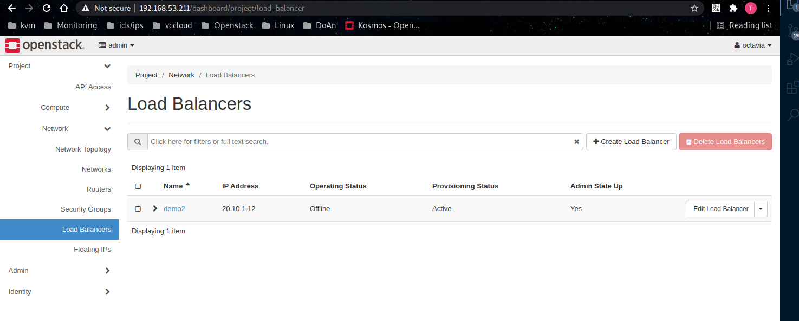

Sau khi hoàn tất ta có mô hình instance và network như sau.
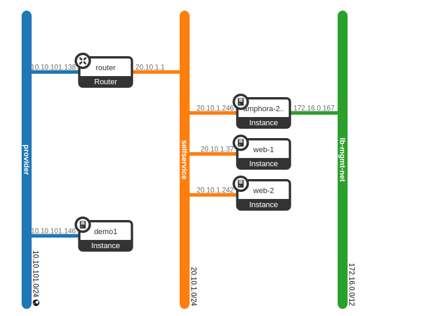

Vì LB này đang nằm trong mạng selfservice nên ta cần floating ip của LB để từ ngoài có thể truy cập vào dc.
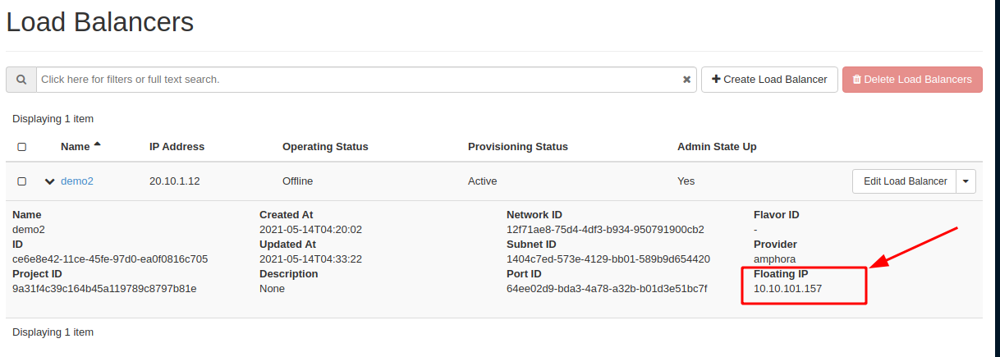

Kiểm tra xem LB có hoạt động hay chưa.
Sử dụng lệnh `while true; do curl http://10.10.101.157; done`

Như vậy LB của ta đã chạy và hoạt động.

## 2. Mô hình network trong octavia.

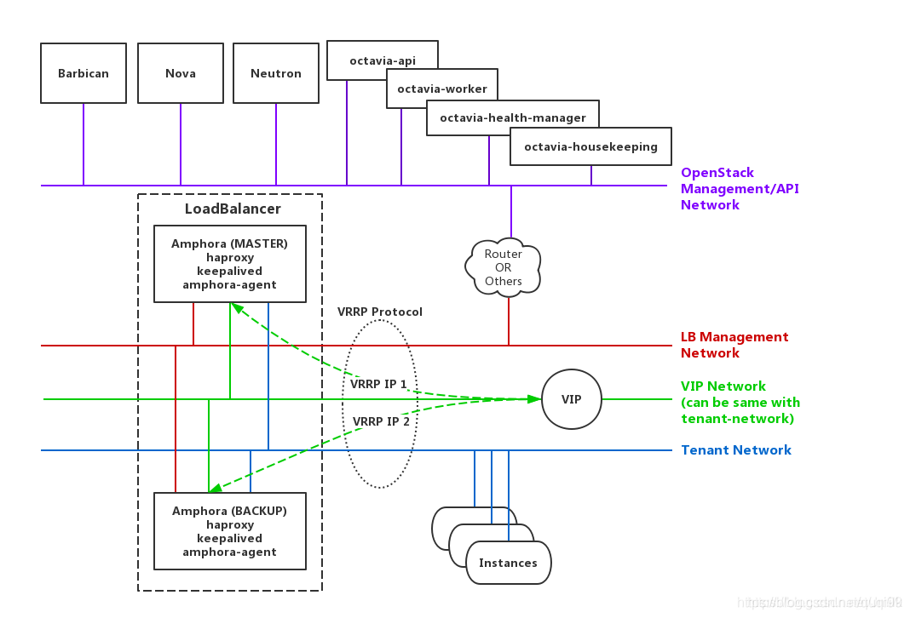