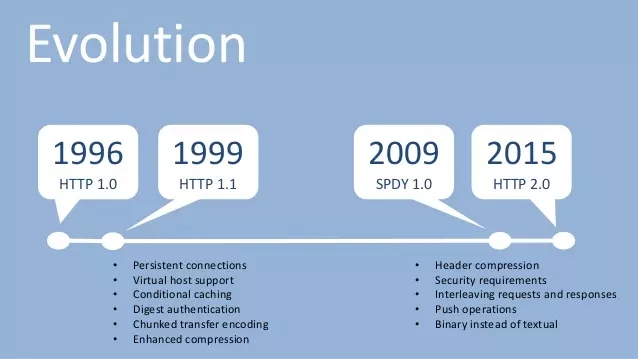
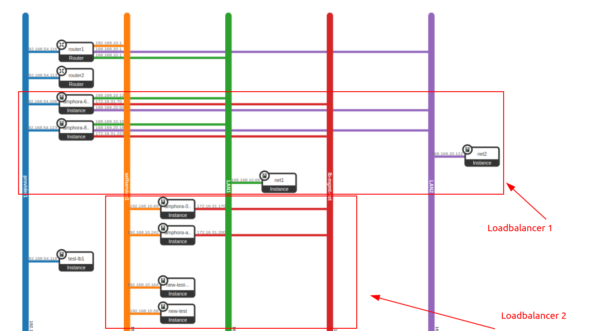
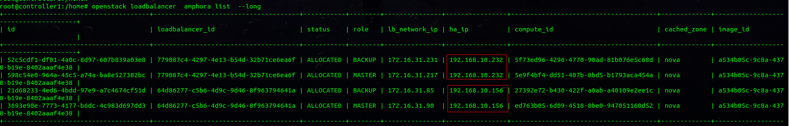
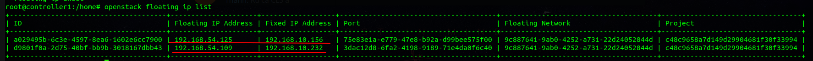
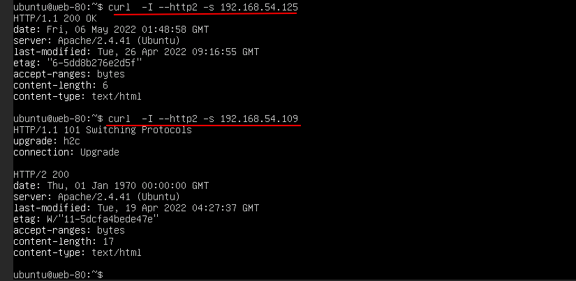

# Tìm hiểu http/2  và TLS trong load-balancer và sử dụng

## 1.Tìm hiểu http/2

### 1.1 Phát triển http/2
HTTP được viết tắt là  HyperText Transfer Protocol (Giao thức truyền siêu văn bản) là cách mà trình duyệt của bạn giao tiếp với máy chủ web của trang web bạn đang truy cập.

Có nhiều rât nhiều cách để các máy tính giao tiếp với nhau qua Internet, HTTP chỉ là một cách được sử dụng để duyệt web.

Phiên bản HTTP chính thức đầu tiên (HTTP 1.0) được phát hành vào năm 1996 dưới dạng RFC 1945.

Với sự phát triển nhanh chóng của web, với nhiều thành phần hơn css, js... đồng nghĩa với việc chúng ta sẽ cần nhiều tài nguyên hơn và có trường hợp sẽ phải tải đồng thời nhiều tài nguyên. Điều mà khi thực hiện bằng cơ chế 1 connection / 1 tài nguyên của HTTP 1.0 sẽ không đạt được sự tối ưu về băng thông.

Năm 1999 phiên bản HTTP/1.1 được phát hành để giải quyết vấn đề trên với khái niệm về pipelining. Sau đó phiên bản HTTP/1.1 tiếp tục được update và sử dụng cho đến thời điểm hiện tại.

Tuy đã được cải thiện, nhưng pipelining không hoàn toàn giải quyết được vấn đề của HTTP/1.0. Trong khi mọi người cảm thấy ổn thì ở Google người ta cảm thấy là chưa hoàn thiện lắm, và thế là họ đã cho ra đời một giao thức mới mang tên SPDY nhằm cải thiện thời gian tải trang. SPDY đạt được mục tiêu giảm thời gian tải trang bằng các công nghệ nén (compression), ghép kênh (multiplexing) và ưu tiên (prioritization).

Tháng 7 năm 2012, nhóm phát triển SPDY công khai răng nó đang được phát triển theo hướng tiêu chuẩn hóa. Các trình duyệt Chromium, Mozilla Firefox, Opera, Amazon Silk, Internet Explorer và Safari cũng đã triển khai SPDY.

Ngay khi được triển khai SPDY đã cho thấy sự cải thiện đáng kể so với HTTP/1.x và sự quan tâm đến từ các nhà phát triển như Firefox và nginx. Không lâu sau đó những nhà phát triển đã bắt đầu thảo luận về HTTP/2. Sau một quá trình kêu gọi và lựa chọn các đề xuất, SPDY/2 đã được chọn làm cơ sở cho HTTP/2. Kể từ đó, đã có một số thay đổi, dựa trên thảo luận trong nhóm làm việc và phản hồi từ những implementers. Đến tháng 5 năm 2015, HTTP/2 specification đã được công bố dưới dạng RFC 7540.

### 1.2 Đặc điểm của http/2
HTTP/2 là phiên bản chính thức tiếp theo của giao thức HTTP, nhằm cải thiện tốc độ tải trang và hiệu suất khi duyệt web.

Như đã đề cập phía trên, mục tiêu của HTTP/2 là cải thiện tốc độ tải trang, chúng ta sẽ cùng tìm hiểu một số đặc điểm giúp HTTP/2 đạt được mục tiêu này.

Ghép kênh (Multiplexed)
Đầu tiên chúng ta cần đề cập đến kỹ thuật Multiplexed, thứ mà đã giải quyết vấn đề “head-of-line blocking” tồn tại thừ HTTP/1. Để dễ hiểu hơn về vấn đề này, hãy tưởng tượng việc chúng ta vào website như vào 1 nhà hàng vậy. Và khi vào nhà hàng, ví dụ chúng ta sẽ gọi 10 món, hãy xem cách mà nhà hàng phục vụ chúng ta ở từng phiên bản:

HTTP/1: Mỗi 1 request sẽ chỉ nhận 1 pipline và nó chỉ thực hiện với đúng 1 request đó, không nhận thêm bất cứ request  nào nữa. Như vậy với 10 request thi  chúng ta sẽ phải gọi đến 10 pipeline. Điều này vừa làm tốn tài nguyên và thời gian xử lý.

HTTP/1.1: Rút kinh nghiệm lần trước, nhà hàng training mấy ông phục vụ để nhận được nhiều order hơn, nhưng chỉ nhận 1 order 1 lần, mang món lên mới nhận order tiếp, chắc sợ quên 🙄. Để gọi đồ nhanh hơn bạn có thể gọi thêm 2-3 ông phục vụ nữa, tùy sức. Nhìn chung cách này khá là ổn, training nhân viên dễ, nên được dùng đến tận bây giờ, có mỗi cái là chưa tối ưu tối đa. Mấy ông này gọi là persistent connection.

HTTP/1.1: Vẫn là thời điểm này, nhà hàng có training 1 ông nhân viên đặc biệt. Ông này làm việc thông minh hơn 1 tí là ghi hết order vào luôn rồi bắt đầu mang đồ lên. Nhưng ông này làm việc hơi máy móc, phải trả đồ theo đúng thứ tự order mới chịu. Chẳng may gọi cơm, canh, cá mà hết mất cơm thì bắt ngồi chờ chứ nhất quyết ko cho ăn cá, dỗi vl 🙄 Thêm vào đấy, training mấy ông này khó hơn mấy ông bình thường nên đến 2018 thì mấy ông này không được dùng nữa. Mấy ông này được gọi là pipelining connection.
HTTP/2: Nhà hàng học được công nghệ training mới, mấy ông nhân viên vẫn ghi hết order vào luôn rồi bắt đầu mang đồ lên. Nhưng mấy ông này sẽ linh hoạt hơn, món nào có trước mang lên trước, thâm chí món nào to quá thì mang từng phần xen kẽ cũng làm đc. Do đó, giảm được rất nhiều thời gian chờ, chỉ cần 1 người cũng phục vụ được 1 bàn, giảm thêm được cả chi phí thuê nhân viên luôn.

Phản hồi ưu tiên (prioritization)

Trong HTTP/1.1, server phải gửi phản hồi theo cùng trật tự nhận truy vấn. HTTP/2 thì giải quyết bất đồng bộ, nên các truy vấn nhỏ hơn hoặc nhanh hơn có thể được xử lý sớm hơn. Đồng thời, cho phép trình duyệt có thể sắp xếp thứ tự ưu tiên tải về cho các tài nguyên nào quan trọng dùng để hiển thị website.

Server Push
HTTP/2 cho phép server có thể gửi gói dữ liệu trước khi nó được yêu cầu. Ví dụ, bạn có thể “reference” một script ở cuối page. Trong HTTP/1.1, trình duyệt sẽ tải, phân giải HTML rồi chạy JavaScript khi đến đoạn tag script. Với HTTP/2, server có thể gửi file JavaScript đến trước khi trình duyệt yêu cầu tài nguyên này. Việc này giúp giảm thơi gian chờ khi trình duyệt phân tích HTML và gửi request.

Dữ liệu truyền tải dạng nhị phân
HTTP/2 truyền dữ liệu ở dạng nhị phân thay vì dạng text như HTTP/1.x. Giao thức nhị phân hiệu quả hơn để phân tích cú pháp, gọn nhẹ hơn, và quan trọng nhất, chúng ít bị lỗi hơn nhiều so với các giao thức văn bản như HTTP/1.x. Bởi giao thức nhị phân không phải xử lý các trường hợp như khoảng trắng, viết hoa, kết thúc dòng, dòng trống...

Ví dụ, HTTP/1.1 định nghĩa 4 cách để phân tích một message còn với HTTP/2 nó chỉ là 1 dòng code.

Có một lưu ý rằng HTTP/2 không thể sử dụng được qua telnet, nhưng đã có một số công cụ hỗ trợ, chẳng hạn như plugin Wireshark.

Nén header (header compression)
Khác với HTTP/1.1, các Header gói tin sẽ được nén trước khi gửi đi. Thông tin được gửi đi kèm với truy vấn mô tả dữ liệu, nguồn gốc, kiểu, độ dài… của dữ liệu đó. Updating....

# 2. Cài đặt và sử dụng loadbalancer http2.

Ta  có thể thấy sau khi cài đặt thì tiến hành  kiểm tra lại trường content-length đã tăng lên vì các header đã đi qua lớp HTTP/2 Framming Layer gom hết các request lại và protocol đã đang được sử đụng   chuyển qua http/2.

