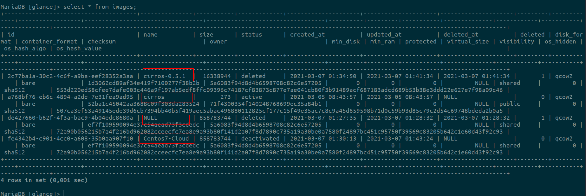

# Tìm hiểu các thao tác sử dụng Glance

## Mục lục

[1. Sử dụng glance command line](#glance)

- [1.1 Tạo image](#create)

- [1.2 Hiển thị danh sách image](#list)

- [1.3 Show image](#show)

- [1.4 Upload image](#upload)

- [1.5 Xóa image](#delete)

- [1.6 Thay đổi trạng thái máy ảo](#update)

[2. Sử dụng OpenStack client](#client)


-----------

<a name ="glance"></a>
## 1. Sử dụng glance command line

<a name="create"></a>
### 1.1 Tạo image

Để upload image lên thư mục của glance từ file image có sẵn, sử dụng lệnh `glance image-create` hoăc cũng có thể sử dụng lệnh `openstack image create`

Ta  có thể sử dung 1 trong 2 lệnh sau để tạo images mới cho glance.

```
glance image-create --file CentOS-7-x86_64-GenericCloud.qcow2 --disk-format qcow2 --container-format bare --public --name Centos7-Cloud

openstack image create --disk-format qcow2 --container-format bare \
--public --file .CentOS-7-x86_64-GenericCloud.qcow2 Centos7Cloud

```

Trong đó :
- `disk-format`: Là kiểu lưu trữ của disk trong glance.
- `container-format`: Là định dạng file và loại metadata được lưu trong glance.
- `file`: Đường dẫn đên file image muôn upload lên glance.
- `public`: Trạng thái của image đc chia sẻ giữa các project.
- `name`: Tên images đươc lưu trong glance.


<a name="list"></a>
### 1.2 Hiển thị danh sách image

Sử dụng câu lệnh sau để lấy danh sách các image được phép truy cập

`glance image-list` or `openstack image list`


<a name="show"></a>
### 1.2 Show image

Để hiển thị thông tin chi tiết 1 image, sử dụng câu lệnh

`glance image-show image_id`


<a name="upload"></a>
### 1.4 Upload image

Trong trường hợp ta tạo ra một image mới và rỗng, ta cần upload dữ liệu cho nó, sử dụng câu lệnh `glance image-upload --file file_name image_id`

```
glance image-create --name cirros-0.5.1 --container bare --disk-format qcow2
```


Như ta thấy nó không có giá trị `os_hash_value` là nó chưa có dữ liệu gì bên trong.

Upload dữ liệu vào images.

```
glance image-upload --file   cirros-0.5.1-x86_64-disk.img  2c77ba1a-30c2-4c6f-a9ba-eef28352a3aa
```


Như ta thấy sau khi upload dữ liệu vào images thì `os_hash_value` đã có giá trị.

<a name="delete"></a>
### 1.5 Xóa image

Để xóa image, ta sử dụng câu lệnh `glance image-delete image_id`
```
glance image-delete 2c77ba1a-30c2-4c6f-a9ba-eef28352a3aa
```


<a name="update"></a>
### 1.6 Thay đổi trạng thái máy ảo

Như ta đã biết một image upload thành công sẽ ở trạng thái active, người dùng có thể đưa nó về trạng thái deactivate cũng như thay đổi qua lại giữa hai trạng thái bằng câu lệnh `glance image-deactivate <IMAGE_ID>>` và `glance image-reactivate <IMAGE_ID>`

```
 glance image-deactivate fe4342b4-c901-4cc0-a608-35b0aa907f10
```


**Lưu ý:**

Đây là câu lệnh để tương tác với glance từ ban đầu, nó còn nhiều hạn chế so với OpenStack client, tham khảo thêm tại link sau:

https://docs.openstack.org/cli-reference/glance.html

<a name="client"></a>
## 2. Sử dụng OpenStack client

Giống với glance command line, OpenStack client sử dụng câu lệnh để quản lí glance. Bảng sau đây thể hiện mối quan hệ tương tác giữa hai câu lệnh trên:

| Glance CLI | OpenStack client | Mục đích |
|------------|------------------|----------|
| glance image-create | openstack image create | Tạo mới image |
| glance image-delete | openstack image delete | Xóa image |
| glance member-create | openstack image add project | Gán project với image |
| glance member-delete | openstack image remove project | Xóa bỏ image khỏi project |
| glance image-list | openstack image list | Xem danh sách image |
| glance image-download | openstack image save | Lưu image vào ổ đĩa |
| glance image-show | openstack image show | Hiển thị thông tin chi tiết của image |
| glance image-deactivate | openstack image set -deactivate | deactivate image |
| glance image-update | openstack set | Thay đổi thông tin image |


**Xem thêm về OpenStack client cho glance tại link sau:**

https://docs.openstack.org/developer/python-openstackclient/command-objects/image.html

**Cách kiểm tra thông tin trong database**

Một image bị xóa sẽ vẫn được lưu thông tin trong database, đây là cấu trúc của glance database :


Bạn có thể connect rồi query ra để xem hoặc dùng GUI tool để hiển thị nội dung database:



Như ta thấy có 4 images đã dc lưu trong db trong đó có 1 image `NULL`. Đây là images đã bị xóa bởi câu lệnh lúc nãy. Metadata đã bị xóa khỏi db nhưng các thông tin khác của images vẫn còn lưu trên db.


**Tham khảo:**

https://github.com/hocchudong/thuctap012017/blob/master/TamNT/Openstack/Glance/docs/3.Cac_thao_tac_su_dung_Glance.md

https://docs.openstack.org/developer/glance/glanceapi.html

https://github.com/thaonv1/meditech-thuctap/blob/master/ThaoNV/Tim%20hieu%20OpenStack/docs/glance/manage-glance.md#delete