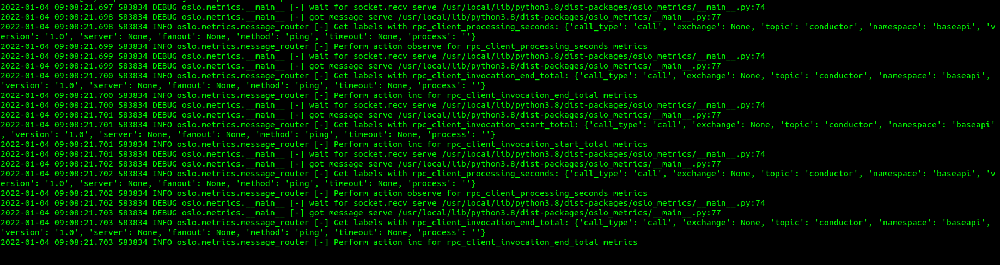

# Nghiên cứu sử dụng  oslo metrics để monitor rpc trên openstack.

## Mục lục 
[1. Tìm hiểu rpc là gì ?](#tim-hieu-rpc)

[2. Tìm hiểu oslo.metrics.](#tim-hieu-oslo)

[3. Cài đặt và moniter rpc trên prometheus.](#cai-dat)


-------

<a name="tim-hieu-rpc"></a>
## 1. Tìm hiểu rpc là gì ?

- RPC – viết tắt của Remote Procedure Call, là một mô hình kỹ thuật mạng hay còn được biết đến là cơ chế giao tiếp giữa hai tiến trình.

- Thuật ngữ RPC ra đời vào năm 1981 được thực hiện bởi Andrew Birrel và Bruce Nelson. RPC được triển khai và phổ biến lần đầu trên Unix dưới dạng Sun’s RPC (ngày nay gọi là ONC RPC). Từ đó, RPC được dùng làm cơ sở chuẩn hóa hệ tập tin mạng. Trong hệ thống mạng máy tính hiện nay có rất nhiều dịch vụ và ứng dụng sử dụng cơ chế kết nối RPC.

### 1.1 RPC là gì ?
- Đây là một loại giao thức yêu cầu-phản hồi, có thể dễ dàng được giải thích sử dụng mô hình truyền thông máy khách/máy chủ. Quá trình gọi một yêu cầu được gọi là “máy khách” và quá trình trả lời lại yêu cầu này gọi là “máy chủ”. Lưu ý, máy khách hoặc máy chủ có thể là các thiết bị khác nhau trong một hệ thống mạng hoặc có thể là các tiến trình khác nhau nằm trong cùng hệ thống. Có hay loại thủ tục xuất hiện trong chương trình gồm:

Thủ tục cục bộ là thủ tục được cài đặt và thực thi tại máy của của chương trình
Thủ tục ở xa là thủ tục được định nghĩa, cài đặt và thực thi trên một máy tính khác.

### 1.2 Ưu điểm và nhược điểm của RPC
#### Ưu điểm
- RPC có khả năng cho phép chuyển sự phân tán của hệ thống cuối cùng vào một quyết định ở thời điểm triển khai. Việc loại bỏ khía cạnh phân tán từ code có thể mang lại rất nhiều lợi ích cho các dự án, vì ở giai đoạn đầu triển khai các chi tiết cuối thường không được biết cụ thể. Lập trình viên có thể tùy biến chuyển từ lời gọi cục bộ sang lời gọi từ xa RPC mà không thay đổi quá lớn cấu trúc ban đầu của chương trình.

#### Nhược điểm
- Với RPC, cách chia nhiều hàm để gọi tồn tại một số hạn chế khi thời gian trễ mỗi lần gọi RPC là khó có thể bỏ quả, càng nhiều lần gọi, tổng thời gian trễ sẽ tăng, khả năng nghẽn cổ chai do kiểu hỏi đáp liên tục sẽ tăng.

- Đối với lời gọi cục bộ, đối tượng gọi (caller) và đối tượng bị gọi (receiver) nằm trong cùng một process. Kiểu tham số truyền được kiểm tra nghiêm ngặt khi biên dịch. Còn với RPC, việc kiểm tra như thế sẽ dẫn đến nhiều rủi ro hơn, dữ liệu có thể bị nghe lén hoặc bị thay đổi trên đường truyền. Việc bảo mật lời gọi RPC dẫn đến cần phải mã hóa, gắn kèm chữ ký kiểm tra…điều này sẽ khiến thư viện bên dưới của caller và receiver sẽ phải làm việc nhiều hơn, độ trễ lại cao hơn.

- Chưa kể đồng hồ thời gian ở máy tính chứa caller và receiver có thể sai khác nhau, hệ điều hành cũng như phần mềm, ngôn ngữ lập trình cũng khác nhau, kiểu dữ liệu có sự sai khác…

#### Cấu trúc và cách thức hoạt động của RPC.
- Trong RPC, một cuộc gọi thủ tục được khởi tạo bởi một hệ thống máy khách, mã hóa và sau đó được gửi đến máy chủ. Sau đó, máy chủ giải mã cuộc gọi và gửi một phản hồi cho máy khách.

Một ứng dụng Client- Server theo cơ chế RPC được xây dựng gồm các phần như hình dưới đây:


`Phần Client` là một quá trình người dùng, nơi khởi tạo một lời gọi thủ tục từ xa. Mỗi lời gọi thủ tục ở xa trên phần Client sẽ kích hoạt một thủ tục cục bộ tương ứng nằm trong phần Stub của Client.

`Phần Client` Stub cung cấp một bộ các hàm cục bộ mà phần Client có thể gọi. Mỗi một hàm của Client Stub đại diện cho một hàm ở xa được cài đặt và thực thi trên server.

Mỗi khi một hàm nào đó của Client Stub được gọi bởi Client, Client Stub sẽ gửi thông điệp để mô tả thủ tục ở xa tương ứng mà Client muốn thực thi cùng với các tham số nếu có. Sau đó nó sẽ nhờ hệ thống RPC Runtime cục bộ gửi thông điệp này đến phần Server Stub của Server.

`Phần RPC Runtime` quản lý việc truyền thông điệp thông qua mạng giữa máy Client và máy Server. Nó đảm nhận việc truyền lại, báo nhận, chọn đường gói tin và mã hóa thông tin.

RPC Runtime trên máy Client nhận thông điệp yêu cầu từ Client Stub, gửi nó cho RPC Runtime trên máy Server bằng lệnh send(). Sau đó gọi lệnh wait() để chờ kết quả trả về từ Server. Khi nhận được thông điệp từ RPC Runtime của Client gửi sang, RPC Runtime bên phía server chuyển thông điệp lên phần Server Stub.

Server Stub mở thông điệp ra xem, xác định hàm ở xa mà Client muốn thực hiện cùng với các tham số của nó. Server Stub gọi một lệnh tương ứng nằm trên phần Server. Khi nhận được yêu cầu của Server Stub, Server cho thực thi lệnh được yêu cầu và gửi kết quả thực thi được cho Server Stub.

`Server Stub` đưa kết quả thực vào một gói tin trả lời, chuyển cho phần RPC Runtime cục bộ để nó gửi sang RPC Runtime của Client

Runtime cục bộ để nó gửi sang RPC Runtime của Client. RPC Runtime bên phía Client chuyển gói tin trả lời nhận được cho phần Client Stub. Client Stub mở thông điệp chứa kết quả thực thi về cho Client tại vị trí phát ra lời gọi thủ tục xa.

Trong các thành phần trên, RPC Runtime được cung cấp bởi hệ thống. Client Stub và Server Stub có thể tạo ra thủ công (phải lập trình) hay có thể tạo ra bằng các công cụ cung cấp bởi hệ thống. Cơ chế RPC được hỗ trợ bởi hầu hết các hệ điều hành mạng cũng như các ngôn ngữ lập trình.

RPC đóng một vai trò quan trọng trong việc quản lý thiết bị từ xa qua mạng và được sử dụng để chia sẻ quyền truy cập vào các thiết bị ngoại vi như máy in và máy scan. Qua bài viết, hy vọng các bạn có thể bổ sung cho bản thân kiến thức hữu ích về lập trình nâng cao.

<a name="tim-hieu-oslo"></a>
## 2. Tìm hiểu oslo.metrics

Là 1 phần của oslo project.

- Oslo.metrics là 1 API hỗ trợ thu thập dữ liệu số liệu từ các thư viện Oslo khác và hiển thị dữ liệu số liệu cho hệ thống giám sát.
- Thu thập dữ liệu từ thư viện oslo libraries và hiện thị ra các dịch vụ monitor khác như prometheus.
- Hỗ trợ sử dụng một số thư viện oslo để monitor.
  - Số cuộc gọi RPC.
  - Số cuộc gọi RPC được chấp nhận.
  - Sô lần sử dụng cuộc gọi RPC.
- Monitoring openstack rpc call.
### 2.2 Quá trình thu thập, gửi, nhận và hiển thị các metrics trong oslo.

Sau đây là sơ đồ quá trình thu thập, gửi, nhận và hiển thị các metrics trong oslo.


1. Các service như nova-compute, nova-conductor, nova-api, neutron-agent được thu thập và gửi về oslo.messaging thông qua các phần code được cấu hình trong file cấu hình của nova, neutron hoặc cinder.
2. Khi đã có các messages oslo sử dụng thư viện oslo.messaging để gửi data đến oslo.metrics thông qua các socket.
3. oslo.metrics nghe trên các socket, phân tích dữ liệu và  đánh giấu các label.
4. Sau đó prometheus scrape các metrics có trong oslo.metrics và hiển thị lên biểu đồ.
   

<a name="cai-dat"></a>
## 3. Cài đặt và sử dụng RPC call openstack trên prometheus.

Cài đặt  và sử dụng devstack.

### 3.1 Cài đặt oslo.metrics

`apt install python3.oslo-metrics -y`

### 3.2 Cài đặt openstack kiểu devstack và thay đổi 1 số cấu hình gốc.
`git clone https://opendev.org/openstack/devstack`
`cd devstack`

Tạo và khai báo thêm cấu hình oslo.metrics. `vim local.conf`

```
[[local|localrc]]
ADMIN_PASSWORD=admin
DATABASE_PASSWORD=$ADMIN_PASSWORD
RABBIT_PASSWORD=$ADMIN_PASSWORD
SERVICE_PASSWORD=$ADMIN_PASSWORD
LIBS_FROM_GIT=oslo.messaging

[[post-config|$NOVA_CONF]]
[oslo_messaging_metrics]
metrics_enabled = True
```

Sau đó bắt đầu cài đặt `./stack.sh`

### 3.3  Kiểm tra kết quả
Sau khi cài đặt  xong thì kiểm tra trong oslo.metrics.

Tiến hành tạo instance mới.


Ta thấy có metrics của nova-compute trong oslo.metrics.
Sau khi tạo xong instance mới.



Nhận thấy đã có metrics  của nova-conductor trong oslo.metrics.

Như vậy ta đã thành công thu thập metrics băng oslo.messgaing  và oslo.metrics.

### 3.4 Kiểm tra prometheus.
Tiến hành Scrape trên prometheus bằng cách sử file cấu hình của prometheus như sau. 

`vim /etc/prometheus/prometheus.yaml`

Do oslo.metrics đang được open mặc định trên port 3000  nên ta sẽ sử dụng prometheus scrape trên port 3000 để thu được metrics


Sau đó restart  prometheus và kiểm tra biểu đồ.
Ta thấy oslo có hiện thị một số thông số như sau.


Một số thông số phố biến như sau.
- **oslo_messaging_rpc_client_exception_created** : Số  oslo.messaging  rpc tạo client không được chấp nhận.
- **oslo_messaging_rpc_client_exception_total** : Tổng số oslo.messaging tạo client không chấp nhận
- **oslo_messaging_rpc_client_invocation_end_created** : Số yêu cầu oslo.messaging kết thúc rpc client
- **oslo_messaging_rpc_client_invocation_end_total** : Tổng số yêu cấu oslo.messaging kết thúc rpc client
- **oslo_messaging_rpc_client_invocation_start_created** : Sô yêu cầu oslo.messaging tạo 1 rpc call
- **oslo_messaging_rpc_client_invocation_start_total** : Tổng các yêu cầu oslo.messaging tạo 1 rpc call
- **oslo_messaging_rpc_client_processing_seconds_bucket** : Số giây oslo.messaging xử lý các bucket
- **oslo_messaging_rpc_client_processing_seconds_count** : Số giây oslo.messaging xử lý các client
- **oslo_messaging_rpc_client_processing_seconds_created** :  Số giây oslo.messaging xử lý các client được tạo
- **oslo_messaging_rpc_client_processing_seconds_sum** : Tổng số giây oslo.messaging xử lý các client


Chọn 1 thông sô `oslo_messaging_rpc_client_invocation_start_total` sẽ có biểu đồ như sau.


### 3.5 Cài đặt và sử dụng trên openstack wallaby.

Trên phiên bản devstack đã được tích hợp sẵn module và socket để các dịch vụ nova va neutron có thể gửi metrics đến oslo.messaging nên ta có thể thấy luôn kết quả.

Trên phiên bản Wallaby thì vẫn chưa có code cấu hinh oslo.metrics nên chưa thể enable để collect dc dữ liệu.
